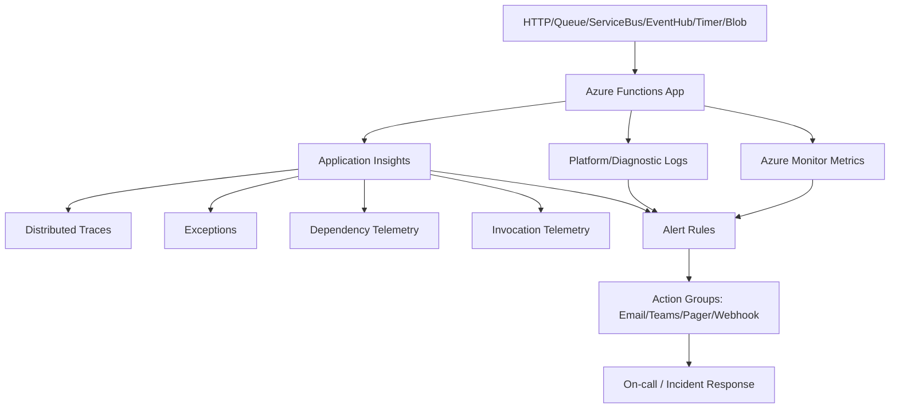
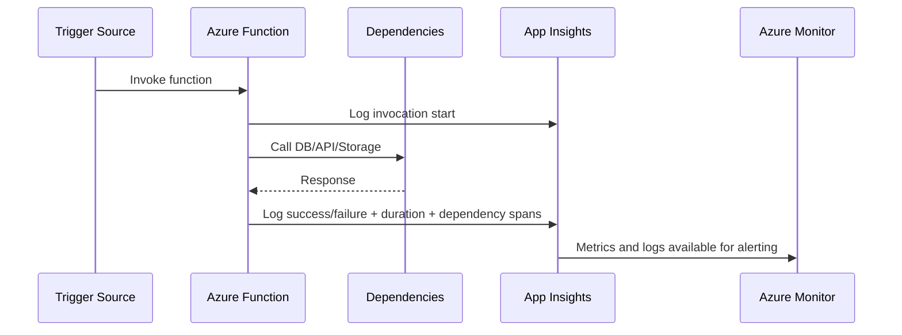
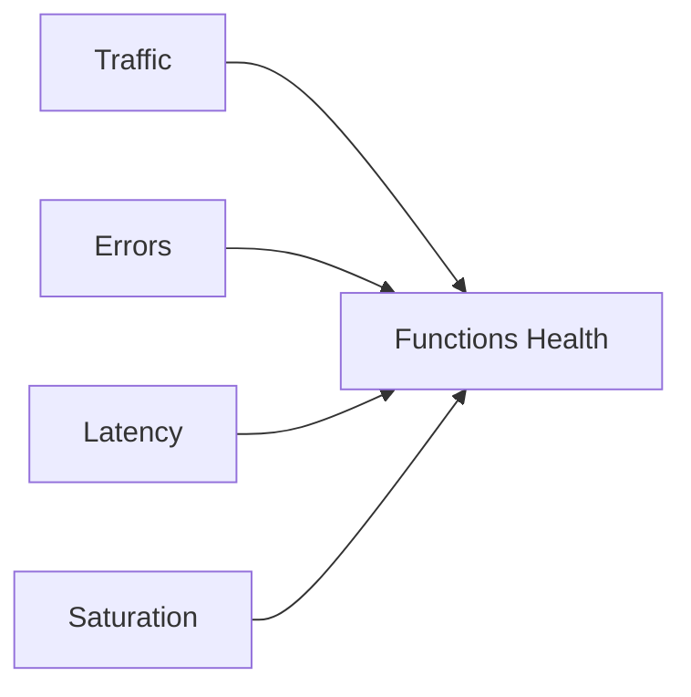
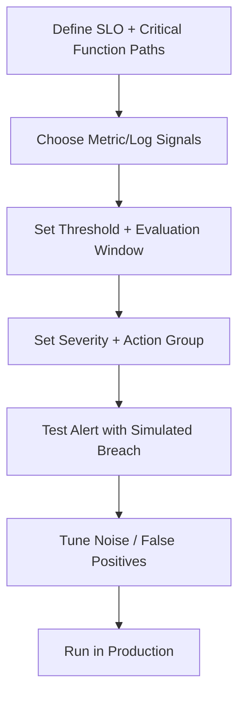
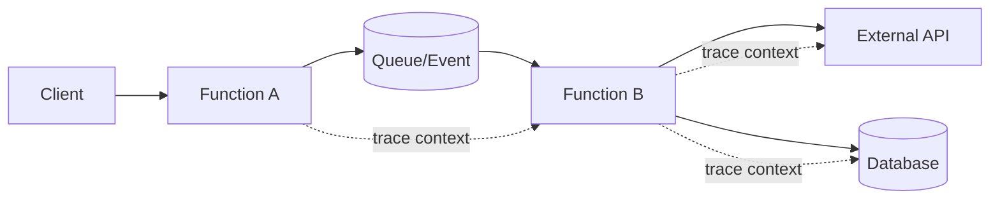
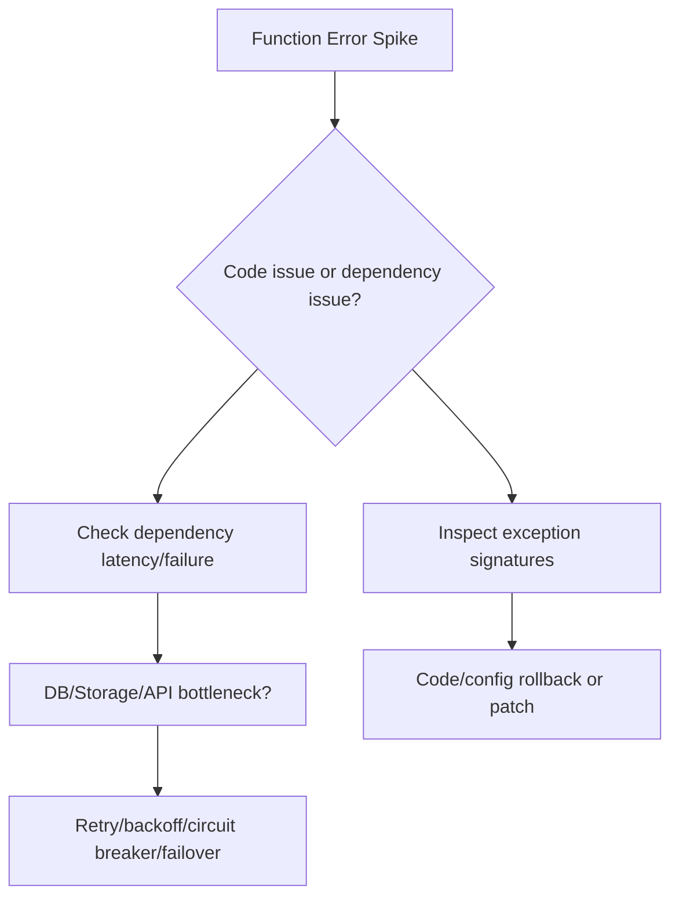
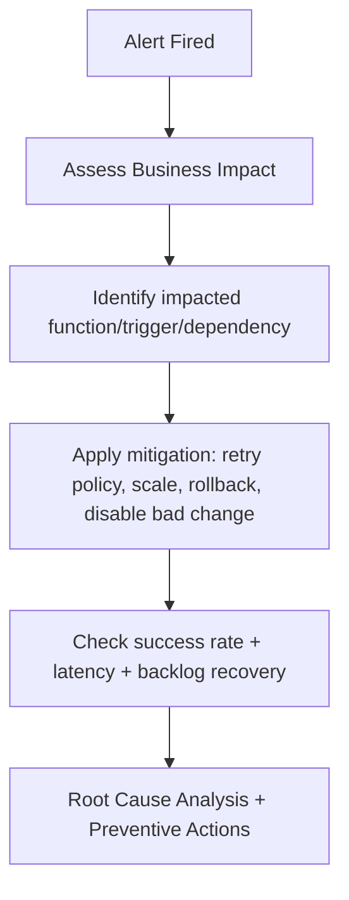

# How Do You Monitor Azure Functions?
## Detailed Interview Preparation Guide with Flow Charts (Static Site Ready)

---

## 1) Direct Interview Answer

Monitor Azure Functions by combining **Application Insights + Azure Monitor + platform diagnostics** to track:

1. Invocation success/failure
2. Execution latency and cold starts
3. Trigger/source health (HTTP, Queue, Service Bus, Timer, Event Hub, Blob)
4. Dependency performance (DB, storage, external APIs)
5. Host/runtime resource behavior and scaling
6. Alerting tied to SLOs and business impact

> One-liner: *Use Application Insights for function-level observability, Azure Monitor for alerting and platform metrics, and structured logs/traces for root-cause analysis.*

---

## 2) End-to-End Monitoring Architecture

---

## 3) What Telemetry to Collect (Must-Have)

## 3.1 Invocation Telemetry
- Total invocations
- Success vs failure count
- Failure rate
- Execution duration (p50/p95/p99)
- Retry attempts
- Timeout occurrences

## 3.2 Trigger Health
- Queue length / message age
- Event Hub lag / checkpoint delay
- Service Bus dead-letter count
- Timer trigger missed runs
- Blob trigger processing backlog

## 3.3 Dependency Telemetry
- DB call latency/failure
- Storage latency/throttling
- External API timeout/error rate
- Cache performance

## 3.4 Runtime/Platform Telemetry
- Cold start count/duration
- Memory usage trends
- CPU pressure (plan dependent)
- Scale-out/scale-in events
- Host restarts

## 3.5 Security/Operations Signals
- Auth failures
- Key/secret access errors
- Configuration changes
- Deployment events

---

## 4) Function Invocation Monitoring Flow

---

## 5) Golden Signals for Azure Functions

Monitor these first:

- **Traffic**: invocation rate
- **Errors**: failed executions/exceptions
- **Latency**: execution and dependency latency
- **Saturation**: concurrency/resource pressure and backlog growth

---

## 6) Recommended Core Alerts

## Critical (Paging)
- Function failure rate above threshold (e.g., >X% for Y min)
- Queue backlog/oldest message age breaching SLO
- Dead-letter queue spike
- Dependency outage/timeouts spike
- Availability check failures for HTTP-triggered critical functions

## Warning (Non-paging or lower severity)
- Cold start increase trend
- Execution duration regression
- Retry count unusual increase
- Memory trend indicating leak risk

---

## 7) Alert Configuration Flow

---

## 8) Distributed Tracing Across Function Workflows

For microservices/event-driven chains:

- Propagate trace context through messages/events
- Capture parent-child spans
- Correlate function invocation with downstream API/DB spans

---

## 9) Monitoring by Trigger Type

## HTTP Trigger
- Request rate, 4xx/5xx, latency, availability checks

## Queue/Service Bus Trigger
- Queue depth, dequeue latency, poison/dead-letter messages, retries

## Event Hub Trigger
- Consumer lag, checkpoint progress, processing latency

## Timer Trigger
- Missed schedule runs, execution duration, overlap risk

## Blob Trigger
- Processed file count, failure count, backlog

---

## 10) Cold Start Monitoring (Interview Favorite)

Track:
- cold start occurrence rate
- cold start latency contribution to p95/p99
- impact by region/plan/time window

Mitigations to mention:
- appropriate hosting plan choices
- pre-warming/always-ready options where applicable
- lighter startup path/dependency initialization optimizations

---

## 11) Logging Best Practices

Use structured logs with fields like:
- `function_name`
- `invocation_id`
- `operation_name`
- `trace_id`
- `trigger_type`
- `message_id` (for queue/event)
- `dependency_name`
- `duration_ms`
- `result` (success/fail)
- `error_code` / `exception_type`

Do not log secrets/PII.

---

## 12) Dependency Failure Triage Flow

---

## 13) Capacity and Scale Monitoring

Track:
- concurrent executions
- scale controller decisions
- queue drain rate vs enqueue rate
- throttling and saturation indicators
- cost/performance ratio by workload pattern

Use this for:
- scaling policy tuning
- partitioning hot workloads
- avoiding backlog snowball incidents

---

## 14) Production Dashboard Blueprint

Create dashboards for:

1. **Executive/SLO View**
   - success rate, p95 latency, backlog health, incident count

2. **Function Runtime View**
   - invocation count, failures by function, duration percentiles, cold starts

3. **Dependency View**
   - DB/API/storage latency and failure trends

4. **Trigger Source View**
   - queue depth, lag, DLQ, retries

5. **Cost & Efficiency View**
   - execution count, average duration, consumption trends

---

## 15) Incident Response Workflow for Functions

---

## 16) Common Monitoring Mistakes

1. Monitoring only invocation count, not failures/latency  
2. Ignoring queue lag and dead-letter metrics  
3. No dependency telemetry correlation  
4. No alert tuning (too noisy or too silent)  
5. Missing trace context propagation in event chains  
6. No distinction between transient and persistent failures  
7. No dashboard per critical business workflow  

---

## 17) Interview Q&A (Strong Answers)

### Q1: What is the primary tool for Azure Functions observability?
**Answer:** Application Insights for function-level telemetry, combined with Azure Monitor for metrics, alerts, and operational workflows.

### Q2: What are the most important function metrics?
**Answer:** Invocation count, success/failure rate, execution latency percentiles, retries, backlog/lag, and dependency latency/failure.

### Q3: How do you monitor queue-triggered functions?
**Answer:** Track queue depth, oldest message age, dequeue rate, retries, and dead-letter volume alongside function execution failures and durations.

### Q4: How do you detect dependency-caused incidents?
**Answer:** Use dependency spans/telemetry to correlate function failures and latency spikes with DB/storage/external API behavior.

### Q5: How do you reduce alert fatigue?
**Answer:** SLO-based thresholds, evaluation windows, deduplication, severity routing, and continuous tuning after incidents.

### Q6: How do you monitor cold starts?
**Answer:** Track cold start frequency and added latency contribution, then optimize startup path and hosting configuration to reduce impact.

---

## 18) 60-Second Interview Pitch

> I monitor Azure Functions with a layered approach: Application Insights captures invocation telemetry, exceptions, dependency calls, and distributed traces, while Azure Monitor handles metrics-based and log-based alerting with action groups. For each critical function, I track success rate, p95/p99 execution time, retries, and trigger-source health such as queue lag and dead-letter growth. I correlate failures with downstream dependencies like SQL, Storage, and external APIs to isolate root cause quickly. I also monitor cold starts, scaling behavior, and concurrency saturation to prevent backlog buildup. Finally, I use SLO-aligned alerts, structured logs with trace IDs, and incident runbooks to keep response fast and reliable in production.

---

## 19) Final Checklist

- [ ] Application Insights connected and validated
- [ ] Invocation success/failure and latency tracked
- [ ] Trigger-specific backlog/lag metrics monitored
- [ ] Dependency telemetry enabled
- [ ] Distributed tracing with context propagation working
- [ ] Alert rules mapped to SLOs
- [ ] Action groups and escalation paths tested
- [ ] Dashboards built for runtime + dependencies + triggers
- [ ] Cold start and scaling behavior monitored
- [ ] Post-incident tuning process in place

---

## One-Line Conclusion

> Monitor Azure Functions by combining invocation, trigger, dependency, and scaling telemetry with SLO-driven alerts and distributed tracing for fast, reliable production diagnosis.
