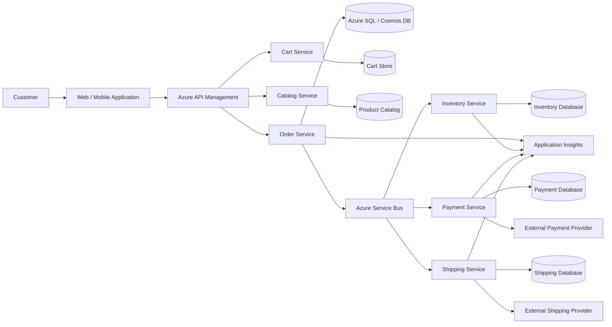
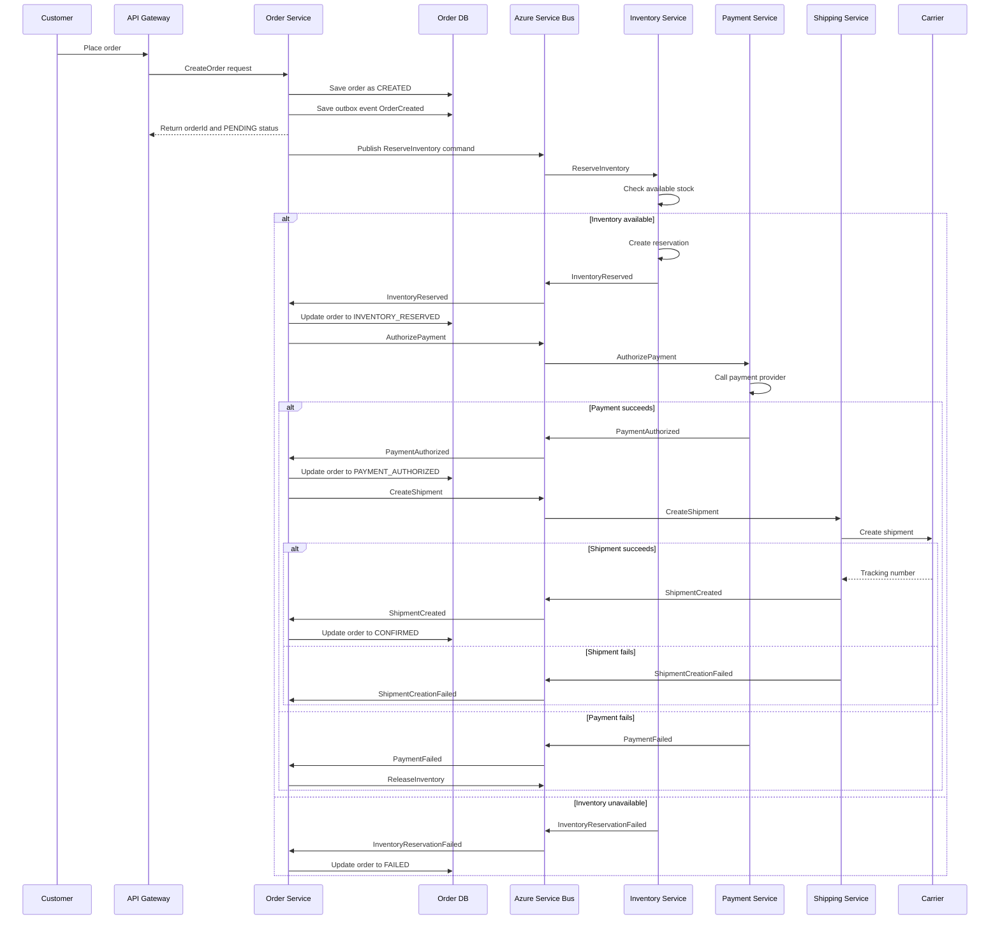
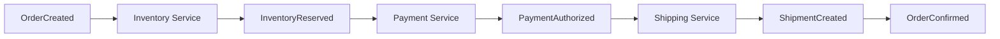
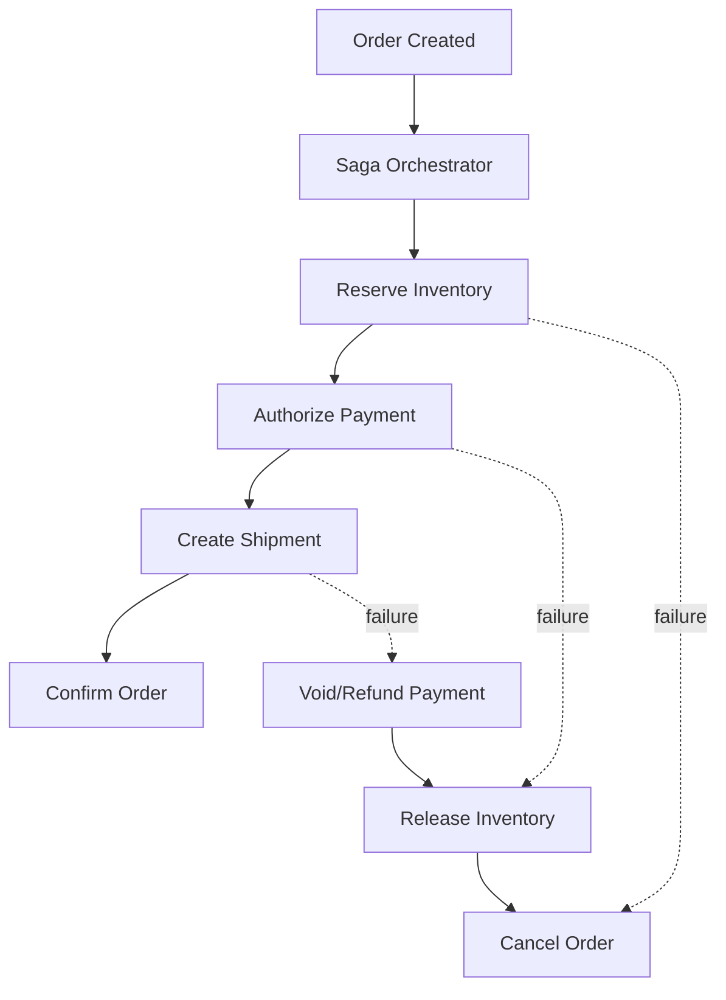
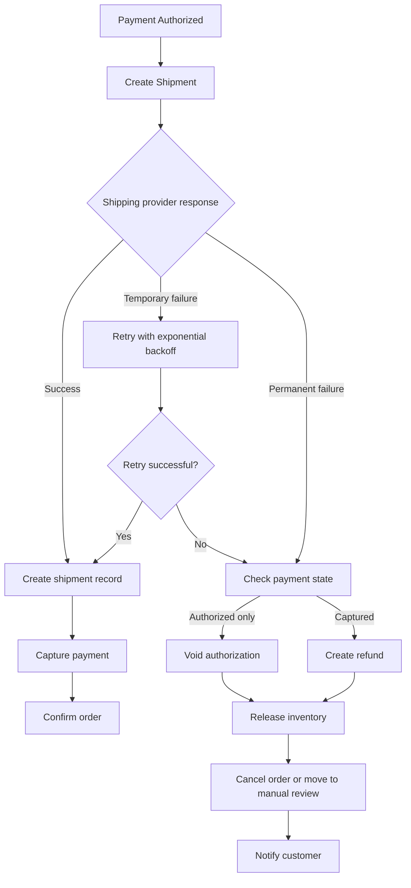
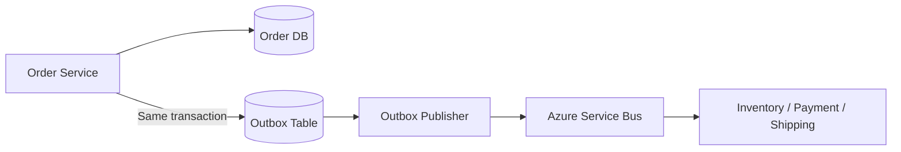
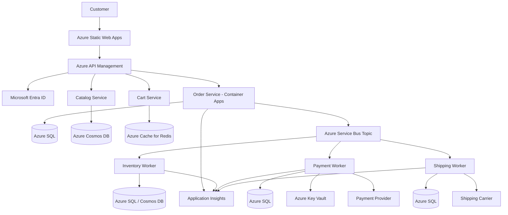
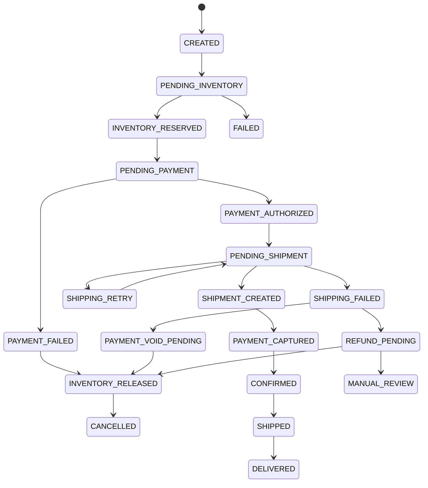
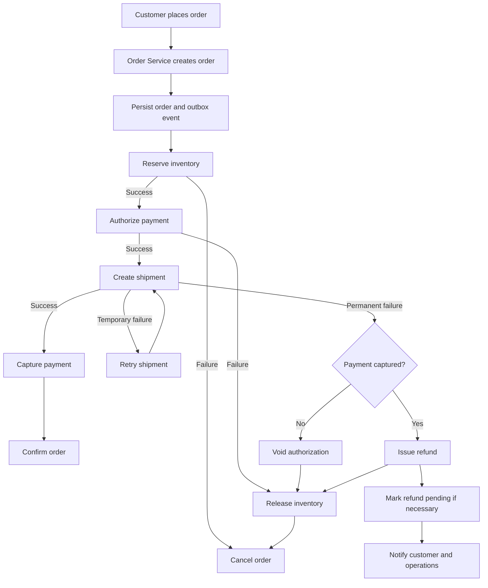

# E-commerce / Order Management System Design

## Interview Preparation Guide

This document explains how to design an e-commerce order management system covering:

- Order creation
- Inventory reservation
- Payment authorization and capture
- Shipping and fulfillment
- Failure handling
- Distributed transactions
- Azure cloud implementation
- Idempotency, retries, observability, and scalability

---

## 1. Problem Statement

Design an order management system that allows a customer to:

1. Add products to a cart.
2. Place an order.
3. Reserve inventory.
4. Process payment.
5. Create a shipment.
6. Track the order lifecycle.

The system must handle partial failures such as:

- Payment failure
- Inventory unavailable
- Shipping provider unavailable
- Payment succeeds but shipping fails
- Duplicate requests
- Timeout after a successful payment
- Service retries
- Message duplication
- Out-of-order events

The key challenge is that Order, Inventory, Payment, and Shipping are usually separate services and cannot participate in a single traditional ACID transaction.

---

# 2. High-Level Architecture



## Main Components

| Component | Responsibility |
|---|---|
| API Gateway | Authentication, throttling, routing, API versioning |
| Order Service | Creates and manages orders |
| Inventory Service | Checks and reserves stock |
| Payment Service | Authorizes or captures payment |
| Shipping Service | Creates shipment and generates tracking information |
| Service Bus | Asynchronous communication and reliable message delivery |
| Order Database | Stores order state and audit history |
| Inventory Database | Stores stock, reservations, and inventory movements |
| Payment Database | Stores payment attempts and transaction references |
| Shipping Database | Stores shipment status and tracking details |
| Outbox Processor | Reliably publishes database changes as events |
| Background Workers | Process retries, timeouts, and compensating actions |

---

# 3. Recommended Service Boundaries

## 3.1 Order Service

The Order Service owns the order lifecycle.

Example order states:

```text
CREATED
PENDING_INVENTORY
INVENTORY_RESERVED
PENDING_PAYMENT
PAYMENT_AUTHORIZED
PENDING_SHIPMENT
SHIPMENT_CREATED
CONFIRMED
CANCELLED
FAILED
REFUND_PENDING
REFUNDED
```

The Order Service should not directly modify inventory or payment databases.

It communicates using commands and events.

### Commands

- `CreateOrder`
- `ReserveInventory`
- `ReleaseInventory`
- `AuthorizePayment`
- `CapturePayment`
- `RefundPayment`
- `CreateShipment`
- `CancelShipment`

### Events

- `OrderCreated`
- `InventoryReserved`
- `InventoryReservationFailed`
- `PaymentAuthorized`
- `PaymentFailed`
- `ShipmentCreated`
- `ShipmentCreationFailed`
- `OrderConfirmed`
- `OrderCancelled`
- `RefundCompleted`

---

## 3.2 Inventory Service

The Inventory Service owns:

- Available stock
- Reserved stock
- Sold stock
- Inventory adjustments
- Reservation expiration

Example inventory calculation:

```text
availableQuantity = totalQuantity - reservedQuantity - soldQuantity
```

Inventory must be reserved before accepting payment whenever possible.

A reservation should have an expiration time, for example:

```text
Reservation duration = 15 minutes
```

If payment does not complete within the reservation period, the reservation can be released.

---

## 3.3 Payment Service

The Payment Service owns:

- Payment attempts
- Authorization
- Capture
- Refund
- Payment provider integration
- Provider webhooks
- Idempotency keys
- Payment audit records

A payment should never be treated as successful solely because an HTTP request returned successfully.

The system should verify the payment provider response or webhook and persist the provider transaction ID.

---

## 3.4 Shipping Service

The Shipping Service owns:

- Shipment creation
- Address validation
- Carrier integration
- Shipping labels
- Tracking numbers
- Shipment cancellation
- Delivery status

The Shipping Service should use an adapter pattern for different carriers:

```text
ShippingProvider
 ├── FedExAdapter
 ├── UPSAdapter
 ├── DHLAdapter
 └── InternalCarrierAdapter
```

---

# 4. Order Creation Flow

## Normal Flow



---

# 5. Synchronous vs Asynchronous Communication

## Synchronous Operations

Use synchronous communication when the client needs an immediate response.

Examples:

- Product lookup
- Cart retrieval
- Order submission acknowledgment
- Querying order status
- Payment status lookup

Example:

```text
POST /orders
Response: 202 Accepted
{
  "orderId": "ORD-1001",
  "status": "PENDING_INVENTORY"
}
```

## Asynchronous Operations

Use asynchronous communication for long-running workflows.

Examples:

- Inventory reservation
- Payment processing
- Shipment creation
- Refunds
- Notifications
- Carrier updates

Azure implementation:

- Azure Service Bus Queue for point-to-point commands
- Azure Service Bus Topic for publishing events to multiple consumers
- Azure Functions or containerized workers for processing messages

---

# 6. Why a Distributed Transaction Is Required

Order placement spans multiple databases and external providers:

```text
Order Database
Inventory Database
Payment Provider
Shipping Provider
```

A single ACID transaction cannot reliably cover all of them.

For example:

```text
BEGIN TRANSACTION
    Insert Order
    Update Inventory
    Charge Credit Card
    Create Shipment
COMMIT
```

This approach is unsafe because:

- External payment providers do not participate in the database transaction.
- Network failures can occur after payment succeeds.
- Shipping systems may be unavailable.
- A database transaction may remain open for too long.
- Distributed locking reduces scalability.

The recommended approach is a **Saga Pattern**.

---

# 7. Saga Pattern

A Saga breaks the business transaction into multiple local transactions.

Each service commits its own transaction and publishes an event.

If a later step fails, the system executes a compensating action.

## Example

| Forward Action | Compensating Action |
|---|---|
| Create order | Cancel order |
| Reserve inventory | Release inventory |
| Authorize payment | Void authorization |
| Capture payment | Refund payment |
| Create shipment | Cancel shipment |

There are two common Saga implementations.

---

## 7.1 Choreography-Based Saga

Each service listens to events and decides what to do next.



### Advantages

- Loosely coupled
- No central coordinator
- Easy to add event consumers

### Disadvantages

- Business flow becomes difficult to understand
- Logic is distributed across multiple services
- Error handling can become complicated
- Risk of circular event dependencies

---

## 7.2 Orchestration-Based Saga

A central Saga Orchestrator controls the workflow.



### Advantages

- Workflow is explicit
- Easier to monitor
- Centralized timeout and retry handling
- Better for complex business processes

### Disadvantages

- Orchestrator becomes an important component
- Must be highly available
- Poor design can create tight coupling

For an interview, a good answer is:

> I would use an orchestration-based Saga for the order workflow because inventory, payment, and shipping have explicit dependencies and require coordinated compensation.

Azure options include:

- Azure Durable Functions
- Azure Logic Apps
- A custom orchestration service running on Azure Container Apps or AKS
- Azure Service Bus for commands and events

---

# 8. Payment Succeeds but Shipping Fails

This is a common interview scenario.

## Scenario

```text
1. Order created
2. Inventory reserved
3. Payment authorized or captured
4. Shipping provider fails
```

The system must not lose the order or silently charge the customer without recovery.

## Important Question: Was Payment Authorized or Captured?

### Authorization

The card is approved, but money is not permanently transferred.

If shipping fails:

```text
Void payment authorization
Release inventory
Cancel order
```

This is the preferred model for physical products.

### Capture

The money has already been captured.

If shipping fails:

```text
Attempt shipping retry
If permanently failed:
    Cancel shipment
    Release inventory if appropriate
    Issue refund
    Mark order as REFUND_PENDING
```

## Recommended Flow



## Best Payment Strategy

For physical goods, use:

```text
Authorize payment
Reserve inventory
Create shipment
Capture payment
```

This reduces the need for refunds when shipping cannot be created.

However, this strategy depends on:

- Payment authorization expiry
- Carrier integration timing
- Inventory reservation timeout
- Payment provider capabilities

If authorization expires before shipment creation, the system should:

1. Re-authorize the payment.
2. Verify inventory reservation.
3. Continue the workflow.
4. Move to manual review if re-authorization fails.

---

# 9. Failure Handling Matrix

| Failure | Action | Final Order State |
|---|---|---|
| Product unavailable | Do not process payment | `FAILED` |
| Inventory reservation timeout | Retry, then cancel | `CANCELLED` |
| Payment declined | Release inventory | `PAYMENT_FAILED` |
| Payment timeout | Query provider using idempotency key | `PAYMENT_PENDING` |
| Payment succeeds but event is lost | Reconcile payment provider | `PAYMENT_AUTHORIZED` |
| Shipping temporary failure | Retry | `PENDING_SHIPMENT` |
| Shipping permanent failure after authorization | Void authorization | `CANCELLED` |
| Shipping permanent failure after capture | Refund payment | `REFUND_PENDING` |
| Refund fails | Retry and alert operations | `REFUND_PENDING` |
| Duplicate event | Ignore using event ID | No state change |
| Carrier timeout | Retry with provider idempotency key | `PENDING_SHIPMENT` |

---

# 10. Idempotency

Distributed systems retry operations. Every command that can cause a side effect must be idempotent.

## Example Idempotency Key

```http
POST /payments/authorize
Idempotency-Key: ORDER-1001-PAYMENT-ATTEMPT-1
```

The Payment Service stores:

```text
idempotencyKey
orderId
paymentAttemptId
providerTransactionId
status
createdAt
```

If the same request is received again:

```text
If idempotency key exists:
    Return the previous result
Else:
    Process payment and save result
```

Idempotency is required for:

- Order creation
- Inventory reservation
- Payment authorization
- Payment capture
- Refund
- Shipment creation
- Notification publishing

---

# 11. Transactional Outbox Pattern

A common failure occurs when the service updates its database but fails to publish the event.

## Unsafe Implementation

```text
1. Update order database
2. Publish OrderCreated event
```

If the application crashes between steps 1 and 2, the order is saved but no workflow starts.

## Safe Implementation

```text
BEGIN DATABASE TRANSACTION
    Insert order
    Insert OrderCreated event into outbox table
COMMIT
```

A background publisher reads the outbox table and sends events to Azure Service Bus.



The outbox record can contain:

```json
{
  "eventId": "evt-123",
  "eventType": "OrderCreated",
  "aggregateId": "ORD-1001",
  "payload": {},
  "status": "PENDING",
  "retryCount": 0
}
```

---

# 12. Inbox Pattern and Duplicate Events

At-least-once delivery means a message can be delivered multiple times.

Each consumer should maintain an inbox or processed-message table.

```text
BEGIN TRANSACTION
    If eventId already processed:
        Ignore event
    Else:
        Process event
        Save eventId as processed
COMMIT
```

This ensures duplicate messages do not produce duplicate payments, reservations, or shipments.

---

# 13. Azure Cloud Implementation

## Recommended Azure Services

| Requirement | Azure Service |
|---|---|
| API gateway | Azure API Management |
| Web application | Azure Static Web Apps or Azure App Service |
| Microservices | Azure Container Apps or AKS |
| Serverless workflow | Azure Durable Functions |
| Messaging | Azure Service Bus |
| Relational transactions | Azure SQL Database |
| Flexible document model | Azure Cosmos DB |
| Cache | Azure Cache for Redis |
| Secrets | Azure Key Vault |
| Monitoring | Azure Monitor and Application Insights |
| Logs | Log Analytics Workspace |
| Object storage | Azure Blob Storage |
| Identity | Microsoft Entra ID |
| Notifications | Azure Communication Services or SendGrid |
| Event streaming | Azure Event Hubs |
| CI/CD | GitHub Actions or Azure DevOps |

---

## Suggested Azure Architecture



---

# 14. Azure Service Bus Design

## Queues

Use queues for commands intended for one consumer.

Examples:

```text
inventory-commands
payment-commands
shipping-commands
refund-commands
```

## Topics and Subscriptions

Use topics for events consumed by multiple services.

Example topic:

```text
order-events
```

Subscriptions:

```text
inventory-subscription
payment-subscription
shipping-subscription
notification-subscription
analytics-subscription
```

## Dead-Letter Queues

Messages should move to a dead-letter queue after repeated processing failures.

Operations teams can:

- Inspect the failed message
- Correct data if required
- Replay the message
- Resolve provider issues
- Manually complete the order

---

# 15. Order State Machine



The system should prevent invalid transitions.

For example:

```text
CONFIRMED -> INVENTORY_RESERVED
```

should not be allowed.

---

# 16. Database Design

## Order Table

```sql
CREATE TABLE Orders (
    OrderId              VARCHAR(50) PRIMARY KEY,
    CustomerId           VARCHAR(50) NOT NULL,
    Status               VARCHAR(50) NOT NULL,
    TotalAmount          DECIMAL(18, 2) NOT NULL,
    Currency              VARCHAR(10) NOT NULL,
    InventoryReservationId VARCHAR(100),
    PaymentId            VARCHAR(100),
    ShipmentId           VARCHAR(100),
    Version              INT NOT NULL,
    CreatedAt            DATETIME2 NOT NULL,
    UpdatedAt            DATETIME2 NOT NULL
);
```

## Order Items Table

```sql
CREATE TABLE OrderItems (
    OrderItemId          VARCHAR(50) PRIMARY KEY,
    OrderId              VARCHAR(50) NOT NULL,
    ProductId            VARCHAR(50) NOT NULL,
    Quantity              INT NOT NULL,
    UnitPrice             DECIMAL(18, 2) NOT NULL,
    FOREIGN KEY (OrderId) REFERENCES Orders(OrderId)
);
```

## Inventory Reservation Table

```sql
CREATE TABLE InventoryReservations (
    ReservationId        VARCHAR(100) PRIMARY KEY,
    OrderId              VARCHAR(50) NOT NULL,
    ProductId            VARCHAR(50) NOT NULL,
    Quantity             INT NOT NULL,
    Status               VARCHAR(30) NOT NULL,
    ExpiresAt            DATETIME2 NOT NULL,
    CreatedAt            DATETIME2 NOT NULL
);
```

## Payment Transaction Table

```sql
CREATE TABLE PaymentTransactions (
    PaymentTransactionId VARCHAR(100) PRIMARY KEY,
    OrderId              VARCHAR(50) NOT NULL,
    IdempotencyKey       VARCHAR(200) UNIQUE NOT NULL,
    ProviderTransactionId VARCHAR(200),
    Status               VARCHAR(30) NOT NULL,
    Amount               DECIMAL(18, 2) NOT NULL,
    CreatedAt            DATETIME2 NOT NULL,
    UpdatedAt            DATETIME2 NOT NULL
);
```

---

# 17. Concurrency and Inventory Overselling

Two customers may try to buy the last item simultaneously.

## Unsafe Flow

```text
Customer A reads stock = 1
Customer B reads stock = 1
Customer A decreases stock
Customer B decreases stock
```

This can cause overselling.

## Safe Options

### Optimistic Concurrency

Use a version column:

```sql
UPDATE Inventory
SET AvailableQuantity = AvailableQuantity - @quantity,
    Version = Version + 1
WHERE ProductId = @productId
  AND AvailableQuantity >= @quantity
  AND Version = @expectedVersion;
```

If zero rows are updated, retry or report insufficient stock.

### Pessimistic Locking

Lock the inventory row during the update.

This is simpler but may reduce throughput.

### Atomic Redis Operation

For very high-volume inventory, use an atomic Lua script in Redis, while treating the durable inventory database as the source of truth.

---

# 18. Retry Strategy

Retries should be used only for transient failures.

## Exponential Backoff

Example schedule:

```text
Attempt 1: immediately
Attempt 2: after 2 seconds
Attempt 3: after 10 seconds
Attempt 4: after 30 seconds
Attempt 5: after 2 minutes
```

Add jitter to avoid many workers retrying simultaneously.

```text
delay = baseDelay * 2^attempt + randomJitter
```

Do not retry:

- Invalid card
- Invalid address
- Product permanently unavailable
- Invalid request
- Authentication failure

Use a circuit breaker for external payment and shipping providers.

---

# 19. Timeouts and Reconciliation

A timeout does not necessarily mean failure.

For example:

```text
Payment request sent
Payment provider times out
```

The provider might have successfully charged the customer.

The Payment Service must not immediately retry the charge with a new transaction.

Correct process:

1. Use the same idempotency key.
2. Query the payment provider.
3. Check provider webhook events.
4. Reconcile the local payment record.
5. Continue or compensate based on the confirmed result.

A scheduled reconciliation worker can periodically check:

```text
Local payment status = PENDING
Provider status = SUCCESS
```

and update the local database.

---

# 20. Observability

Every request and event should carry a correlation ID.

Example:

```text
CorrelationId: corr-789
OrderId: ORD-1001
PaymentAttemptId: PAY-2001
EventId: EVT-3001
```

Use Azure Application Insights to track:

- Order processing duration
- Inventory reservation failures
- Payment failure rate
- Shipping provider latency
- Refund failures
- Saga timeout count
- Dead-letter queue messages
- Orders stuck in intermediate states

Important dashboards:

```text
Orders created per minute
Payment success percentage
Inventory reservation failure percentage
Average time from order to shipment
Orders pending for more than 15 minutes
Refunds pending
Messages in dead-letter queues
```

---

# 21. Security Considerations

## Payment Security

- Do not store raw card numbers.
- Use payment provider tokenization.
- Store only provider references and masked details.
- Use Azure Key Vault for secrets.
- Apply least-privilege access.
- Enable encryption at rest and in transit.

## API Security

- Use Microsoft Entra ID or OAuth 2.0.
- Validate authorization for every order.
- Apply rate limiting in API Management.
- Validate all input data.
- Protect against replay attacks.
- Use TLS everywhere.

## Data Privacy

- Minimize personally identifiable information.
- Encrypt sensitive customer data.
- Apply retention policies.
- Audit access to order and payment data.

---

# 22. API Examples

## Create Order

```http
POST /api/v1/orders
Idempotency-Key: customer-123-cart-456
Content-Type: application/json
```

```json
{
  "customerId": "CUS-123",
  "items": [
    {
      "productId": "PROD-100",
      "quantity": 2
    }
  ],
  "shippingAddress": {
    "line1": "100 Main Street",
    "city": "Seattle",
    "state": "WA",
    "postalCode": "98101",
    "country": "US"
  },
  "paymentMethodToken": "pm_token_123"
}
```

Response:

```http
202 Accepted
```

```json
{
  "orderId": "ORD-1001",
  "status": "PENDING_INVENTORY",
  "statusUrl": "/api/v1/orders/ORD-1001"
}
```

## Get Order Status

```http
GET /api/v1/orders/ORD-1001
```

```json
{
  "orderId": "ORD-1001",
  "status": "PENDING_SHIPMENT",
  "paymentStatus": "AUTHORIZED",
  "inventoryStatus": "RESERVED",
  "shippingStatus": "PENDING"
}
```

---

# 23. How to Answer the Interview Question

A concise interview answer could be:

> I would split the system into Order, Inventory, Payment, and Shipping services, with each service owning its own data. The Order Service would start an orchestration-based Saga. It would first reserve inventory, then authorize payment, then create a shipment. Once shipping is successfully created, payment would be captured and the order would be confirmed.
>
> I would use Azure API Management for the API layer, Azure Service Bus for asynchronous commands and events, Azure SQL or Cosmos DB for persistence, Azure Durable Functions for Saga orchestration, Azure Key Vault for secrets, and Application Insights for observability.
>
> Because this is a distributed workflow, I would not use a two-phase commit. Each service would use local transactions, transactional outbox, idempotency keys, retries, and compensating actions.
>
> If payment succeeds but shipping fails, I would retry temporary shipping failures. If payment was only authorized, I would void the authorization and release inventory. If payment was captured, I would issue a refund, release inventory, mark the order as refund-pending, and notify the customer. The operation must be idempotent and recoverable if the network fails after payment succeeds.

---

# 24. Key Design Decisions

## Use Authorization Before Capture

For physical goods:

```text
Reserve inventory
Authorize payment
Create shipment
Capture payment
Confirm order
```

This reduces refund scenarios.

## Use an Orchestrated Saga

The workflow has dependencies and compensating actions, so orchestration provides better visibility and control.

## Use At-Least-Once Delivery

At-least-once delivery with idempotent consumers is more reliable than trying to guarantee exactly-once delivery across distributed systems.

## Use the Outbox Pattern

The outbox pattern prevents database updates from succeeding while event publication fails.

## Use Explicit State Transitions

Order state should be modeled as a state machine rather than as loosely related Boolean flags.

## Build for Recovery

Every intermediate state should have:

- Timeout handling
- Retry behavior
- Reconciliation logic
- Manual recovery option
- Audit trail

---

# 25. Final Architecture Summary



The main principle is:

> Do not try to make the entire order workflow one distributed database transaction. Use a Saga with local transactions, reliable messaging, idempotency, compensating actions, and operational recovery.
