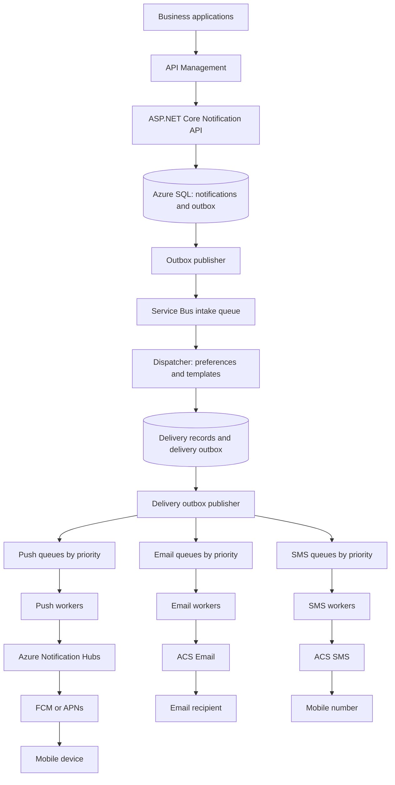
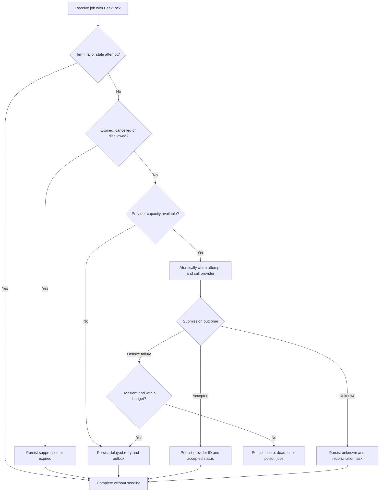
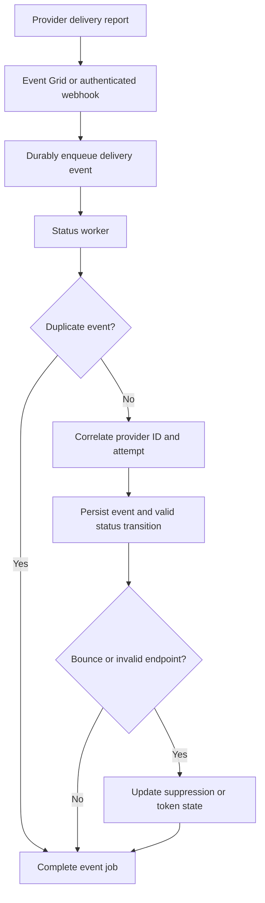

# Design a Notification System: Email, SMS and Push at Million-User Scale

> Interview preparation for experienced developers and technical leads. Azure reference architecture with ASP.NET Core examples. Verified against Microsoft documentation on 1 October 2026.

## 1. Interview question

**Design a notification system supporting email, SMS and push notifications for millions of users. How would you handle queues, priorities, retries and failures?**

Start by clarifying whether notifications are transactional, promotional, or both; expected peak requests per second; channels per request; delivery deadlines; target countries; consent requirements; and the meaning of “delivered.” Millions of registered users does not automatically mean millions of simultaneous sends.

## 2. A strong opening answer

“I would build an asynchronous notification platform. An ASP.NET Core API validates requests and durably records the notification with an outbox entry before returning HTTP 202. Background services resolve user preferences and create independent email, SMS and push delivery jobs. Azure Service Bus queues separate channels and priorities, while independently scaled workers call Azure Communication Services for email and SMS, and Azure Notification Hubs for mobile push.

“I would reserve worker and provider capacity for urgent traffic, enforce global provider rate limits, retry transient failures using delayed exponential backoff with jitter, and send poison messages to dead-letter queues. Durable delivery records and provider idempotency, where supported, reduce duplicates. Delivery callbacks update status asynchronously. I would explicitly handle ambiguous provider timeouts because exactly-once external delivery cannot be guaranteed by the queue alone.”

## 3. Requirements and assumptions

### Functional requirements

- Send transactional notifications such as OTPs, order confirmations, payment receipts and security alerts.
- Send campaigns to large user segments without blocking transactional traffic.
- Support email, SMS and mobile push, with versioned templates and localization.
- Respect user preferences, unsubscribe rules, quiet hours and frequency limits.
- Support scheduled sends, cancellation where still possible, and status lookup.
- Record delivery attempts and expose operational replay tools.
- Support multiple providers through channel adapters when business requirements justify them.

### Nonfunctional requirements

| Requirement | Design response |
|---|---|
| Durable acceptance | Commit notification and outbox together before returning 202 |
| High throughput | Queue buffering, parallel workers and bounded fan-out |
| Low urgent latency | Isolated queues, reserved capacity and provider quota |
| Failure isolation | Separate channels, worker pools and circuit breakers |
| Reliable processing | PeekLock, durable state, retry outbox and dead-letter handling |
| Duplicate reduction | API idempotency, unique delivery keys and provider reconciliation |
| Traceability | Correlation IDs, attempt records and delivery events |
| Security | Managed identities, Key Vault, authorization and data minimization |

**Sample design targets, not Azure guarantees:** 99.9% API availability; urgent notifications submitted to a provider within 5 seconds at p95 under the agreed load; normal notifications within 60 seconds; campaigns within their configured delivery window. Measure provider submission separately from recipient delivery.

## 4. Azure service mapping

| Component | Azure service / technology | Purpose |
|---|---|---|
| API gateway | Azure API Management | Authenticate, authorize, validate and rate-limit callers |
| Notification API | ASP.NET Core on Azure Container Apps | Accept requests and expose status endpoints |
| Durable operational store | Azure SQL Database | Notifications, deliveries, preferences, attempts and transactional outbox |
| Alternative high-scale store | Azure Cosmos DB | Partitioned records; redesign transactions within logical partitions |
| Broker | Azure Service Bus | Durable channel jobs, delayed messages and dead-letter subqueues |
| Workers | .NET Worker Services on Container Apps | Independent email, SMS and push consumers |
| Serverless alternative | Azure Functions with Service Bus triggers | Event-driven processing with explicitly controlled concurrency |
| Email | Azure Communication Services Email | Submit email and track asynchronous results |
| SMS | Azure Communication Services SMS | Submit supported SMS workloads and receive delivery reports |
| Mobile push | Azure Notification Hubs | Route push to platform services such as FCM and APNs |
| Delivery events | Azure Event Grid / provider webhooks | Ingest supported delivery reports asynchronously |
| Distributed rate limiter | Azure Managed Redis | Atomic quota counters and token buckets |
| Templates / large content | Azure Blob Storage | Store versioned content; queue messages carry references |
| Secrets | Azure Key Vault | Provider credentials where managed identity is unavailable |
| Observability | Azure Monitor, Application Insights | Traces, metrics, dashboards and alerts |

Service Bus is the work broker here; Event Grid is useful for distributing delivery events. Notification Hubs is the mobile push gateway, while Communication Services provides email and SMS. Actual country coverage, sender eligibility, quotas and pricing must be checked for the deployment [S1–S4].

## 5. Architecture flowchart



**Read the chart:** acceptance is a database transaction; publication is recoverable through an outbox; the dispatcher creates a job per selected channel; each channel is processed independently. Delivery feedback has its own flow below.

### Why two outboxes?

The first bridges API acceptance and the intake queue. The second bridges dispatcher database writes and channel queues. Every boundary that writes a database and publishes a message needs a recovery strategy. A reliable intake outbox alone does not fix a dispatcher that creates three jobs but crashes after publishing only one.

## 6. End-to-end example: order confirmation

1. Order Service emits an order-confirmed event, ideally through its own outbox, or calls the notification API with an idempotency key.
2. The API validates the tenant, template, recipient reference and request payload.
3. One SQL transaction inserts the notification and intake outbox record.
4. The API returns `202 Accepted`, a notification ID and a status URL. This means durably accepted, not delivered.
5. The publisher sends the intake job to Service Bus and marks the outbox entry published after broker acknowledgment.
6. The dispatcher resolves preferences and checks whether email, SMS and push are allowed for this notification category.
7. One transaction creates uniquely keyed channel deliveries and their outbox entries. Duplicate intake processing finds those existing records.
8. Publishers route each job to the relevant channel and priority queue.
9. Workers recheck expiry, cancellation, consent and provider capacity before sending.
10. Provider submission results and later delivery reports update channel status independently.

If email succeeds while SMS fails, the parent notification reports a partial result. Retrying SMS must not resend successful email or push jobs.

## 7. Queue design

### Recommended baseline: channel × priority queues

| Channel | Urgent | Normal | Bulk |
|---|---|---|---|
| Email | `email-urgent` | `email-normal` | `email-bulk` |
| SMS | `sms-urgent` | `sms-normal` | `sms-bulk` |
| Push | `push-urgent` | `push-normal` | `push-bulk` |

Use three priority levels initially; nine queues are manageable. Each queue has a dead-letter subqueue. Workers on the same queue compete for jobs rather than each receiving a copy [S1, S5].

Separate channel queues prevent an SMS outage from consuming email capacity. Separate priority queues prevent a campaign backlog from blocking an OTP.

**Service Bus does not automatically reorder a queue because a custom `Priority` property is present.** Implement priority through separate queues or filtered subscriptions and consumer scheduling. Microsoft’s Azure priority example uses topic subscription filters [S6].

### Alternative: topic and filtered subscriptions

Publish one message per channel delivery to a `notification-deliveries` topic. Set application properties `Channel` and `Priority`; define mutually exclusive filters such as:

```sql
Channel = 'sms' AND Priority = 'urgent'
```

Remove the default match-all rule when configuring filters. A matching subscription receives a copy; accidentally overlapping filters can create duplicate work. Keep the physical topology consistent: use either direct channel queues or this topic-based routing baseline, rather than accidentally publishing each job through both.

### Message envelope

```json
{
  "schemaVersion": 1,
  "notificationId": "ntf-1001",
  "deliveryId": "del-1001-sms",
  "tenantId": "tenant-01",
  "recipientId": "user-789",
  "channel": "sms",
  "priority": "urgent",
  "templateId": "login-otp",
  "templateVersion": 3,
  "payloadReference": "payload-1001",
  "attempt": 1,
  "expiresAtUtc": "2026-10-01T15:00:00Z",
  "correlationId": "corr-456"
}
```

Keep contact information and secrets out of general queue payloads where possible. Resolve them through authorized storage. OTP values require restricted storage, short retention and redacted logs.

## 8. Priorities and starvation prevention

| Priority | Examples | Scheduling policy |
|---|---|---|
| Urgent | OTP, fraud alert, password reset | Warm workers and reserved provider quota |
| Normal | Receipt, shipping update | Guaranteed baseline capacity |
| Bulk | Campaign, newsletter | Throttled, resumable and deadline-aware |

Use dedicated urgent workers for stronger latency isolation. Reserve downstream provider tokens too: urgent workers still stall if bulk traffic consumes all SMS quota.

For shared spare capacity, use weighted scheduling, for example 70% urgent, 20% normal and 10% bulk. These are illustrative starting weights. Allow unused capacity to be borrowed, enforce minimum service for lower priorities, and watch the oldest message age. Strictly draining urgent messages first can starve normal traffic forever.

Limit how much urgent work each tenant can submit. Assign priority through trusted policy, not an unrestricted client-supplied field.

Queue isolation gives differentiated processing latency; it does not preempt a provider request already in progress or guarantee strict ordering across queues.

## 9. Retry strategy

### Classify before retrying

| Failure | Classification | Action |
|---|---|---|
| HTTP 429 | Provider throttling | Respect Retry-After and reduce aggregate send rate |
| Temporary 5xx / unavailable provider | Transient or potentially ambiguous | Retry only after evaluating submission outcome |
| Connection failure before submission | Usually transient | Schedule bounded retry |
| Timeout after request transmission | Unknown outcome | Reconcile before blindly resending |
| Invalid email / unsupported number | Permanent recipient error | Record failure; suppress repeated invalid sends |
| Invalid template or malformed job | Poison data | Dead-letter with actionable reason |
| Invalid push token | Permanent endpoint error | Invalidate that token; keep other endpoints active |
| Provider credential failure | Operational configuration error | Pause affected sends and alert operators |

Provider-specific error contracts determine the final classification. Do not treat every HTTP 400 as a recipient problem or every HTTP 500 as definitely unsent.

### Exponential backoff with jitter

```text
delay = random(0, min(cap, base × 2^(attempt - 1)))
nextAttempt = now + max(delay, providerRetryAfter)
```

Illustrative normal-message policy: at most five provider attempts, with a base delay of 5 seconds and cap of 5 minutes. Urgent OTPs use a shorter policy constrained by their business expiry. Stop if the next attempt would occur after expiry.

Jitter spreads retries across time so thousands of workers do not retry together. Keep broker connection retries separate from business delivery attempts. SDK retries, worker retries and broker redeliveries must share a controlled budget rather than multiplying sends.

### Durable delayed retry

1. Persist a delivery state transition to `RetryScheduled` and a retry outbox row in one database transaction.
2. Complete the current queue message only after that durable decision commits.
3. The publisher sends a scheduled Service Bus message to the same channel-priority queue.
4. The retried job keeps the same `DeliveryId` but uses a distinct transport `MessageId`, such as `del-1001-sms:attempt:2`.
5. The worker checks the durable attempt state before executing.

The publisher uses the same transport ID when retrying publication of the same outbox record. A deliberate new delivery attempt needs a different transport ID; otherwise broker duplicate detection can suppress it within its window [S7].

Do not keep a message locked while sleeping for minutes. Abandoning a message is also not a delayed exponential-backoff scheduler: it may become available immediately. Track an application attempt counter across newly scheduled messages; broker `DeliveryCount` does not represent all attempts across those messages.

## 10. Worker flowchart: retries and failures



For permanent recipient errors, record a terminal failure and normally complete the message. For poison jobs or exhausted technical processing, dead-letter with a reason. If persistence fails, do not complete the job; allow recovery through redelivery.

## 11. Message settlement and worker crashes

Use Service Bus **PeekLock** rather than ReceiveAndDelete for reliable delivery processing [S8].

| Operation | Meaning in this design |
|---|---|
| Complete | Durable outcome or durable follow-up work exists; remove current message |
| Abandon | Release for redelivery after recoverable processing failure |
| DeadLetter | Quarantine job with a reason and description |
| Renew lock | Extend processing ownership while bounded work continues |

Renew locks for long processing and tune prefetch conservatively. A message can spend time waiting in a prefetched buffer while its lock ages. Limit concurrency according to provider quotas and database capacity.

A crash before completing the message causes redelivery. A crash after a provider accepts the send but before the database records it produces an ambiguous delivery. Locking and database uniqueness help control concurrent attempts, but they cannot undo an external send.

## 12. Idempotency and duplicate prevention

Use multiple layers because each protects a different boundary.

| Layer | Key / mechanism | Protection |
|---|---|---|
| API | `(TenantId, IdempotencyKey)` plus request hash | Repeated caller submissions |
| Dispatcher | Unique `(NotificationId, RecipientId, Channel, EndpointId)` | Repeated channel or device expansion |
| Broker publication | Stable transport MessageId per outbox event | Duplicate publication within configured window |
| Worker | Atomic claim, row version and durable attempt state | Concurrent or repeated processing |
| Provider | Provider-supported idempotency key / lookup | Repeated external submissions where supported |
| Callbacks | Unique provider event ID | Duplicate delivery reports |

Return the original notification for a repeated API key with the same payload; reject reuse with conflicting content. Retain idempotency records for at least the accepted replay horizon.

**Do not promise exactly-once recipient delivery.** Broker deduplication has a finite window and does not make the provider API transactional with your database. A provider may accept a send and then time out before replying.

For `Unknown` outcomes, query provider state where available, wait for correlated callbacks, or send to a reconciliation workflow. Only use provider idempotency when that specific API documents it. Without it, choose a business policy: critical alerts may tolerate duplicate risk; marketing may prefer avoiding a resend. Provider failover has the same duplicate risk when the first provider's outcome is unknown.

## 13. Delivery status and callbacks

### Suggested delivery states

`Pending`, `Queued`, `Submitting`, `AcceptedByProvider`, `Delivered`, `RetryScheduled`, `Unknown`, `FailedPermanent`, `Suppressed`, `Expired`, `Cancelled`.

Store status per channel and per push endpoint when targeted individually. Aggregate parent status from those results; a successful channel does not mean every channel succeeded.



Authenticate webhook requests and durably enqueue before acknowledging them. Handle duplicated, delayed and out-of-order events. A late report for attempt 1 must not overwrite newer attempt state incorrectly. Persist unmatched events for later correlation if feedback arrives before the submission response is saved.

Email provider acceptance does not prove inbox placement. SMS delivery reports depend on provider and carrier support. Push gateway acceptance does not prove the device displayed the message. Use application acknowledgments if the product needs a stronger push receipt signal; distinguish “delivered,” “displayed” and “read.”

## 14. Dead-letter queue operations

A DLQ is an operational recovery tool, not a place to forget failures. Service Bus supports explicit dead-lettering and automatic conditions such as maximum delivery count; expiry dead-lettering requires the relevant configuration [S5].

Record reason codes such as `InvalidPayload`, `TemplateNotFound`, `ProcessingAttemptsExceeded` and `UnsupportedSchemaVersion`. Include safe diagnostic metadata and correlation IDs, not message secrets.

Recovery procedure:

1. Alert on DLQ growth and oldest dead-letter age.
2. Group failures by root cause and inspect a sample.
3. Fix the template, code or configuration.
4. Recheck expiry, cancellation, consent and existing delivery status.
5. Replay a small batch through the normal rate-limited path.
6. Observe results and increase replay throughput gradually.

Replay gets a new transport event ID while preserving delivery identity and audit history. Never reset an already delivered record merely to make replay possible. Retain failed-recipient records for diagnostics without repeatedly replaying known invalid addresses.

## 15. Scaling to millions of users

### Capacity example

Assume 10 million users, 20 million logical notifications per day, and 1.5 selected channels per notification:

```text
Channel delivery jobs/day = 20,000,000 × 1.5 = 30,000,000
Average job rate = 30,000,000 / 86,400 ≈ 347 jobs/second
Illustrative peak at 10× average ≈ 3,472 jobs/second
```

Include retries and push devices per user in the actual forecast. Push device fan-out can make endpoint sends exceed channel-job count.

If a worker instance sustains 50 jobs/second under measured provider latency and quota, then 3,472 jobs/second needs approximately 70 instances before headroom. This is arithmetic for planning, not a benchmark or Azure capacity claim. Size each channel separately.

### Scale workers without overwhelming providers

Use Container Apps scaling based on Service Bus backlog and monitor oldest-message age. Queue depth alone misses latency violations and says little about provider saturation. Cap worker instances and per-instance concurrency.

Use an atomic distributed token bucket keyed by provider, channel and account. Add tenant and recipient limits. Per-worker local limiters alone allow the global rate to multiply as replicas increase.

ACS has service limits and onboarding quotas. Secure the required throughput before relying on it for a campaign; more workers cannot overcome an approved provider quota [S4]. Load-test the broker and database; choose Service Bus capacity based on measured throughput, message size, features and isolation requirements.

### Large campaigns

- Store a campaign definition and recipient-selection policy.
- Expand recipients in bounded pages, for example 1,000 at a time, with durable checkpoints.
- Write idempotent delivery records and outbox entries per page.
- Throttle expansion based on queue capacity and downstream delivery rate.
- Recheck current unsubscribe and suppression state near actual send time.
- Pause or cancel remaining jobs without undoing already submitted sends.

Do not create an enormous in-memory recipient list or include millions of addresses in one queue message. Notification Hubs tag-based broadcasts may reduce application-level push expansion when detailed per-device tracking is unnecessary; that is a deliberate trade-off against individualized audit and delivery control [S3].

## 16. Backpressure and outage recovery

Queues absorb bursts; they do not provide infinite capacity.

Pause campaign expansion when backlog age or storage approaches limits. Apply tenant admission limits, return 429 when callers exceed their allowance, and return 503 if durable acceptance cannot be completed. Do not return 202 before durable persistence.

For a provider outage, open a circuit breaker and durably postpone work instead of repeatedly calling the failing provider. Half-open with a small number of probes. On recovery, drain gradually with reserved urgent capacity and the global rate limiter.

For a 30-minute outage at 1,000 jobs/second, backlog grows by approximately 1.8 million jobs. If restored capacity is 1,500 jobs/second while arrivals continue at 1,000, net drain is 500 jobs/second: about 60 minutes to clear the backlog, ignoring expiry and retries. Recovery capacity must exceed live traffic.

## 17. Data model

| Table | Important fields |
|---|---|
| Notifications | Id, TenantId, IdempotencyKey, RequestHash, Category, CreatedAt, ExpiresAt |
| Deliveries | Id, NotificationId, RecipientId, Channel, EndpointId, Priority, Status, RowVersion |
| DeliveryAttempts | DeliveryId, AttemptNumber, Provider, ProviderMessageId, Outcome, StartedAt, ErrorCode |
| Outbox | EventId, EventType, PayloadReference, AvailableAt, PublishedAt, PublishAttempts |
| DeliveryEvents | ProviderEventId, ProviderMessageId, AttemptReference, EventType, OccurredAt |
| Preferences | UserId, Category, AllowedChannels, Locale, QuietHours, TimeZone |
| DeviceEndpoints | UserId, InstallationId, Platform, TokenReference, IsActive, UpdatedAt |
| Templates | TemplateId, Version, Channel, Locale, ContentReference |
| Suppressions | RecipientReference, Channel, Reason, CreatedAt |

Index pending outbox rows, delivery IDs, provider message IDs and tenant-created time. Use pagination and retention policies for historical records. Avoid endlessly updating one campaign row for every recipient; aggregate counts asynchronously or in batches.

Azure SQL is a clear initial choice for transaction and uniqueness requirements. At higher volumes consider database partitioning or Cosmos DB, but preserve transaction boundaries and design partition keys around real access patterns. Moving to Cosmos DB does not make cross-partition atomicity automatic.

## 18. ASP.NET Core API and worker sketch

### API contract

```http
POST /api/notifications
Idempotency-Key: order-987-confirmation
Content-Type: application/json

{
  "recipientId": "user-789",
  "category": "OrderConfirmation",
  "channels": ["email", "push"],
  "templateId": "order-confirmed",
  "data": { "orderId": "987" }
}
```

```http
HTTP/1.1 202 Accepted
Location: /api/notifications/ntf-1001

{ "notificationId": "ntf-1001", "status": "Accepted" }
```

Authorize tenant access to both submission and status APIs. The server maps category to an allowed priority and checks whether requested channels are permitted.

### Conceptual worker logic

```csharp
// Pseudocode: repositories encapsulate atomic claims, state transitions,
// durable retry/reconciliation outbox writes, and optimistic concurrency.
async Task HandleAsync(DeliveryJob job, QueueContext queue, CancellationToken ct)
{
    var decision = await store.TryPrepareAttemptAsync(job, ct);

    if (decision.IsTerminalOrStale)
    {
        await queue.CompleteAsync(ct);
        return;
    }

    if (!await limiter.TryAcquireAsync(decision.ProviderQuotaKey, ct))
    {
        await store.ScheduleCapacityRetryAsync(job, ct);
        await queue.CompleteAsync(ct);
        return;
    }

    var result = await adapter.SubmitAsync(decision.Request, ct);

    // PersistOutcome writes either an accepted result, a retry outbox,
    // an unknown-outcome reconciliation outbox, or a permanent failure.
    await store.PersistOutcomeAsync(job, result, ct);
    await queue.CompleteAsync(ct);
}
```

This illustrates boundaries rather than production-ready code. Implement adapter timeouts as `Unknown` when acceptance is uncertain, claim leases with recovery rules, lock renewal, durable expiry/cancellation decisions, and a poison-message path. A missing database commit or a lost claim must never silently become success. Use the current `Azure.Messaging.ServiceBus` SDK for concrete Service Bus integration [S7].

## 19. Ordering, quiet hours and fallback

**Ordering:** independent alerts normally do not require global ordering. Where necessary, use Service Bus sessions keyed by a meaningful stream such as user and workflow. Parallel independent queues do not preserve cross-channel or cross-priority order. Prefer version checks and expiry for obsolete alerts; do not impose one global session that serializes all users.

**Quiet hours:** calculate the next allowed send time using the user's time zone and daylight-saving rules. Store scheduling instants in UTC. Recheck policy before submission. Define business-approved exceptions for security and transactional categories.

**Channel fallback:** represent fallback as a policy-driven workflow, such as push then SMS after a specified timeout. Persist which stage is active. Distinguish sending all selected channels from sending alternatives. Since push receipt is uncertain, a fallback may intentionally cause both channels to arrive.

**Cancellation:** mark pending work cancelled and have workers check it immediately before send. A queued cancellation cannot retract an SMS or email already accepted by a provider.

## 20. Security and regional resilience

Use Microsoft Entra ID and managed identities where supported; store remaining credentials in Key Vault. Apply least-privilege roles to publishers and consumers. Validate templates and escape untrusted substitutions. Avoid sensitive content on lock-screen push notifications.

Enforce tenant authorization, marketing consent, suppression lists and retention rules appropriate to the deployment. Keep addresses, phone numbers and OTPs out of general logs. Verify channel eligibility and country coverage rather than assuming global SMS support.

Begin with zone-resilient services where supported and tested backups. For regional disaster recovery, define RTO/RPO, database replication, broker recovery and provider failover explicitly. Broker metadata replication and message-data replication are different capabilities; confirm the selected configuration. Fence the old active region before replaying work in another region to reduce double sends. A second region alone does not guarantee recovery of accepted queued messages.

## 21. Observability and tests

| Metric | What it reveals |
|---|---|
| API acceptance latency and errors | Front-door reliability |
| Oldest unpublished outbox age | Database-to-broker publication failure |
| Queue age by channel and priority | Latency and starvation |
| Provider submission latency / 429 rate | Provider capacity bottleneck |
| Accepted-to-delivered duration | Downstream delivery behavior |
| Retry and DLQ rates | Transient or poison failures |
| Unknown-outcome age | Reconciliation backlog |
| Bounce and invalid-token rates | Recipient data quality |
| Cost per delivered notification | Channel efficiency |

Trace notification → delivery → attempt → provider ID. Alert on urgent message age before the deadline is breached. Separate permanent recipient failures from infrastructure errors in dashboards.

Meaningful tests include duplicate API submissions, dispatcher crash between channel publications, publisher crash after broker acceptance, worker crash after provider acceptance, delayed duplicate callbacks, provider 429 storms, campaign cancellation, OTP expiry during retry, and regional replay. Load-test bursts and backlog drain with realistic provider latency and quotas.

## 22. Interview trade-offs

| Decision | Benefit | Trade-off |
|---|---|---|
| Asynchronous processing | Fast API and burst buffering | Eventual results |
| Channel and priority queues | Isolation and urgent capacity | More entities and deployments |
| Transactional outbox | Recoverable database-to-broker publication | Publisher and cleanup work |
| Durable idempotency records | Safer redelivery | Storage and concurrency handling |
| Delayed retries | Reduced retry storms | More state and scheduling |
| DLQ with controlled replay | Diagnosis and recovery | Operational tooling |
| Provider abstraction | Easier failover | Different API semantics and duplicate risk |
| Individual push jobs | Detailed device tracking | More jobs than tag broadcasts |
| Warm urgent workers | Lower startup latency | Standing cost |

## 23. Common interviewer follow-up questions

### 1. Why not send directly inside the API?

Provider latency and outages would slow business transactions. Durable asynchronous acceptance lets workers recover independently and handles bursts. HTTP 202 must follow durable persistence.

### 2. How do you prevent an OTP from waiting behind a newsletter?

Separate urgent and bulk queues, reserved workers, reserved provider tokens, bounded bulk expansion and alerts on urgent queue age.

### 3. Is Service Bus duplicate detection enough?

No. It protects duplicate broker publication within a window. It does not prevent an external resend after a provider timeout or handle all replay horizons. Durable delivery identity and provider reconciliation are still needed.

### 4. What if the worker sends an email and crashes?

If acceptance was durably recorded, redelivery completes without sending again. If the crash happened before recording, recover it as an unknown outcome and reconcile. Without provider idempotency or a queryable result, duplicate-free recovery cannot be guaranteed.

### 5. What happens when SMS is unavailable for an hour?

Open the SMS circuit breaker, postpone SMS work durably and preserve queue capacity. Email and push continue independently. On recovery, drain under global limits; expire obsolete OTPs.

### 6. What if one user has five devices?

Store installations per user and decide whether to notify all active devices or selected devices. Use endpoint-level delivery keys where individual tracking matters. Invalid tokens remove only the affected endpoint.

### 7. How do you avoid retrying an expired OTP?

Carry an absolute business expiry and recheck it before every provider call and retry schedule. Broker TTL is a supplementary control, not the sole business expiry check.

### 8. Can email failure trigger SMS automatically?

Only through a configured fallback policy that checks consent, cost, category and outcome. An unknown email outcome differs from a definite failure and may result in both channels arriving.

### 9. Can adding workers fix a huge backlog?

Only if the provider, broker and database have spare capacity. Otherwise it increases throttling and contention. Scale within the global provider budget and control arrivals.

### 10. What is the most important reliability issue?

The nontransactional boundary between provider submission and recording its result. Outboxes solve internal publication gaps; external side effects still need idempotency, reconciliation and explicit business policies.

## 24. A two-minute closing answer

“My design separates durable acceptance, delivery orchestration and provider submission. Azure SQL stores notification state and transactional outboxes; Azure Service Bus buffers jobs by channel and priority. Independent .NET workers send through ACS Email, ACS SMS and Azure Notification Hubs.

“Urgent traffic gets reserved workers and provider quota. I use bounded retries with scheduled messages, exponential backoff and jitter; invalid recipients become terminal failures, while poison jobs go to a monitored DLQ. Workers use PeekLock and complete only after a durable outcome or follow-up action exists.

“I reduce duplicates with API idempotency, unique channel delivery records, broker MessageIds and provider capabilities. I treat post-submission timeouts as unknown and reconcile them. Provider callbacks update statuses idempotently, and I measure queue age, submission latency, delivery results and failures. Millions of users are handled through paged fan-out, independently scaled workers and global rate limits, with recovery capacity planned above live traffic.”

## 25. Official references and static-site notes

Architecture choices, sample capacities, policies and SLOs above are proposed design decisions. Azure capabilities and constraints are grounded in these primary sources:

- **[S1]** [Azure Service Bus overview](https://learn.microsoft.com/en-us/azure/service-bus-messaging/service-bus-messaging-overview)
- **[S2]** [Azure Communication Services documentation](https://learn.microsoft.com/en-us/azure/communication-services/)
- **[S3]** [Azure Notification Hubs overview](https://learn.microsoft.com/en-us/azure/notification-hubs/notification-hubs-push-notification-overview)
- **[S4]** [Azure Communication Services limits](https://learn.microsoft.com/en-us/azure/communication-services/concepts/service-limits)
- **[S5]** [Service Bus dead-letter queues](https://learn.microsoft.com/en-us/azure/service-bus-messaging/service-bus-dead-letter-queues)
- **[S6]** [Azure Priority Queue pattern](https://learn.microsoft.com/en-us/azure/architecture/patterns/priority-queue)
- **[S7]** [Service Bus duplicate detection](https://learn.microsoft.com/en-us/azure/service-bus-messaging/duplicate-detection)
- **[S8]** [Service Bus locks and settlement](https://learn.microsoft.com/en-us/azure/service-bus-messaging/message-transfers-locks-settlement)

The file uses standard Markdown tables and fenced Mermaid diagrams. Your static site's Markdown renderer must support Mermaid to display the flowcharts; a plain Markdown renderer will show their source code. GitHub Markdown viewing supports Mermaid, while a GitHub Pages site needs Mermaid configured in its theme or build pipeline.
