# API Gateway Design for 50+ Microservices

## Interview Preparation Guide

This guide explains how to design an API Gateway for a platform with more than 50 microservices. It covers where to implement:

- Authentication
- Authorization
- Rate limiting
- Routing
- Throttling
- API versioning
- Request validation
- Observability
- Resiliency
- Azure cloud integration

The examples use Azure API Management, Azure Front Door, Web Application Firewall, Microsoft Entra ID, Azure Container Apps, Azure Kubernetes Service, Azure Service Bus, Azure Key Vault, and Application Insights.

---

## 1. Problem Statement

Assume the platform has more than 50 backend services:

```text
Catalog Service
Order Service
Payment Service
Inventory Service
Shipping Service
Customer Service
Search Service
Recommendation Service
Notification Service
Reporting Service
...
```

Clients should not call all services directly. Direct service exposure creates several problems:

- Clients need to know the location of every service.
- Authentication and authorization logic becomes duplicated.
- Each service must independently implement rate limiting and API policies.
- Internal service addresses become publicly exposed.
- API version migrations become difficult.
- Observability is fragmented.
- A mobile or browser client may need to make many backend calls.
- Security policies can become inconsistent.

The API Gateway provides a controlled entry point for external clients while keeping internal services private.

> The gateway should centralize cross-cutting concerns, but business authorization and business validation should remain inside the owning service.

---

# 2. High-Level Architecture

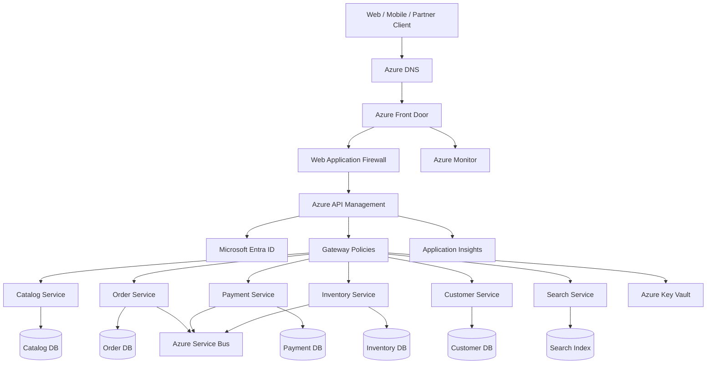

## Recommended Azure Layers

| Layer | Azure service | Main responsibility |
|---|---|---|
| DNS and global entry | Azure DNS | Resolve the public API domain |
| Global edge | Azure Front Door | Global routing, TLS, caching, health-based failover |
| Edge security | Azure Front Door WAF | Protect against common web attacks and malicious traffic |
| API gateway | Azure API Management | Authentication, policies, routing, quotas, transformations, versioning |
| Identity | Microsoft Entra ID | OAuth 2.0, OpenID Connect, JWT issuance and validation |
| Compute | Azure Container Apps or AKS | Host microservices and internal APIs |
| Secrets | Azure Key Vault | Store certificates, backend secrets, and signing material |
| Messaging | Azure Service Bus | Asynchronous internal communication |
| Monitoring | Application Insights and Azure Monitor | Logs, metrics, traces, alerts, and dashboards |

---

# 3. Responsibilities of the API Gateway

The gateway should handle cross-cutting concerns that are common to many APIs:

```text
Client authentication
Token validation
Coarse-grained authorization
TLS termination
Request routing
API version selection
Rate limiting
Quotas and throttling
Request size limits
Schema validation
Header normalization
Correlation ID propagation
Response transformation
Caching for safe read operations
Backend timeout policies
Observability and audit logging
```

The gateway should not become a business-logic monolith.

Avoid putting the following in gateway policies:

```text
Inventory decisions
Payment business rules
Order state transitions
Customer-specific pricing decisions
Complex multi-service workflows
Long-running business operations
```

Those responsibilities belong to the appropriate domain service or an orchestration component.

---

# 4. Request Flow Through the Gateway

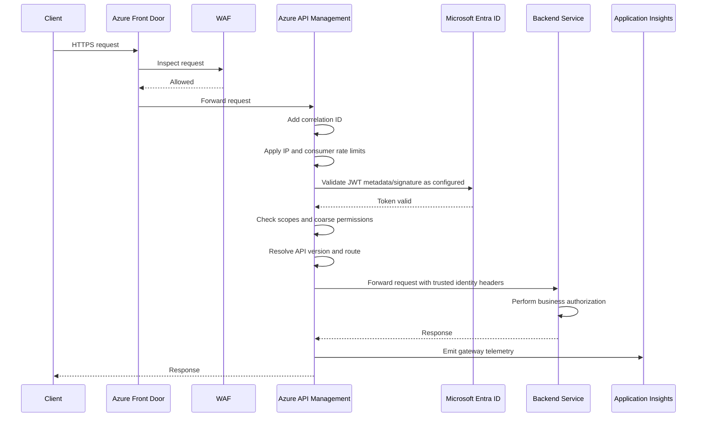

A request should be rejected as early as possible when the failure is structural:

```text
Invalid TLS       -> Front Door
Blocked attack    -> WAF
Invalid token     -> API Management
Rate limit hit    -> API Management
Missing resource permission -> Service or gateway, depending on policy
Business rule failure -> Domain service
```

---

# 5. Authentication: Where Should It Be Implemented?

## Recommended Location

Implement client authentication at the edge and gateway:

```text
Client -> Microsoft Entra ID -> Access token
Client -> Front Door / WAF -> API Management
API Management validates token
```

Use OAuth 2.0 and OpenID Connect for user-facing applications. Use client credentials flow for service-to-service or partner integrations where appropriate.

## Azure Implementation

- Microsoft Entra ID issues access tokens.
- Azure API Management validates JWT tokens with a `validate-jwt` policy.
- Azure Front Door provides TLS termination and WAF protection.
- Backend services receive trusted identity claims only after the gateway has validated the token.

## Important Security Rule

Gateway validation is not the only security boundary.

Services should also validate:

- The authenticated principal or service identity.
- Required scopes or roles for sensitive operations.
- Tenant membership.
- Resource ownership.
- Business permissions.

Why? Internal calls might bypass the external gateway, and a compromised internal component should not automatically have unrestricted access.

## Example JWT Claims

```json
{
  "sub": "user-123",
  "oid": "entra-object-id",
  "tid": "tenant-id",
  "aud": "api://commerce-api",
  "scp": "orders.read orders.write",
  "roles": ["customer"],
  "exp": 1790784000
}
```

## Authentication Flow

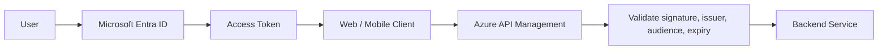

## API Key Authentication

API keys can be useful for:

- Low-risk internal utilities.
- Partner identification.
- Subscription-level quota tracking.

They should not replace OAuth tokens for user authentication or high-value operations. Store and rotate API keys securely, and never put them in source code.

---

# 6. Authorization: Gateway Versus Service

Authorization should be split into two levels.

## Gateway-Level Authorization

The gateway can perform coarse-grained checks:

```text
Does the token contain orders.read?
Does the partner have access to this API product?
Is the client allowed to call version 2?
Is the request from an approved tenant?
```

## Service-Level Authorization

The domain service must enforce business and resource-level authorization:

```text
Can this customer view order ORD-1001?
Can this employee refund this payment?
Can this tenant access this product?
Can this user update inventory?
```

## Example Authorization Split

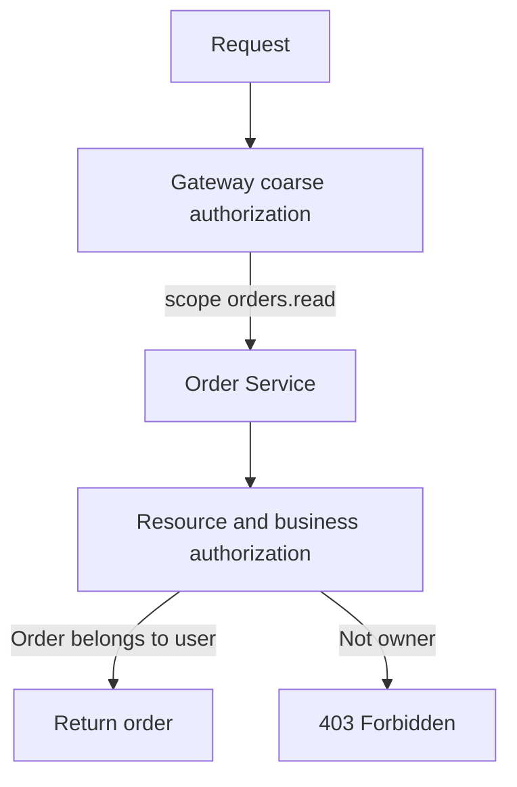

## Recommended Rule

> The gateway decides whether the caller may invoke an API capability. The service decides whether the caller may perform the operation on the specific business resource.

## Azure API Management Policy Example

```xml
<policies>
  <inbound>
    <base />
    <validate-jwt header-name="Authorization"
                  failed-validation-httpcode="401"
                  failed-validation-error-message="Invalid access token">
      <openid-config url="https://login.microsoftonline.com/{tenant-id}/v2.0/.well-known/openid-configuration" />
      <required-claims>
        <claim name="aud">
          <value>api://commerce-api</value>
        </claim>
        <claim name="scp">
          <value>orders.read</value>
        </claim>
      </required-claims>
    </validate-jwt>
  </inbound>
</policies>
```

Use policy fragments and named values so the same security policy can be managed consistently without copying large policy blocks to every API.

---

# 7. Routing Across 50+ Services

The gateway should provide a stable public API surface while backend locations remain private and changeable.

## Path-Based Routing

```text
GET /api/v1/catalog/products     -> Catalog Service
POST /api/v1/orders              -> Order Service
GET /api/v1/orders/{id}          -> Order Service
POST /api/v1/payments            -> Payment Service
GET /api/v1/inventory/{sku}      -> Inventory Service
```

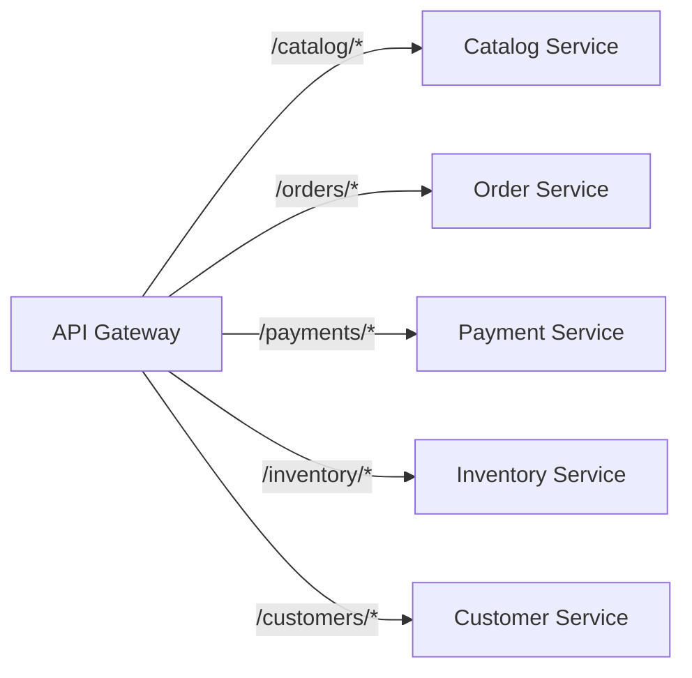

## Host-Based Routing

```text
api.example.com/catalog  -> Catalog API
api.example.com/orders   -> Order API
partners.example.com     -> Partner API product
admin.example.com        -> Admin API product
```

## Header-Based Routing

Header-based routing can be used for:

- Canary releases.
- Internal preview versions.
- Tenant-specific backend routing.
- Migration from a legacy service.

Example:

```text
X-Release: canary -> route to canary backend
X-Tenant-Tier: premium -> route to premium capacity pool
```

Avoid allowing clients to arbitrarily choose privileged backend routes. Header values must be validated and controlled by gateway policy.

## Private Backend Access

Backends should not be publicly exposed. Use:

- Internal load balancers.
- Private endpoints.
- VNet integration.
- Private DNS zones.
- AKS internal services.
- Container Apps internal ingress.

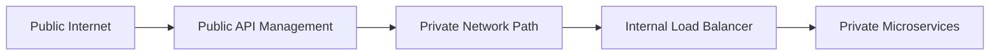

---

# 8. Rate Limiting, Quotas, and Throttling

These terms are related but different.

## Rate Limiting

Limits requests within a time window.

```text
100 requests per minute per consumer
```

## Quota

Limits total usage over a larger period.

```text
1 million requests per month for a partner subscription
```

## Throttling

The behavior applied when a limit is reached, normally returning `429 Too Many Requests` and optionally a `Retry-After` header.

## Rate-Limit Dimensions

Use several dimensions rather than only IP address:

```text
Per IP address
Per user identity
Per tenant
Per subscription or partner
Per API product
Per route
Per HTTP method
Per payment or high-risk operation
```

IP-only limiting is not sufficient because many users may share a corporate NAT or mobile carrier address.

## Example Limits

| Consumer | Endpoint | Limit |
|---|---|---:|
| Anonymous client | Product search | 60 requests/minute/IP |
| Authenticated user | Order reads | 300 requests/minute/user |
| Partner | Catalog APIs | 10,000 requests/minute/subscription |
| Payment client | Payment creation | 20 requests/minute/customer |
| Admin client | Bulk export | 10 requests/minute/user |

## Azure API Management Policy Example

```xml
<policies>
  <inbound>
    <base />
    <rate-limit-by-key
        calls="100"
        renewal-period="60"
        counter-key="@(context.Subscription?.Id ?? context.Request.IpAddress)" />

    <quota-by-key
        calls="1000000"
        bandwidth="0"
        renewal-period="604800"
        counter-key="@(context.Subscription?.Id ?? context.Request.IpAddress)" />
  </inbound>
  <outbound>
    <base />
    <set-header name="X-RateLimit-Policy" exists-action="override">
      <value>standard-api-policy</value>
    </set-header>
  </outbound>
</policies>
```

The exact policy syntax should be tested against the selected API Management tier and policy version.

## Handling 429 Responses

```http
HTTP/1.1 429 Too Many Requests
Retry-After: 30
Content-Type: application/json
```

```json
{
  "code": "rate_limit_exceeded",
  "message": "Too many requests. Retry after 30 seconds.",
  "correlationId": "corr-123"
}
```

Clients should use exponential backoff and respect `Retry-After`. Do not let clients retry aggressively after a 429 response.

---

# 9. API Versioning

API versioning allows the platform to evolve without breaking existing clients.

## Common Versioning Strategies

### URI Versioning

```text
/api/v1/orders
/api/v2/orders
```

Advantages:

- Easy to understand.
- Easy to route and monitor.
- Works well for public APIs.

Disadvantages:

- Creates multiple visible URL paths.

### Header Versioning

```http
X-API-Version: 2
```

Advantages:

- Keeps URLs clean.

Disadvantages:

- Less visible and more difficult to test manually.
- Clients can accidentally omit the header.

### Media-Type Versioning

```http
Accept: application/vnd.company.orders.v2+json
```

Advantages:

- Expresses version as a representation format.

Disadvantages:

- More complex for clients and gateway policies.

## Recommendation

For a large public or partner API, use URI versioning for major versions and maintain backward-compatible changes within a version.

```text
/api/v1/orders
/api/v2/orders
```

Use semantic compatibility rules:

```text
Safe within same major version:
- Add optional response field
- Add optional request field
- Add a new endpoint

Requires a new major version:
- Rename a response field
- Remove a field
- Change field meaning
- Change authentication requirements
- Change status-code semantics
```

## Version Routing

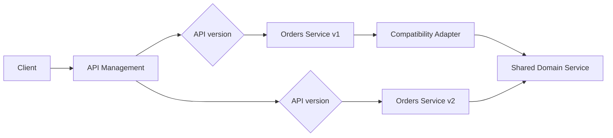

Avoid maintaining completely separate business implementations if a compatibility adapter can translate the old contract to the current internal model.

## Version Lifecycle

```text
1. Design v1
2. Publish v1
3. Introduce v2
4. Announce v1 deprecation
5. Monitor v1 usage
6. Contact remaining consumers
7. Stop new v1 subscriptions
8. Retire v1 after an announced date
```

Track usage by API version in Application Insights and API Management analytics.

---

# 10. Request Validation and Transformation

The gateway can perform structural validation:

- Required headers.
- Content type.
- Maximum body size.
- Query parameter formats.
- JSON schema validation for selected APIs.
- Header normalization.
- Removing unsafe client-supplied internal headers.

Example:

```text
Remove incoming X-User-Id header
Validate JWT
Set X-Authenticated-User from validated token
Forward X-Correlation-Id
```

Never trust identity headers sent directly by a client.

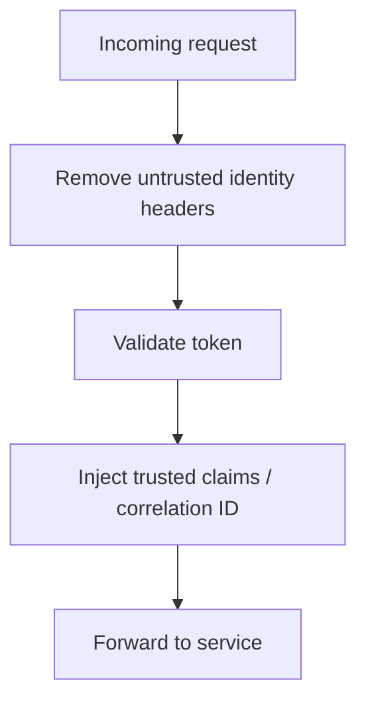

Use gateway transformation carefully. Excessive transformation can hide contract problems and make debugging difficult.

---

# 11. Timeouts, Retries, and Resiliency at the Gateway

The gateway should protect clients and backends from unbounded work.

## Gateway Responsibilities

- Set an upper bound on backend response time.
- Retry only safe operations where appropriate.
- Avoid retrying non-idempotent operations blindly.
- Return consistent error responses.
- Apply circuit-breaking or fail-fast behavior where supported.
- Propagate correlation IDs.

## Retry Rules

| Operation | Gateway retry recommendation |
|---|---|
| `GET` catalog | Limited retry may be acceptable |
| `GET` order status | Limited retry may be acceptable |
| `POST` create order | Do not blindly retry without idempotency key |
| `POST` payment | Never blindly retry without provider idempotency semantics |
| `PUT` replacement | Retry only if operation is idempotent and safe |
| `DELETE` | Depends on API contract and idempotency |

A gateway retry can multiply traffic during an outage. Keep retries low and coordinate them with backend resilience policies.

---

# 12. API Aggregation and Backend-for-Frontend

With 50+ services, a client may otherwise need many calls to render one screen.

## Without Aggregation

```text
Mobile client -> User Service
Mobile client -> Order Service
Mobile client -> Catalog Service
Mobile client -> Recommendation Service
Mobile client -> Notification Service
```

## With BFF or Aggregation

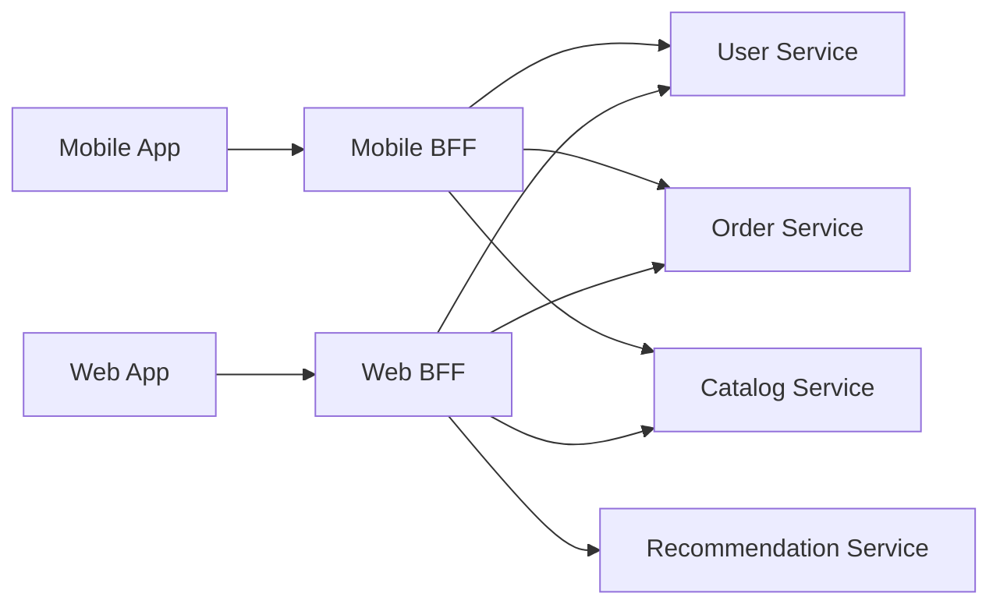

Azure options:

- API Management backend aggregation policies for simple cases.
- Azure Functions for lightweight BFFs.
- Azure Container Apps for independently deployed BFF services.

Do not turn the gateway into a long-running orchestration engine. For complex workflows, use a domain service, Saga orchestrator, or asynchronous workflow.

---

# 13. Observability

The gateway is the best place to create consistent ingress telemetry.

## Correlation Headers

```http
X-Correlation-Id: corr-789
X-Request-Id: req-456
Traceparent: 00-4bf92f3577b34da6a3ce929d0e0e4736-00f067aa0ba902b7-01
```

If the client supplies a correlation ID, validate its format and either accept it under controlled rules or generate a new one. Never allow arbitrary sensitive data in logging headers.

## Metrics

Track at least:

```text
Request count by API, operation, version, consumer, and region
4xx and 5xx rate
401 and 403 rate
429 rate
P50/P95/P99 latency
Backend latency
Gateway processing latency
Timeout count
Circuit-breaker state
Cache hit ratio
Traffic by subscription and tenant
```

## Azure Monitoring Flow

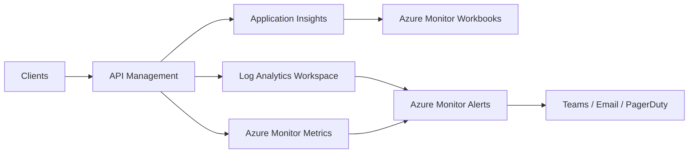

## Useful Dashboards

```text
Gateway traffic by API version
Top consumers by request volume
Rejected requests by reason
Rate-limit violations
Backend availability
Slowest backend operations
5xx errors by service
API version migration progress
```

Never log access tokens, passwords, card data, or sensitive request bodies.

---

# 14. Security Architecture

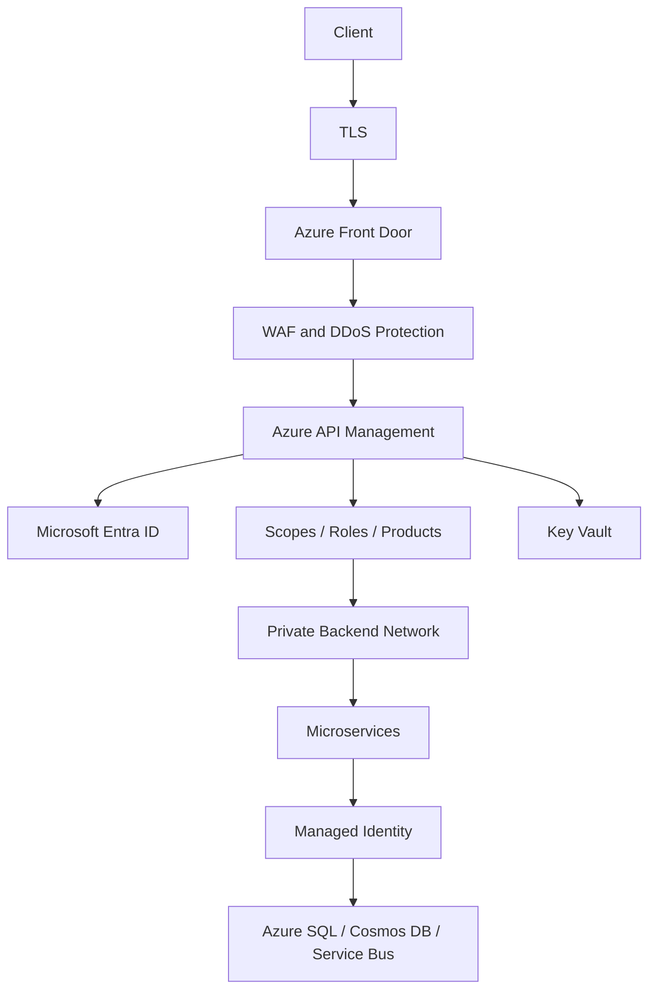

Recommended controls:

- TLS 1.2 or later.
- OAuth 2.0 and OpenID Connect.
- JWT validation at the gateway.
- Managed identities for Azure resources.
- Private endpoints for backend services and data stores.
- WAF policies at Front Door.
- DDoS protection appropriate to the threat model.
- APIM subscription keys for product and quota tracking.
- Key Vault for secrets and certificates.
- RBAC and least privilege.
- Network segmentation and controlled egress.
- Audit logs for administrative policy changes.

---

# 15. Scaling the API Gateway

An API Gateway can become a bottleneck if deployed as a single instance or overloaded with business logic.

## Scaling Strategies

- Use a managed, multi-instance API Management tier.
- Deploy regional gateway capacity where needed.
- Use Azure Front Door for global distribution and failover.
- Keep policies efficient and avoid expensive synchronous lookups.
- Cache safe read responses.
- Use backend connection reuse.
- Avoid large response transformations.
- Keep request and response payloads bounded.
- Scale backend services independently.

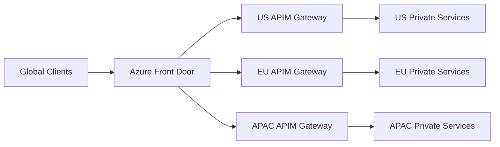

Choose active-active or active-passive multi-region operation based on data consistency, cost, and recovery requirements.

---

# 16. Azure API Management Organization

With 50+ services, manage the gateway using a hierarchy.

## Products

Group APIs for consumers:

```text
Public Product
Partner Product
Mobile Product
Internal Product
Admin Product
```

Products can define:

- APIs included.
- Subscription requirements.
- Approval workflow.
- Quotas.
- Terms of use.

## APIs and Operations

```text
API: Orders v1
  GET /orders
  GET /orders/{id}
  POST /orders

API: Orders v2
  GET /orders
  GET /orders/{id}
  POST /orders
```

## Policy Fragments

Create reusable policies for:

```text
validate-common-jwt
add-correlation-id
remove-untrusted-headers
standard-error-response
common-security-headers
consumer-rate-limit
```

## Named Values

Use named values backed by Key Vault for:

```text
Backend URLs
Certificate references
External provider endpoints
Feature flags
```

Do not embed secrets directly in policy XML or source control.

---

# 17. API Gateway Error Contract

Use a consistent error response across all APIs.

```json
{
  "error": {
    "code": "AUTHENTICATION_REQUIRED",
    "message": "A valid access token is required.",
    "details": [],
    "correlationId": "corr-789",
    "timestamp": "2026-09-30T12:00:00Z"
  }
}
```

Recommended status codes:

| Status | Meaning |
|---:|---|
| 400 | Invalid request format |
| 401 | Missing or invalid authentication |
| 403 | Authenticated but not authorized |
| 404 | Resource or route not found |
| 409 | Conflict or duplicate operation |
| 413 | Request body too large |
| 429 | Rate limit or quota exceeded |
| 500 | Unexpected gateway or service error |
| 502 | Invalid backend response or upstream failure |
| 503 | Backend temporarily unavailable |
| 504 | Backend timeout |

Do not expose internal stack traces, database details, or secret values.

---

# 18. Request Flow Examples

## Public Catalog Request

```text
GET /api/v1/catalog/products?category=books
```

Flow:

```text
1. Front Door receives HTTPS request.
2. WAF inspects request.
3. APIM identifies catalog API v1.
4. APIM applies anonymous/IP rate limit.
5. APIM optionally serves cached response.
6. APIM routes to Catalog Service.
7. Catalog Service returns data.
8. APIM emits telemetry and returns response.
```

## Authenticated Order Request

```text
POST /api/v1/orders
Authorization: Bearer <token>
Idempotency-Key: checkout-123-attempt-1
```

Flow:

```text
1. APIM validates JWT.
2. APIM requires orders.write scope.
3. APIM applies per-user and per-tenant limits.
4. APIM validates request size and content type.
5. APIM forwards correlation and identity context.
6. Order Service validates resource and business permissions.
7. Order Service handles idempotency and creates order.
8. API returns 202 Accepted or 201 Created according to contract.
```

## Payment Request

```text
POST /api/v1/payments
Authorization: Bearer <token>
Idempotency-Key: order-1001-payment-1
```

The gateway should validate authentication, authorization scope, payload size, and rate limits, but the Payment Service must own provider-specific idempotency and payment state.

---

# 19. When Not to Use the Gateway for Internal Calls

Not every service-to-service call should pass through the public gateway.

For internal communication, use:

- Private service discovery.
- Internal load balancers.
- Azure Service Bus for asynchronous workflows.
- Managed identity or workload identity.
- mTLS or service mesh controls where required.

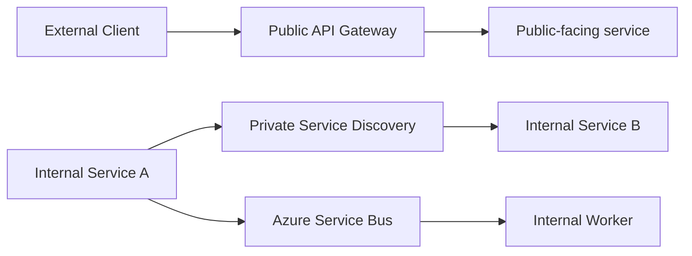

Routing every internal call through a public gateway can add latency, cost, and a single shared bottleneck.

---

# 20. Governance for 50+ APIs

At this scale, governance is essential.

## API Standards

Define organization-wide standards for:

```text
URL and resource naming
HTTP methods and status codes
Pagination
Filtering and sorting
Error contracts
Authentication scopes
Correlation IDs
API versioning
Deprecation policy
OpenAPI documentation
Rate-limit headers
Idempotency keys
```

## API Lifecycle

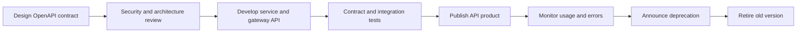

Use infrastructure as code and CI/CD to manage APIM APIs and policies consistently. Possible tools include:

- Bicep.
- Terraform.
- ARM templates.
- GitHub Actions.
- Azure DevOps pipelines.

---

# 21. Sample Interview Answer

> For 50 or more microservices, I would expose a small number of stable API products through Azure API Management instead of exposing every internal service directly. Azure Front Door and WAF would provide global routing, TLS, and edge protection. API Management would handle routing, JWT validation, scopes, subscriptions, rate limits, quotas, API versioning, request validation, correlation IDs, and consistent error responses.
>
> Authentication would be performed using Microsoft Entra ID. APIM would validate the token's signature, issuer, audience, expiry, and required scopes. Gateway authorization would be coarse-grained, such as checking `orders.read` or `orders.write`. The domain service would still perform resource-level and business authorization, such as verifying that an order belongs to the current user.
>
> Routing would be based primarily on API paths and versions, for example `/api/v1/orders` and `/api/v2/orders`. Backend services would remain private behind internal ingress, private endpoints, or internal load balancers. API Management products would group APIs for public users, partners, mobile clients, and administrators.
>
> Rate limiting would be applied by subscription, tenant, user, IP, and route depending on the risk. Quotas would control longer-term usage, while throttling would return HTTP 429 with a `Retry-After` header when a limit is exceeded. Payment and order-creation endpoints would have stricter controls and require idempotency keys.
>
> API versioning would use URI-based major versions for clarity. I would support backward-compatible changes within a major version, publish a new major version for breaking changes, measure usage of old versions, and retire them through a documented deprecation process.
>
> The gateway would emit correlation IDs and telemetry to Application Insights, including latency, 401/403/429/5xx rates, backend failures, and traffic by API version. I would avoid putting business logic or long-running workflows in the gateway. Complex operations would remain in domain services or asynchronous workflow components.

---

# 22. Key Design Decisions

| Concern | Recommended design |
|---|---|
| Authentication | Microsoft Entra ID with OAuth 2.0/OIDC and APIM JWT validation |
| Authorization | Coarse API/scope checks at gateway; resource/business checks in services |
| Routing | Path and version based, with private backend endpoints |
| Rate limiting | Subscription, tenant, user, IP, and route-aware limits |
| Throttling | HTTP 429 with `Retry-After` and client backoff |
| API versioning | URI-based major versions with a lifecycle policy |
| Security | Front Door WAF, TLS, Key Vault, Managed Identity, private networking |
| Resiliency | Timeouts, careful retries, backend health checks, circuit protection |
| Aggregation | BFF for client-specific composition; avoid business orchestration in gateway |
| Observability | Application Insights, Azure Monitor, correlation IDs, structured logs |
| Governance | Products, policy fragments, OpenAPI, IaC, CI/CD |

---

# 23. Common Pitfalls to Avoid

| Pitfall | Problem | Better approach |
|---|---|---|
| Gateway contains business logic | Gateway becomes a distributed monolith | Keep domain rules in services |
| Only gateway validates authorization | Internal bypass can become a security gap | Enforce resource authorization in services too |
| Rate limit only by IP | Shared NAT users are unfairly limited | Use identity, tenant, subscription, and route dimensions |
| Blind gateway retries | Duplicate orders or payments | Retry only safe operations; require idempotency keys |
| Publicly exposed microservices | Larger attack surface | Use private ingress and gateway-only external access |
| No version retirement process | Old APIs run forever | Track usage and publish deprecation dates |
| One global gateway for every region | Higher latency and regional blast radius | Use global edge routing and regional gateway capacity |
| Excessive transformations | Contracts become difficult to debug | Keep transformations small and explicit |
| Logging tokens or sensitive payloads | Security and compliance risk | Redact secrets and sensitive fields |
| No gateway observability | Difficult to identify bottlenecks | Track route, consumer, version, backend, and status metrics |

---

# 24. Final Architecture Diagram

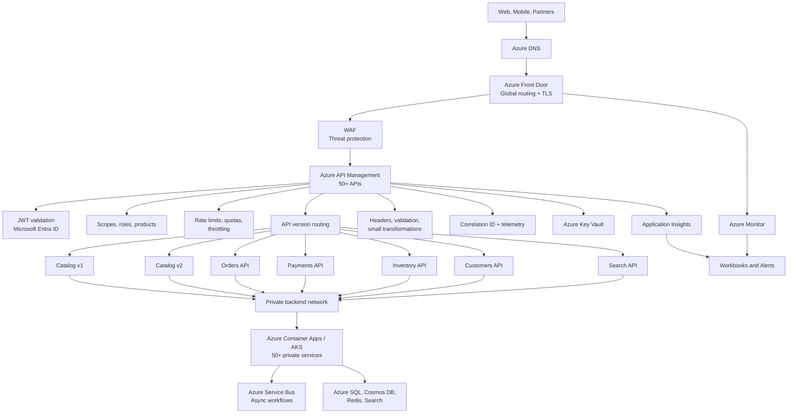

---

# 25. Final Takeaway

> For 50+ microservices, use Azure Front Door and WAF for global edge protection, Azure API Management as the centralized API Gateway, Microsoft Entra ID for identity, and private networking for backend services. Put authentication, coarse authorization, routing, rate limiting, throttling, versioning, validation, and ingress observability at the gateway. Keep resource-level authorization and business rules inside the owning service. Use products, policy fragments, OpenAPI, and infrastructure as code to govern the API estate. Keep the gateway stateless, scalable, and focused on cross-cutting concerns rather than business workflows.
