## Distributed Caching Solution Design

## Interview Preparation Guide

This guide explains how to design a distributed caching solution, covering Redis vs local cache, cache invalidation strategies, TTL, cache stampede prevention, and stale data handling, with Azure implementation.

---

## 1. Problem Statement

Design a caching layer that:

- Reduces database load and latency for frequently accessed data
- Works correctly across multiple service instances
- Keeps cached data reasonably fresh (avoids staleness)
- Prevents cache stampede (thundering herd) during cache misses or expiration
- Handles cache invalidation reliably when underlying data changes
- Scales to millions of requests per second

---

# 2. Local Cache vs Distributed Cache

## Local (In-Process) Cache

Data stored in application memory (e.g., `MemoryCache` in .NET).

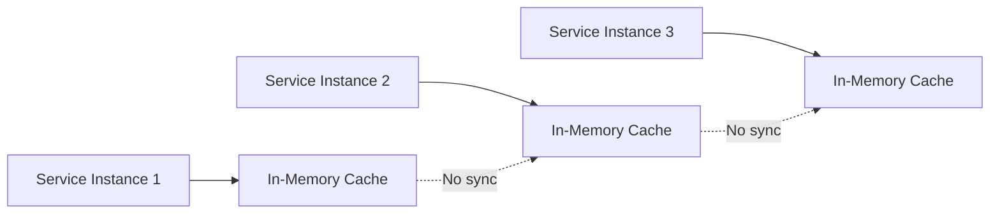

**Pros**:
- Extremely fast (no network call, nanoseconds)
- No external dependency
- Simple to implement

**Cons**:
- Each instance has its own copy — inconsistent across instances
- Memory limited by instance size
- Cache lost on instance restart/redeploy
- Doesn't scale cache capacity independently from compute
- Cache invalidation must be broadcast to all instances (hard)

**Best for**: Rarely-changing reference data (country codes, config flags), per-request memoization, data where slight inconsistency across instances is acceptable.

---

## Distributed Cache (Redis)

Data stored in a separate, shared cache tier that all instances access.

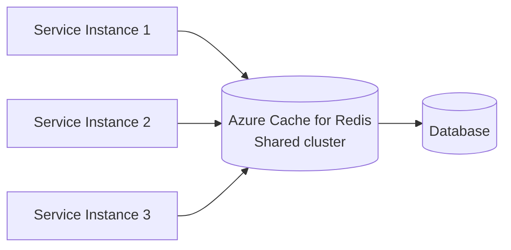

**Pros**:
- Single consistent view across all instances
- Cache survives instance restarts/redeployments
- Can scale independently of application tier
- Supports advanced data structures (sets, sorted sets, pub/sub)
- Built-in replication and persistence options

**Cons**:
- Network round-trip latency (sub-millisecond to a few ms)
- Additional infrastructure to manage
- Becomes a single point of failure if not configured for HA
- Costs scale with memory and throughput

**Best for**: Session data, shopping carts, product catalogs, rate-limiting counters, any data shared across service instances.

---

## Hybrid: Two-Level Cache (Recommended for High Scale)

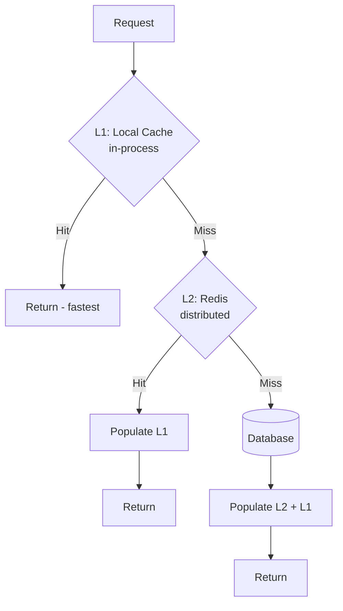

Use a **short TTL for L1** (e.g., 30 seconds) to bound staleness, and a **longer TTL for L2/Redis** (e.g., 1 hour). This combines the speed of local cache with the consistency of a shared cache.

```csharp
public async Task<Product> GetProductAsync(string productId)
{
    // L1: local in-memory cache (very short TTL)
    if (_memoryCache.TryGetValue($"product:{productId}", out Product cached))
        return cached;

    // L2: Redis distributed cache
    var redisValue = await _redis.StringGetAsync($"product:{productId}");
    if (redisValue.HasValue)
    {
        var product = JsonSerializer.Deserialize<Product>(redisValue);
        _memoryCache.Set($"product:{productId}", product, TimeSpan.FromSeconds(30));
        return product;
    }

    // L3: Database
    var dbProduct = await _db.Products.FindAsync(productId);
    await _redis.StringSetAsync(
        $"product:{productId}", 
        JsonSerializer.Serialize(dbProduct), 
        TimeSpan.FromHours(1)
    );
    _memoryCache.Set($"product:{productId}", dbProduct, TimeSpan.FromSeconds(30));
    
    return dbProduct;
}
```

---

# 3. Decision Matrix

| Factor | Local Cache | Redis (Distributed) |
|---|---|---|
| Latency | Nanoseconds | Sub-millisecond to few ms |
| Consistency across instances | No | Yes |
| Survives restart | No | Yes |
| Scales independently | No | Yes |
| Shared state (sessions, carts) | Not suitable | Ideal |
| Reference/config data | Ideal | Overkill, but works |
| Infrastructure cost | None (uses app memory) | Additional service to run |
| Best use case | Hot, rarely-changing, per-instance-tolerant data | Shared, frequently-accessed, cross-instance data |

**Recommendation for interview**: Use a **two-level cache** for maximum performance at scale — Redis as the source of truth for the cache tier, with a short-lived local cache in front to absorb the highest-frequency reads without network calls.

---

# 4. TTL (Time-To-Live) Strategy

## Choosing TTL Values

```text
Product catalog (changes occasionally): 1 hour
User session data: 30 minutes (sliding expiration)
Pricing (changes frequently): 5 minutes
Shopping cart: 24 hours
Static reference data (countries, currencies): 24 hours or no expiry + manual invalidation
Real-time inventory count: 10-30 seconds or no cache (always hit DB)
```

## Sliding vs Absolute Expiration

```csharp
// Absolute expiration: expires exactly 1 hour after being set
await _redis.StringSetAsync(key, value, TimeSpan.FromHours(1));

// Sliding expiration (session-like): resets TTL on each access
var options = new DistributedCacheEntryOptions
{
    SlidingExpiration = TimeSpan.FromMinutes(30)
};
await _cache.SetAsync(key, value, options);
```

Use **sliding expiration** for session-like data (keep active sessions alive), and **absolute expiration** for data tied to a specific freshness requirement (pricing, catalog).

## TTL Jitter (Avoid Synchronized Expiration)

If thousands of keys are set with the exact same TTL, they can all expire simultaneously, causing a spike in database load.

```csharp
var baseTtl = TimeSpan.FromHours(1);
var jitter = TimeSpan.FromSeconds(Random.Shared.Next(0, 300)); // 0-5 min jitter
await _redis.StringSetAsync(key, value, baseTtl + jitter);
```

---

# 5. Cache Invalidation Strategies

> "There are only two hard things in Computer Science: cache invalidation and naming things." — Phil Karlton

## Strategy 1: TTL-Based (Passive) Expiration

Simplest approach — just let the cache expire naturally.

**Pros**: No extra code, self-healing
**Cons**: Data can be stale for up to the TTL duration

## Strategy 2: Write-Through Invalidation (Event-Driven)

When data changes, explicitly delete or update the cache entry.

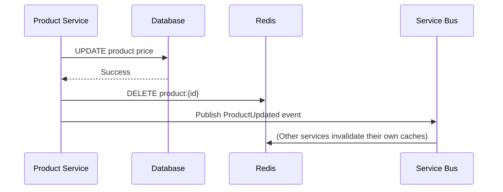

```csharp
public async Task UpdateProductAsync(Product product)
{
    await _db.SaveChangesAsync();
    
    // Invalidate cache immediately
    await _redis.KeyDeleteAsync($"product:{product.Id}");
    
    // Notify other services/instances to invalidate their local caches too
    await _serviceBus.PublishAsync(new ProductUpdated { ProductId = product.Id });
}
```

**Pros**: Cache is immediately consistent after a write
**Cons**: More code, requires reliable event delivery; local (L1) caches on other instances won't know unless notified via pub/sub

## Strategy 3: Cache-Aside with Pub/Sub Invalidation (For Multi-Level Caches)

Use Redis Pub/Sub to broadcast invalidation to all service instances' local caches.

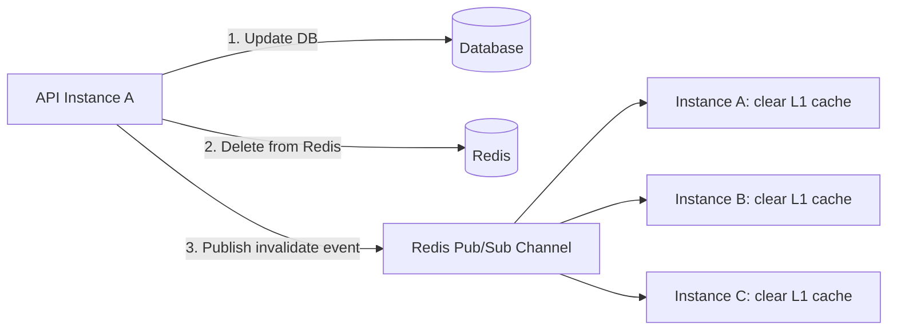

```csharp
// Publisher
await _redis.GetSubscriber().PublishAsync(
    "cache-invalidation", 
    $"product:{productId}"
);

// Each instance subscribes on startup
_redis.GetSubscriber().Subscribe("cache-invalidation", (channel, message) =>
{
    _memoryCache.Remove(message.ToString());
});
```

## Strategy 4: Version/Generation-Based Invalidation

Instead of deleting keys, embed a version number that changes when data updates — old cached entries become naturally unreachable.

```text
Cache key: product:1001:v3
When product updates: increment to product:1001:v4

Old cache entries (v3) are never explicitly deleted;
they simply age out via TTL since nothing references them anymore.
```

```csharp
var version = await _redis.StringGetAsync($"product:{productId}:version") ?? "1";
var cacheKey = $"product:{productId}:v{version}";

var cached = await _redis.StringGetAsync(cacheKey);
if (cached.HasValue) return Deserialize(cached);

// On update:
await _redis.StringIncrementAsync($"product:{productId}:version");
```

**Pros**: No need to explicitly invalidate every cache node
**Cons**: Slightly more complex key management, old versions linger until TTL

---

# 6. Cache Stampede (Thundering Herd) Problem

## The Problem

```text
A popular cache key (e.g., "trending-products") expires.
1,000 concurrent requests all get a cache miss at the same moment.
All 1,000 requests hit the database simultaneously for the same data.
Database gets overwhelmed, possibly causing cascading failures.
```

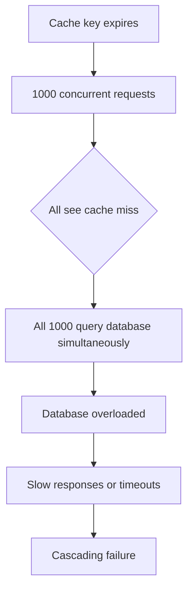

## Solution 1: Mutex / Lock (Single Flight Pattern)

Only one request recomputes the value; others wait for it.

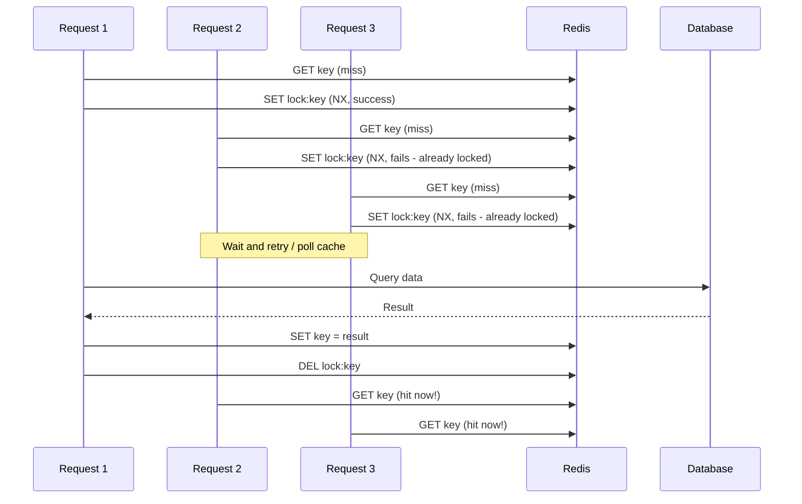

```csharp
public async Task<Product> GetProductWithLockAsync(string productId)
{
    var cacheKey = $"product:{productId}";
    var lockKey = $"lock:{cacheKey}";

    var cached = await _redis.StringGetAsync(cacheKey);
    if (cached.HasValue) 
        return Deserialize(cached);

    // Try to acquire distributed lock (NX = only set if not exists)
    bool lockAcquired = await _redis.StringSetAsync(
        lockKey, "1", TimeSpan.FromSeconds(10), When.NotExists
    );

    if (lockAcquired)
    {
        try
        {
            // Double-check cache (another process might have just populated it)
            cached = await _redis.StringGetAsync(cacheKey);
            if (cached.HasValue) return Deserialize(cached);

            var product = await _db.Products.FindAsync(productId);
            await _redis.StringSetAsync(cacheKey, Serialize(product), TimeSpan.FromHours(1));
            return product;
        }
        finally
        {
            await _redis.KeyDeleteAsync(lockKey);
        }
    }
    else
    {
        // Another request is already fetching; wait briefly and retry
        await Task.Delay(50);
        return await GetProductWithLockAsync(productId); // Retry (with max attempt guard)
    }
}
```

## Solution 2: Probabilistic Early Expiration (Recompute Before Expiry)

Recompute the cache value slightly *before* it actually expires, probabilistically, so only a few requests trigger a refresh instead of all of them at the exact expiry moment.

```csharp
// XFetch algorithm (simplified)
public async Task<Product> GetWithEarlyRefreshAsync(string productId)
{
    var (value, ttlRemaining, computeTime) = await GetCacheMetadataAsync(productId);

    // Probabilistically decide to refresh early based on how close to expiry we are
    var beta = 1.0;
    var shouldRefresh = (computeTime * beta * Math.Log(Random.Shared.NextDouble())) 
                        >= ttlRemaining.TotalSeconds * -1;

    if (shouldRefresh)
    {
        // This request refreshes; others continue using slightly stale cached value
        _ = Task.Run(() => RefreshCacheInBackgroundAsync(productId));
    }

    return value;
}
```

## Solution 3: Never-Expire + Background Refresh

Keep serving stale data while a background job refreshes it — never let the cache fully expire.

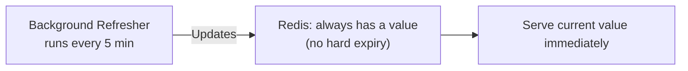

**Pros**: Zero cache misses for end users, no stampede possible
**Cons**: Requires a reliable background refresh process; risk of serving outdated data if refresh job fails silently (needs monitoring)

## Solution 4: Request Coalescing (In-Process)

If multiple requests for the same key arrive at the same instance simultaneously, coalesce them into a single upstream call.

```csharp
private readonly ConcurrentDictionary<string, Lazy<Task<Product>>> _inFlightRequests = new();

public Task<Product> GetProductAsync(string productId)
{
    return _inFlightRequests.GetOrAdd(productId, 
        _ => new Lazy<Task<Product>>(() => FetchAndCacheAsync(productId))
    ).Value;
}
```

---

# 7. Stale Data Handling

## Accepting Bounded Staleness

Not all data needs to be perfectly fresh. Define acceptable staleness per data type:

```text
Product price: max 5 minutes stale
Inventory count: max 30 seconds stale (or real-time for checkout flow)
User profile: max 1 hour stale
Static content: max 24 hours stale
```

## Stale-While-Revalidate Pattern

Serve the stale cached value immediately while asynchronously refreshing it in the background.

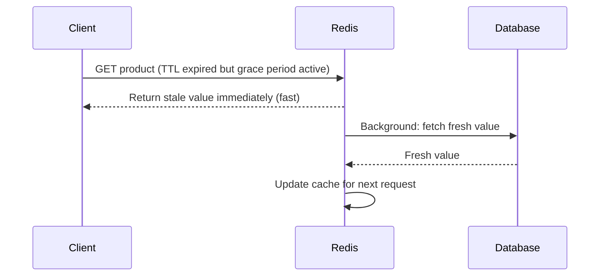

```csharp
public async Task<Product> GetWithStaleWhileRevalidateAsync(string productId)
{
    var entry = await _redis.HashGetAllAsync($"product:{productId}");
    var value = Deserialize(entry);
    var expiresAt = GetExpiryFromEntry(entry);

    if (DateTime.UtcNow > expiresAt)
    {
        // Serve stale value now, but kick off a background refresh
        _ = Task.Run(() => RefreshCacheAsync(productId));
    }

    return value; // Always returns immediately, even if slightly stale
}
```

**Trade-off**: Clients always get a fast response, but may occasionally see data that's a few seconds/minutes old. This is usually an acceptable trade-off for read-heavy, non-critical data.

## Read-Your-Own-Writes Consistency

For critical flows (e.g., a user just updated their profile and immediately views it), bypass the cache or write directly to cache after the DB write to avoid showing stale data to the user who just made the change.

```csharp
public async Task UpdateUserProfileAsync(UserProfile profile)
{
    await _db.SaveChangesAsync();
    
    // Immediately update cache (not just invalidate) to ensure the writer
    // sees their own update right away
    await _redis.StringSetAsync(
        $"user:{profile.UserId}", 
        Serialize(profile), 
        TimeSpan.FromHours(1)
    );
}
```

---

# 8. Azure Cloud Implementation

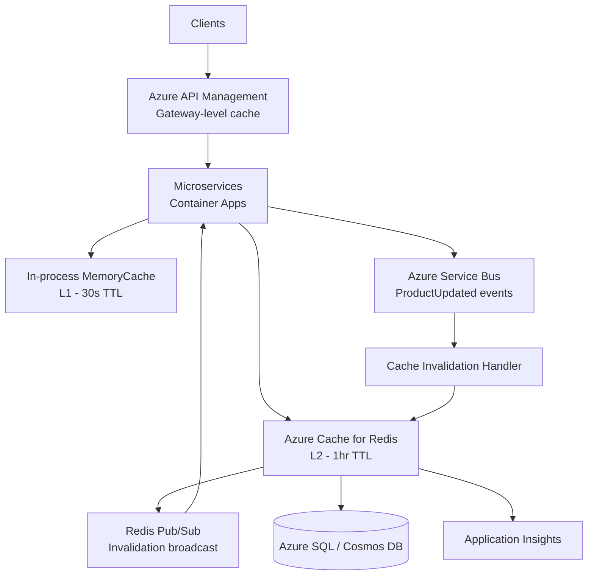

## Azure Cache for Redis Tiers

| Tier | Use Case |
|---|---|
| Basic | Dev/test only, no SLA, single node |
| Standard | Production, replicated (primary + replica), automatic failover |
| Premium | High throughput, clustering (sharding), persistence (RDB/AOF), VNet isolation |
| Enterprise | Redis modules (RedisJSON, RedisSearch), active geo-replication, highest availability |

**Recommendation**: Use **Premium tier** for production distributed caching at scale — supports clustering for horizontal scale-out and data persistence for faster recovery after failover.

## Redis Clustering for Horizontal Scale

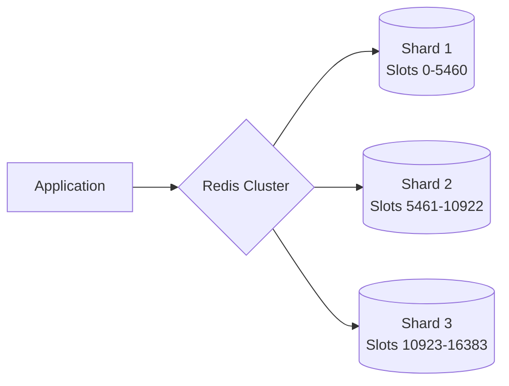

Redis Cluster automatically distributes keys across shards using hash slots, enabling horizontal scaling beyond a single node's memory/throughput limits.

---

# 9. Cache Key Design Best Practices

```text
Good key naming convention:
{entity}:{id}:{version?}

Examples:
product:1001
product:1001:v3
user:session:abc123
cart:user:456
rate-limit:user:789:2026-09-30-10

Avoid:
- Overly long keys (wastes memory)
- Keys without namespacing (collision risk)
- Storing huge objects in a single key (split if >100KB)
```

---

# 10. Monitoring Cache Health

```text
Cache hit ratio (target > 80-90%)
Cache miss ratio
Eviction rate (keys evicted due to memory pressure)
Average GET/SET latency
Memory usage percentage
Connected clients count
Redis CPU usage
Replication lag (if using replicas)
```

**Alerts**:

```text
Alert if hit ratio drops below 70%
Alert if memory usage > 85%
Alert if eviction rate spikes suddenly
Alert if Redis CPU > 80% for 5 minutes
```

---

# 11. How to Answer the Interview Question

> I'd use a **two-level caching strategy**: a short-lived local in-memory cache (L1) in front of a distributed Redis cache (L2, Azure Cache for Redis Premium tier). Local cache handles the highest-frequency reads with nanosecond latency, while Redis provides a consistent shared view across all service instances and survives instance restarts.
>
> For **TTL strategy**, I'd set different expiration times based on data volatility — pricing data might have a 5-minute TTL, product catalog an hour, user sessions use sliding expiration. I'd add small random jitter to TTLs to avoid many keys expiring simultaneously and causing a load spike.
>
> For **cache invalidation**, rather than relying purely on TTL expiration, I'd use event-driven invalidation — when data changes, the service publishes an event (via Azure Service Bus) and deletes/updates the Redis key immediately. I'd also use Redis Pub/Sub to broadcast invalidation messages so every instance's local L1 cache clears the stale entry too.
>
> For **cache stampede prevention**, I'd implement a distributed lock pattern — when a cache miss occurs for a popular key, only the first request acquires a lock and queries the database; concurrent requests either wait briefly and retry the cache, or receive a slightly stale value. For extremely hot keys, I'd use a background refresh pattern where the cache never fully expires — a scheduled job proactively refreshes it before TTL expiry, so user requests never experience a stampede-triggering miss.
>
> For **stale data**, I'd accept bounded staleness for most read-heavy data using a stale-while-revalidate pattern — serve the cached value immediately even if slightly expired, while asynchronously refreshing it in the background. For critical flows like a user viewing their own just-updated data, I'd write-through to the cache immediately after the database write rather than just invalidating, to guarantee read-your-own-writes consistency.
>
> I'd monitor cache hit ratio, memory usage, and eviction rate through Application Insights, with alerts if hit ratio drops or memory pressure increases, since that typically signals the cache is undersized or data patterns have changed.

---

The main principle is:

> Use local cache for ultra-low-latency, per-instance-tolerant data, and distributed Redis cache for consistency across instances. Combine both in a two-level cache for best performance. Prevent staleness with event-driven invalidation plus bounded TTLs, and prevent cache stampede with distributed locking or background refresh so a single expiring key never overwhelms the database.
