## Distributed Transactions in Microservices

## Interview Preparation Guide

This document explains how to design distributed transactions across microservices covering:

- Distributed transaction challenges
- ACID transactions vs eventual consistency
- Saga pattern (orchestration vs choreography)
- Compensation logic and rollbacks
- Failure scenarios and recovery
- Azure cloud implementation
- Real-world examples

---

## 1. Problem Statement

Design a system where an order placement requires coordinating multiple services:

1. **Order Service**: Create order record
2. **Inventory Service**: Reserve stock
3. **Payment Service**: Charge customer
4. **Shipping Service**: Create shipment
5. **Notification Service**: Send confirmation email

These services have separate databases and cannot participate in a single distributed ACID transaction.

**The Problem**: 

What happens if:
- Order created, inventory reserved, payment **fails** → must release inventory
- Order created, inventory reserved, payment succeeds, shipping **fails** → must refund payment and release inventory
- Payment succeeds but notification fails → money charged but customer never notified
- A service crashes mid-operation and loses state

**Goal**: Ensure the entire workflow completes or rolls back consistently, even with partial failures.

---

# 2. Why Not Traditional ACID Transactions?

## The Two-Phase Commit (2PC) Problem

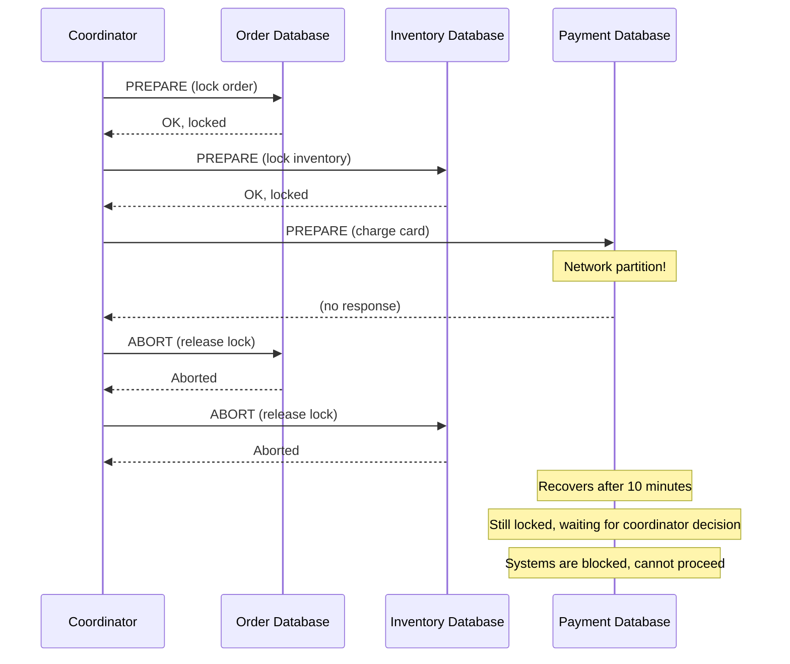

**Why 2PC Fails in Microservices**:

1. **Blocking**: Locks are held for duration of entire transaction, reducing throughput
2. **Network partition**: If coordinator can't reach a service, locks hang indefinitely
3. **Scalability**: Performance degrades as more services join the transaction
4. **Availability**: System cannot tolerate partial service failures
5. **Cloud-incompatible**: Cloud services (external payment providers) don't support 2PC

**Real-World Example**:
- Visa/Mastercard don't participate in 2PC
- External APIs don't support distributed transactions
- Service can crash after committing locally but before responding to coordinator

---

# 3. The Saga Pattern

Instead of a single ACID transaction, use a **Saga** — a sequence of local transactions, each with a compensating action.

```text
Forward Transaction          Compensating Transaction
Create Order          ←→      Cancel Order
Reserve Inventory     ←→      Release Inventory
Authorize Payment     ←→      Void Authorization
Capture Payment       ←→      Refund Payment
Create Shipment       ←→      Cancel Shipment
```

If a step fails, execute compensating actions backward to undo completed steps.

## Two Types of Sagas

---

# 4. Choreography-Based Saga

Services listen to events and publish events to coordinate workflow.

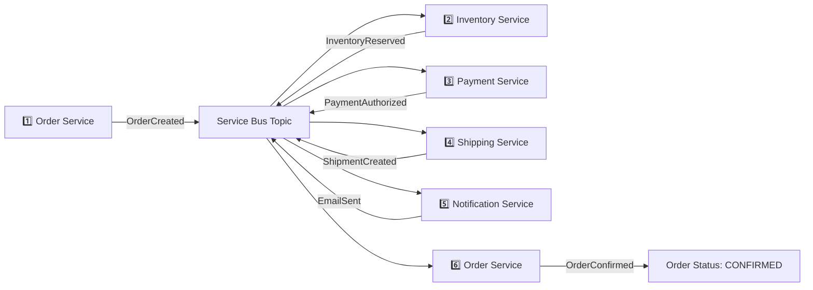

### How It Works

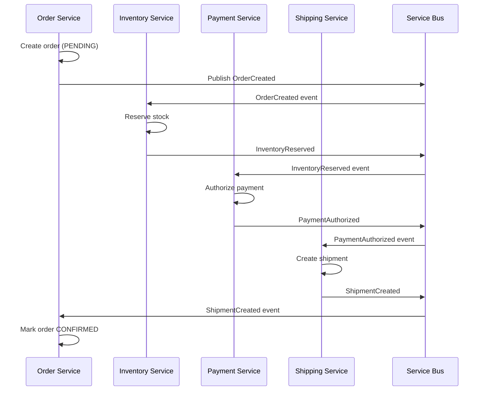

### Choreography with Failure

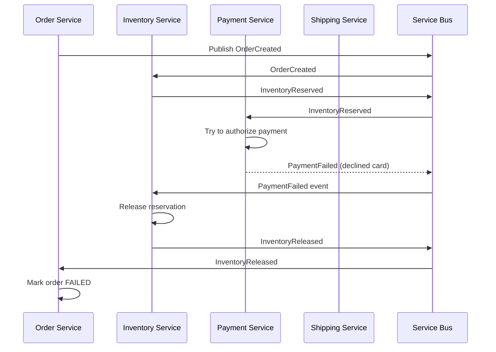

### Pros and Cons

**Pros**:
- No central point of failure
- Services are loosely coupled
- Easy to add new event listeners
- Decentralized coordination

**Cons**:
- Business flow scattered across services
- Hard to understand complete workflow
- Difficult to debug distributed logic
- Risk of circular dependencies
- Harder to track saga state

---

# 5. Orchestration-Based Saga

A central **Saga Orchestrator** controls the workflow and tells each service what to do.

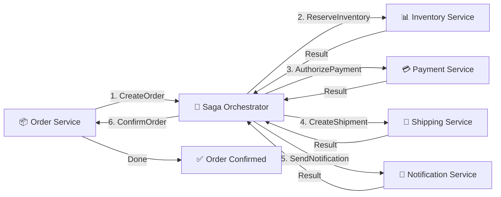

### How It Works

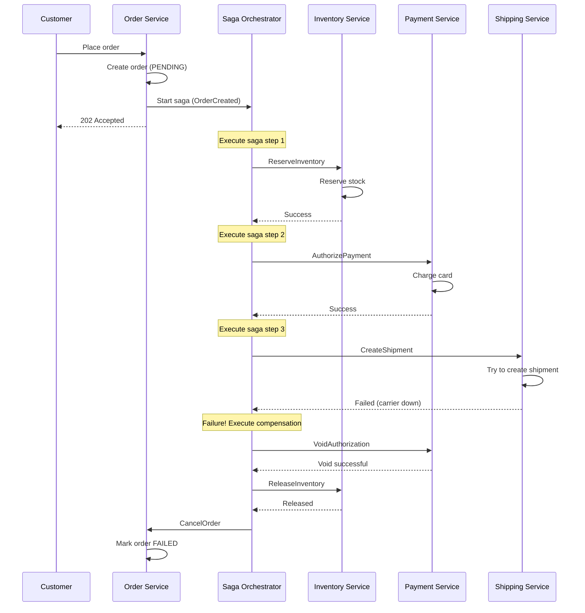

### Saga Orchestrator Implementation

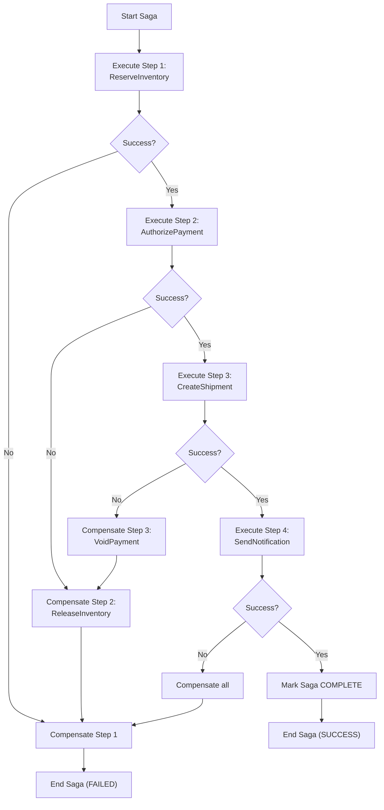

### Pros and Cons

**Pros**:
- Explicit business flow in one place
- Easy to understand and debug
- Centralized control and monitoring
- Clear compensation logic
- Simple event handling

**Cons**:
- Central orchestrator is a single point of failure
- Orchestrator must be highly available
- Tighter coupling (orchestrator knows about all services)
- Scaling orchestrator requires careful design

---

# 6. Orchestration vs Choreography Decision Matrix

| Aspect | Choreography | Orchestration |
|---|---|---|
| Complexity | Low initially, grows over time | Higher upfront, scales better |
| Coupling | Loose | Moderate (orchestrator couples to services) |
| Visibility | Scattered logic | Central, easy to see flow |
| Testing | Difficult (distributed) | Easier (centralize logic) |
| Monitoring | Hard to track saga state | Easy (orchestrator has state) |
| Scaling | Simple (add handlers) | Needs HA orchestrator |
| Failure Recovery | Implicit (event chain) | Explicit (resume saga) |
| Recommended For | Small workflows, 2-3 services | Complex workflows, 4+ services |

**Recommendation for Interview**:
> For the order management saga (4-5 services), I would use **orchestration** because the workflow is complex with explicit dependencies. The Order Service acts as orchestrator, managing state and deciding next steps. This gives us clear control and visibility over the entire workflow.

---

# 7. Compensation Logic

## Compensating Transaction Design

### Example: Order Saga with Compensation

```text
Forward                  Compensating
Step 1: Create Order     ← Cancel Order
Step 2: Reserve Inv      ← Release Inventory
Step 3: Auth Payment     ← Void Authorization
Step 4: Capture Payment  ← Refund Payment
Step 5: Create Ship      ← Cancel Shipment
```

### Key Principle: Idempotency

Compensation must be idempotent — calling it multiple times should be safe.

```csharp
// ❌ NOT Idempotent (bad)
public async Task VoidPaymentAsync(string orderId)
{
    var payment = await _db.Payments.FindAsync(orderId);
    payment.Amount = 0;  // Blindly void
    await _db.SaveChangesAsync();
}

// ✅ Idempotent (good)
public async Task VoidPaymentAsync(string orderId)
{
    var payment = await _db.Payments.FindAsync(orderId);
    
    // Check if already voided
    if (payment.Status == PaymentStatus.VOIDED)
    {
        logger.LogInformation($"Payment already voided: {orderId}");
        return;  // Idempotent return
    }
    
    if (payment.Status != PaymentStatus.AUTHORIZED)
    {
        throw new InvalidOperationException($"Cannot void {payment.Status} payment");
    }
    
    // Call payment provider
    try
    {
        await _paymentProvider.VoidAsync(payment.ProviderTransactionId);
        payment.Status = PaymentStatus.VOIDED;
        await _db.SaveChangesAsync();
    }
    catch (Exception ex)
    {
        logger.LogError($"Void failed: {ex}");
        throw;  // Will be retried by orchestrator
    }
}
```

---

# 8. Compensation Failure Handling

What happens if a compensation step also fails?

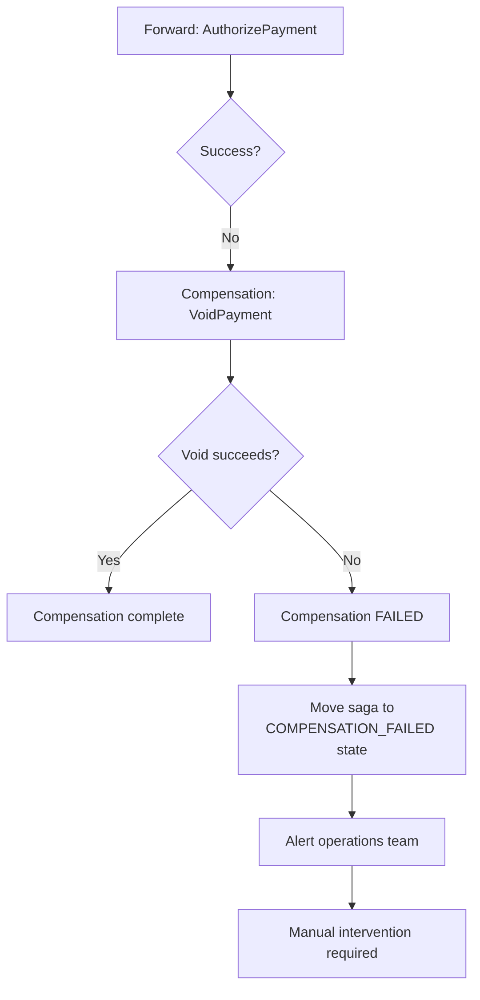

## Strategies for Compensation Failure

### Strategy 1: Retry with Exponential Backoff

```csharp
public async Task CompensateAsync(SagaStep step, int maxRetries = 7)
{
    for (int attempt = 1; attempt <= maxRetries; attempt++)
    {
        try
        {
            await ExecuteCompensationAsync(step);
            return;  // Success
        }
        catch (Exception ex)
        {
            logger.LogWarning($"Compensation attempt {attempt} failed: {ex}");
            
            if (attempt == maxRetries)
            {
                // Final attempt failed
                logger.LogError($"Compensation permanently failed after {maxRetries} attempts");
                throw;
            }
            
            // Exponential backoff
            var delay = TimeSpan.FromSeconds(Math.Pow(2, attempt));
            await Task.Delay(delay);
        }
    }
}
```

### Strategy 2: Manual Recovery

If compensation fails, alert operations team to manually fix:

```csharp
catch (Exception ex)
{
    logger.LogCritical($"Compensation failed, needs manual intervention: {ex}");
    
    await _saga.UpdateStateAsync(new SagaState
    {
        Status = SagaStatus.MANUAL_INTERVENTION_REQUIRED,
        FailedStep = step.Name,
        FailureReason = ex.Message,
        ResumeAction = "RunCompensation"  // Operations team can retry
    });
    
    // Send alert
    await _alertService.SendAlertAsync(
        "Saga Compensation Failed",
        $"Order {_saga.OrderId} needs manual recovery. Step: {step.Name}"
    );
}
```

### Strategy 3: Reconciliation Job

Background job periodically checks for stuck sagas and completes them:

```csharp
[FunctionName("SagaReconciliation")]
public async Task ReconcileAsync([TimerTrigger("0 */5 * * * *")] TimerInfo timer)
{
    // Find sagas stuck for > 30 minutes
    var stuckSagas = await _db.Sagas
        .Where(s => s.Status == SagaStatus.IN_PROGRESS 
                 && DateTime.UtcNow - s.LastUpdate > TimeSpan.FromMinutes(30))
        .ToListAsync();
    
    foreach (var saga in stuckSagas)
    {
        logger.LogWarning($"Found stuck saga: {saga.Id}");
        
        // Get current state from services
        var latestState = await QueryCurrentStateAsync(saga);
        
        if (latestState.AllStepsCompleted)
        {
            // Services completed but saga didn't update
            saga.Status = SagaStatus.COMPLETED;
            await _db.SaveChangesAsync();
        }
        else if (latestState.FailedStep != null)
        {
            // Found failed step, retry compensation
            await CompensateAsync(latestState.FailedStep);
        }
    }
}
```

---

# 9. Saga State Management

The orchestrator must track saga state persistently.

## Saga State Table

```sql
CREATE TABLE Sagas (
    SagaId                 VARCHAR(100) PRIMARY KEY,
    OrderId                VARCHAR(50) NOT NULL,
    Status                 VARCHAR(30) NOT NULL,  -- IN_PROGRESS, COMPLETED, FAILED, COMPENSATION_IN_PROGRESS
    CurrentStep            VARCHAR(50),
    CreatedAt              DATETIME2 NOT NULL,
    LastUpdate             DATETIME2 NOT NULL,
    CompletedSteps         VARCHAR(MAX),  -- JSON array of completed steps
    FailedStep             VARCHAR(50),
    FailureReason          VARCHAR(500),
    ManualInterventionNote VARCHAR(1000)
);

CREATE TABLE SagaSteps (
    SagaStepId  VARCHAR(100) PRIMARY KEY,
    SagaId      VARCHAR(100) NOT NULL,
    StepName    VARCHAR(50) NOT NULL,
    Status      VARCHAR(30) NOT NULL,  -- PENDING, IN_PROGRESS, COMPLETED, FAILED, COMPENSATING, COMPENSATED
    Attempt     INT NOT NULL,
    ErrorMessage VARCHAR(1000),
    CompensationAttempt INT,
    CompensationError VARCHAR(1000),
    CreatedAt   DATETIME2 NOT NULL,
    FOREIGN KEY (SagaId) REFERENCES Sagas(SagaId)
);
```

## Saga Execution State Machine

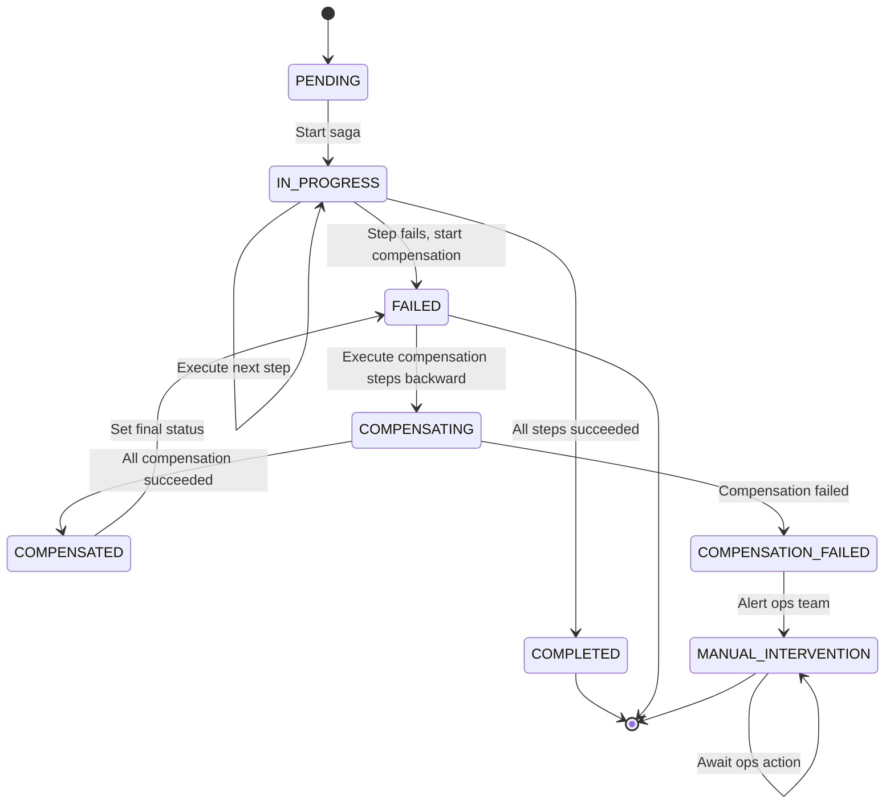

---

# 10. Orchestrator Implementation (Azure Durable Functions)

```csharp
[FunctionName("OrderSagaOrchestrator")]
public static async Task RunOrderSagaAsync(
    [OrchestrationTrigger] IDurableOrchestrationContext context,
    OrderCreatedEvent orderEvent)
{
    var sagaId = context.InstanceId;
    var retryPolicy = new RetryOptions(
        firstRetryInterval: TimeSpan.FromSeconds(1),
        maxNumberOfAttempts: 7)
    {
        Handle = ex => ex is FunctionFailedException ffe 
            && IsTransientError(ffe.InnerException)
    };

    try
    {
        logger.LogInformation($"Starting saga: {sagaId}");
        
        // Step 1: Reserve Inventory
        logger.LogInformation($"Step 1: Reserve Inventory");
        var reservationId = await context.CallActivityWithRetryAsync<string>(
            "ReserveInventory",
            retryPolicy,
            orderEvent
        );
        
        // Step 2: Authorize Payment
        logger.LogInformation($"Step 2: Authorize Payment");
        var authorizationId = await context.CallActivityWithRetryAsync<string>(
            "AuthorizePayment",
            retryPolicy,
            orderEvent
        );
        
        // Step 3: Create Shipment
        logger.LogInformation($"Step 3: Create Shipment");
        var shipmentId = await context.CallActivityWithRetryAsync<string>(
            "CreateShipment",
            retryPolicy,
            orderEvent
        );
        
        // Step 4: Capture Payment
        logger.LogInformation($"Step 4: Capture Payment");
        await context.CallActivityWithRetryAsync(
            "CapturePayment",
            retryPolicy,
            authorizationId
        );
        
        // Step 5: Send Notification
        logger.LogInformation($"Step 5: Send Notification");
        await context.CallActivityWithRetryAsync(
            "SendNotification",
            retryPolicy,
            orderEvent
        );
        
        // All steps succeeded
        logger.LogInformation($"Saga completed successfully");
    }
    catch (FunctionFailedException ex) when (ex.InnerException is OrderSagaException sagaEx)
    {
        logger.LogError($"Saga failed at step: {sagaEx.FailedStep}");
        
        // Compensation: execute in reverse order
        try
        {
            if (sagaEx.FailedStep > 2)  // Capture payment was called
            {
                logger.LogInformation("Compensating: Refund Payment");
                await context.CallActivityWithRetryAsync(
                    "RefundPayment",
                    retryPolicy,
                    authorizationId
                );
            }
            
            if (sagaEx.FailedStep > 1)  // Inventory was reserved
            {
                logger.LogInformation("Compensating: Release Inventory");
                await context.CallActivityWithRetryAsync(
                    "ReleaseInventory",
                    retryPolicy,
                    reservationId
                );
            }
            
            logger.LogInformation("Compensation completed");
        }
        catch (Exception compensationEx)
        {
            logger.LogError($"Compensation failed: {compensationEx}");
            // Mark for manual intervention
            throw new SagaCompensationException(
                $"Failed to compensate saga: {compensationEx.Message}",
                compensationEx
            );
        }
        
        throw;
    }
}

[FunctionName("ReserveInventory")]
public static async Task<string> ReserveInventoryAsync(
    [ActivityTrigger] OrderCreatedEvent orderEvent)
{
    var inventoryService = new InventoryService();
    return await inventoryService.ReserveAsync(
        orderEvent.OrderId,
        orderEvent.Items
    );
}

[FunctionName("AuthorizePayment")]
public static async Task<string> AuthorizePaymentAsync(
    [ActivityTrigger] OrderCreatedEvent orderEvent)
{
    var paymentService = new PaymentService();
    return await paymentService.AuthorizeAsync(
        orderEvent.OrderId,
        orderEvent.Amount,
        orderEvent.CardToken
    );
}

[FunctionName("ReleaseInventory")]
public static async Task ReleaseInventoryAsync(
    [ActivityTrigger] string reservationId)
{
    var inventoryService = new InventoryService();
    await inventoryService.ReleaseAsync(reservationId);
}
```

---

# 11. Handling External Service Failures

## Timeout Scenario

What if Shipping Service takes too long?

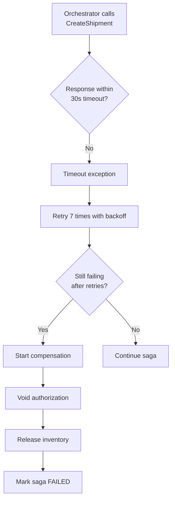

## External Payment Provider Failure

Payment provider crashes after charging but before returning response.

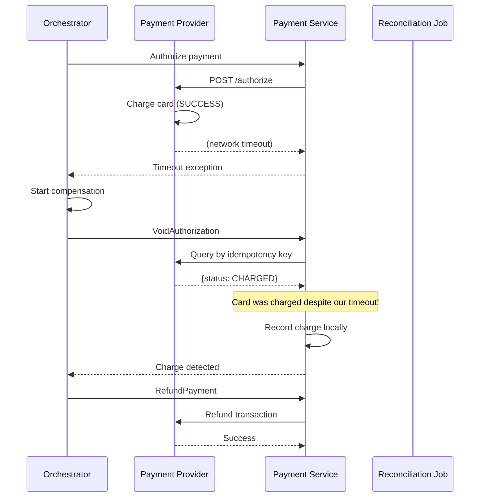

**Lesson**: Always use idempotency keys and reconcile with provider after timeouts.

---

# 12. Azure Implementation Patterns

## Pattern 1: Azure Durable Functions (Recommended)

Built-in orchestration engine for Sagas.

```csharp
// Durable Functions handle:
// ✓ Orchestration state persistence
// ✓ Automatic retry
// ✓ Compensation on failure
// ✓ Timeout handling
// ✓ Replay on restart
```

**Pros**:
- Fully managed
- Built-in features for orchestration
- Scales automatically
- Azure-native

**Cons**:
- Azure-specific
- Learning curve for Durable Functions patterns

---

## Pattern 2: Custom Orchestrator Service

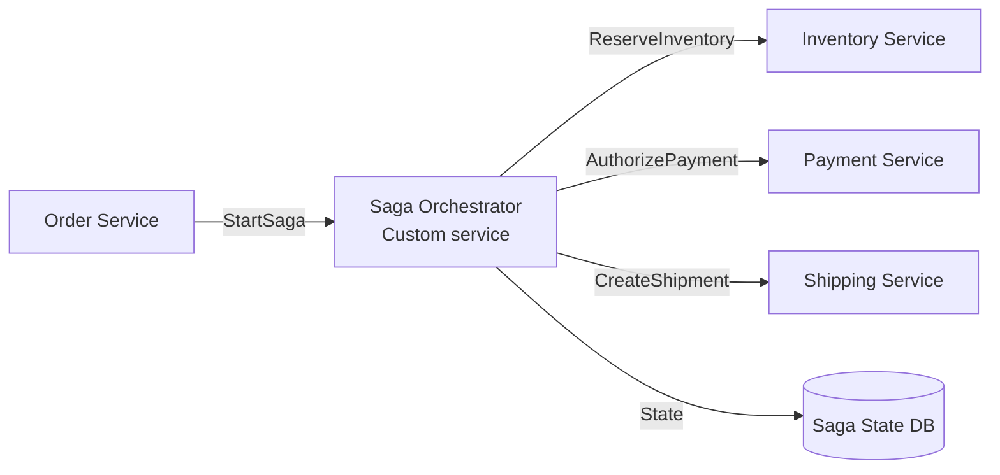

```csharp
public class SagaOrchestrator
{
    private readonly SagaStateRepository _stateRepo;
    private readonly IServiceBusClient _serviceBus;
    private readonly Dictionary<string, IActivityHandler> _handlers;
    
    public async Task ExecuteSagaAsync(SagaDefinition saga)
    {
        var sagaState = new SagaState { Id = saga.Id, Status = SagaStatus.IN_PROGRESS };
        await _stateRepo.SaveAsync(sagaState);
        
        try
        {
            foreach (var step in saga.Steps)
            {
                sagaState.CurrentStep = step.Name;
                await _stateRepo.SaveAsync(sagaState);
                
                var handler = _handlers[step.Handler];
                var result = await ExecuteWithRetryAsync(() => 
                    handler.ExecuteAsync(step.Input)
                );
                
                sagaState.CompletedSteps.Add(step.Name);
                await _stateRepo.SaveAsync(sagaState);
            }
            
            sagaState.Status = SagaStatus.COMPLETED;
            await _stateRepo.SaveAsync(sagaState);
        }
        catch (Exception ex)
        {
            await CompensateAsync(sagaState, saga);
        }
    }
    
    private async Task CompensateAsync(SagaState sagaState, SagaDefinition saga)
    {
        sagaState.Status = SagaStatus.COMPENSATING;
        await _stateRepo.SaveAsync(sagaState);
        
        // Execute compensation in reverse order
        for (int i = sagaState.CompletedSteps.Count - 1; i >= 0; i--)
        {
            var step = saga.Steps.First(s => s.Name == sagaState.CompletedSteps[i]);
            var handler = _handlers[step.CompensationHandler];
            
            try
            {
                await ExecuteWithRetryAsync(() => 
                    handler.CompensateAsync(step.Output)
                );
            }
            catch (Exception ex)
            {
                logger.LogError($"Compensation failed: {ex}");
                sagaState.Status = SagaStatus.COMPENSATION_FAILED;
                sagaState.FailureReason = ex.Message;
                await _stateRepo.SaveAsync(sagaState);
                throw;
            }
        }
        
        sagaState.Status = SagaStatus.FAILED;
        await _stateRepo.SaveAsync(sagaState);
    }
}
```

**Pros**:
- Full control over orchestration logic
- Not vendor-specific
- Can optimize for specific needs

**Cons**:
- Significant operational overhead
- Must handle state, retries, timeouts yourself
- Scaling and high availability is harder

---

# 13. Complete Order Saga Example

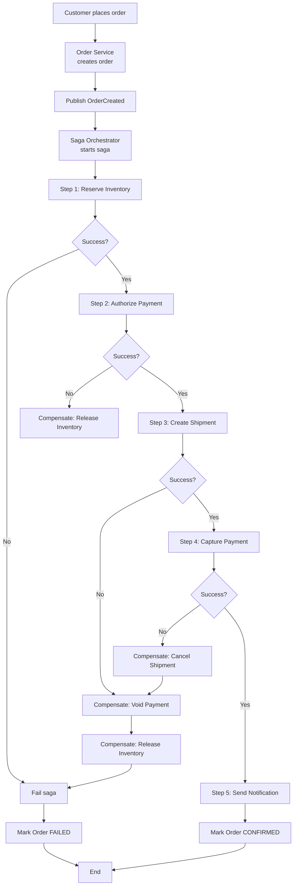

## With Failure Examples

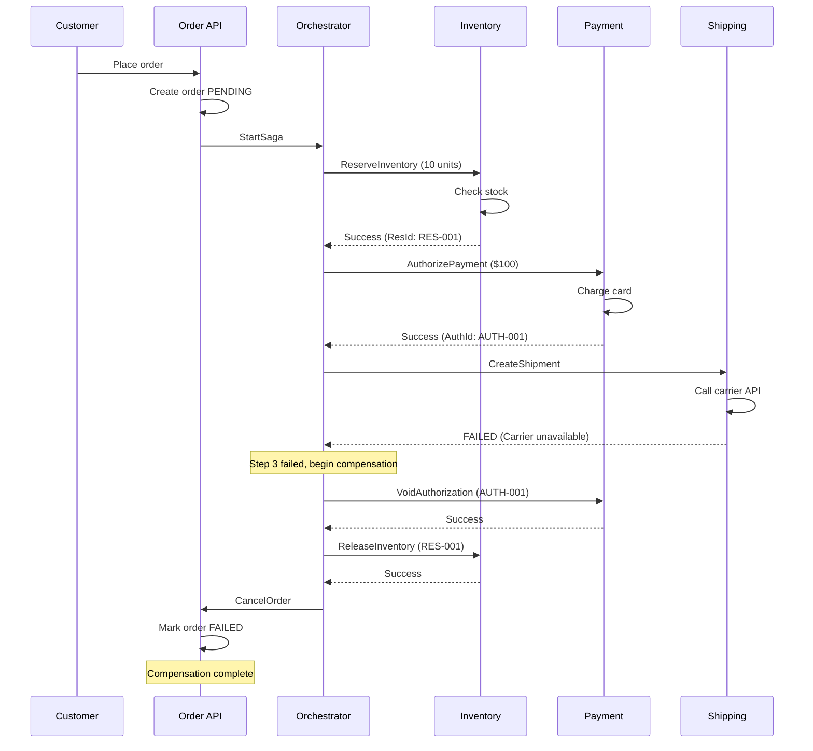

---

# 14. How to Answer the Interview Question

A comprehensive interview answer could be:

> I would use an **orchestration-based Saga** because the order workflow has explicit dependencies and requires complex error handling.
>
> **Why Orchestration?**
> The workflow has 5 steps in sequence: Create Order → Reserve Inventory → Authorize Payment → Create Shipment → Capture Payment. Each step depends on previous steps succeeding. If any step fails, I need to reverse prior steps in a specific order. Orchestration makes this explicit and controllable.
>
> **Architecture**: I would use Azure Durable Functions as the Saga Orchestrator. When an order is created, the Order Service publishes an OrderCreated event. A Durable Function orchestrator picks it up and executes each step:
>
> 1. Call Inventory Service to reserve stock
> 2. Call Payment Service to authorize payment
> 3. Call Shipping Service to create shipment
> 4. Capture the payment
> 5. Send confirmation notification
>
> Each step has a retry policy — exponential backoff up to 7 times for transient failures (timeouts, 503s).
>
> **Compensation Logic**: If any step fails, the orchestrator executes compensating transactions in reverse:
> - If shipment fails: void payment authorization, release inventory, cancel order
> - If payment fails: release inventory, cancel order
> - If inventory fails: cancel order
>
> All compensating actions are idempotent — if we call them twice, the second call safely returns success without duplicating the action.
>
> **State Management**: The Durable Function framework automatically persists saga state after each step. If the orchestrator crashes, it replays from the last checkpoint and continues. This ensures saga state is never lost.
>
> **Failure Handling**: If a compensation step itself fails (rare but possible), I retry it. If all retries exhaust, the saga moves to a MANUAL_INTERVENTION status and alerts operations. An operations team can then manually review and recover the saga (refund manually, rollback service state, etc).
>
> **External Services**: For the payment provider, I always use idempotency keys. If the authorize call times out, I don't immediately compensate — I query the provider using the idempotency key to check if the charge went through. If it did, I record it locally and continue. If it didn't, I retry. This prevents accidentally double-charging.
>
> **Monitoring**: Every saga instance has a unique ID. I track saga state in Application Insights with distributed tracing. If any saga fails, I log the failure reason and alert on-call engineers.

---

# 15. Key Takeaways

| Concept | Implementation |
|---|---|
| Distributed transaction | Saga pattern (orchestration or choreography) |
| Orchestration | Central orchestrator controls workflow, Azure Durable Functions |
| Choreography | Services listen to events, implicit workflow |
| Idempotency | Each operation can safely run multiple times |
| Compensation | Reverse operation for each forward transaction |
| Timeout handling | Query provider, reconcile state before compensating |
| State persistence | Database tracks saga state for crash recovery |
| Retry strategy | Exponential backoff, distinguish transient vs permanent failures |
| Monitoring | Distributed tracing, alert on saga failures |

---

# 16. Common Pitfalls to Avoid

| Pitfall | Problem | Solution |
|---|---|---|
| No state persistence | Saga state lost if orchestrator crashes | Persist state to database, support replay |
| Compensation failures ignored | Compensation fails silently, system left inconsistent | Retry compensation, alert if exhausted |
| No idempotency | Running step twice charges twice | Idempotent operations, track execution IDs |
| Assuming HTTP response = success | Service crashed after charging | Query provider using idempotency key |
| No timeout | Wait indefinitely for slow service | Set explicit timeouts, implement retry |
| Tight coupling | Every change to workflow breaks services | Use events to decouple, versioning |
| No monitoring | Can't see why saga failed | Distributed tracing, central logging |

---

# 17. Orchestration vs Choreography Decision Tree

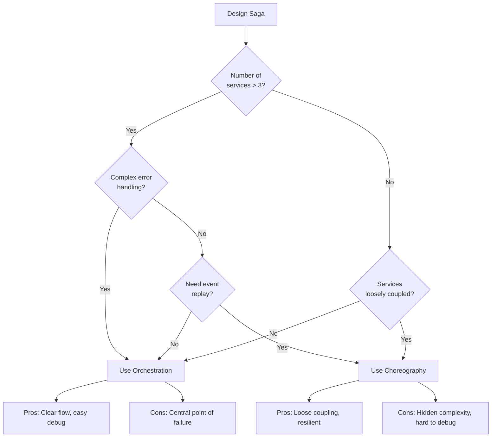

---

# 18. Final Saga Architecture Diagram

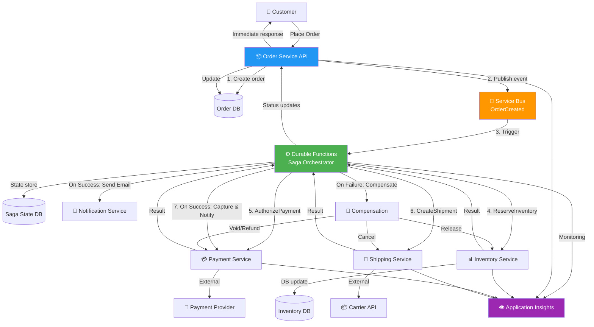

The main principle is:

> Distributed transactions in microservices cannot use traditional 2PC due to blocking, network partitions, and external service constraints. Use the Saga pattern instead: a sequence of local transactions each with a compensating action. Prefer orchestration for complex workflows and choreography for simple, loosely-coupled flows. Always ensure idempotency, persistent state, and explicit timeout/retry handling. Monitor saga execution end-to-end and alert on failures.
