## Event-Driven Architecture Design

## Interview Preparation Guide

This document explains how to design an event-driven architecture covering:

- Event-driven vs request-response patterns
- Message broker technologies (Kafka, Azure Service Bus, RabbitMQ)
- Producer and consumer design patterns
- Retry strategies and dead-letter queues
- Message ordering guarantees
- Duplicate message detection and handling
- Exactly-once vs at-least-once semantics
- Azure cloud implementation
- Common failure scenarios

---

## 1. Problem Statement

Design an event-driven system where:

- Services communicate asynchronously via events
- Systems can decouple producers and consumers
- Failures in one service don't cascade to others
- Messages are delivered reliably
- Messages are processed exactly-once (or safely handled if duplicated)
- Message ordering is preserved when needed
- Failed messages can be recovered
- System scales to millions of events per second

Key challenges:

- Network failures can lose messages
- Network delays can cause duplicate delivery
- Consumers can crash mid-processing
- Services have different processing speeds
- Message ordering must be maintained for some workflows
- Dead-letter handling must be automated yet debuggable

---

# 2. Event-Driven vs Request-Response

## Request-Response (Synchronous)

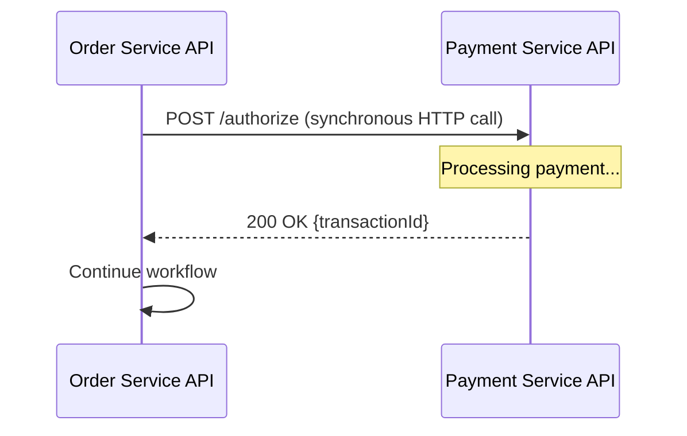

**Pros**: Simple, immediate response, easy to debug
**Cons**: Tight coupling, blocks if dependency is slow/down, hard to scale

## Event-Driven (Asynchronous)

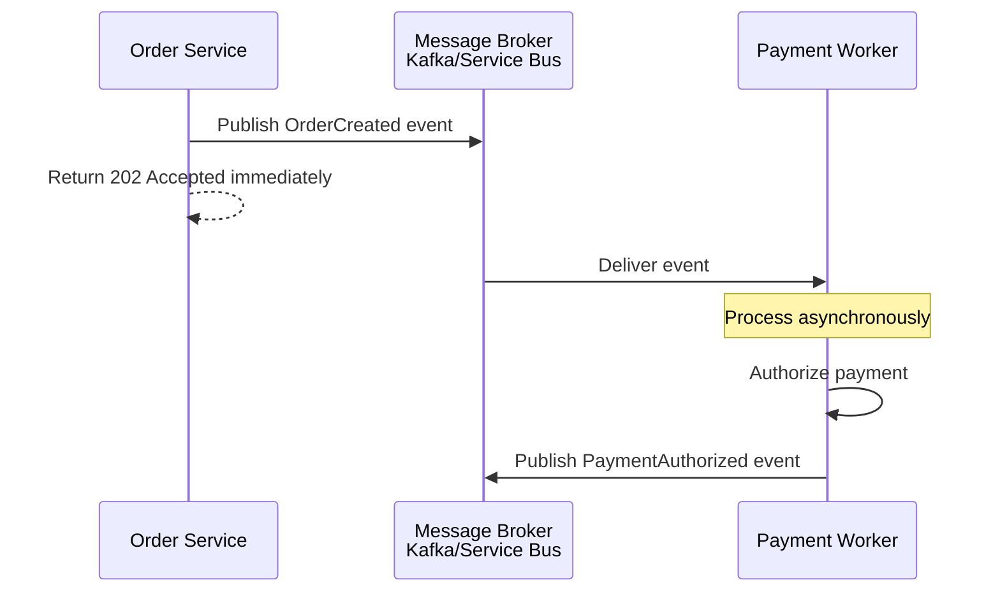

**Pros**: Loose coupling, scales independently, absorbs traffic spikes, fault isolation
**Cons**: Eventual consistency (delay before event processed), harder to debug, more infrastructure

---

# 3. Message Broker Technologies

## Apache Kafka

Distributed append-only log system optimized for high throughput.

```
Topic: orders
Partition 0: [Event1] [Event2] [Event3] [Event4] [Event5]
Partition 1: [Event6] [Event7] [Event8] [Event9] [Event10]
Partition 2: [EventN...] ... [EventM]

Consumer Group: payment-processors
├── Consumer 1 reads Partition 0
├── Consumer 2 reads Partition 1
└── Consumer 3 reads Partition 2
```

**Use Kafka when**: Very high throughput (millions of events/sec), need event replay, distributed system, strict ordering per partition

**Pros**:
- High throughput (1M+ msgs/sec per broker)
- Fault tolerant (replication)
- Maintains order per partition
- Event log can be replayed

**Cons**:
- Complex operational overhead
- Requires multiple broker nodes
- Needs ZooKeeper or Kraft mode
- Overkill for small-to-medium systems

---

## Azure Service Bus

Managed message broker with queues and topics.

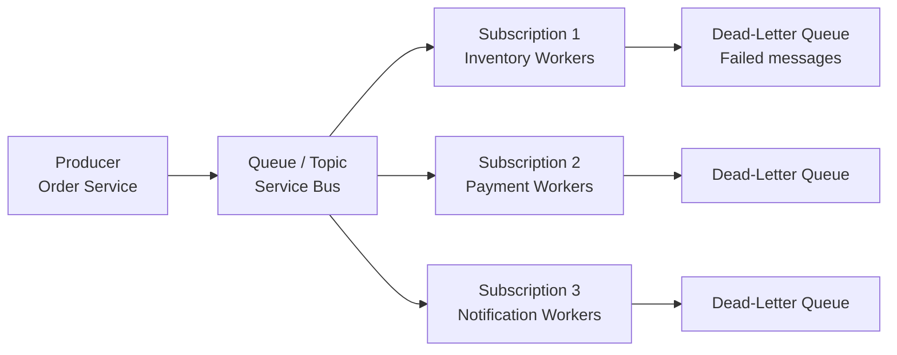

**Use Service Bus when**: Enterprise Azure workloads, moderate throughput (up to 1M msgs/sec), managed service preferred, FIFO needed, DLQ required

**Pros**:
- Managed service (no operations)
- Built-in dead-letter queues
- Transactional processing
- FIFO guarantees
- Sessionful messaging (ordered processing)
- Azure ecosystem integration

**Cons**:
- Lower throughput than Kafka
- Limited event replay (90-day retention)
- Azure-specific (lock-in)
- Cost scales with message volume

---

## RabbitMQ

Traditional message broker with flexible routing.

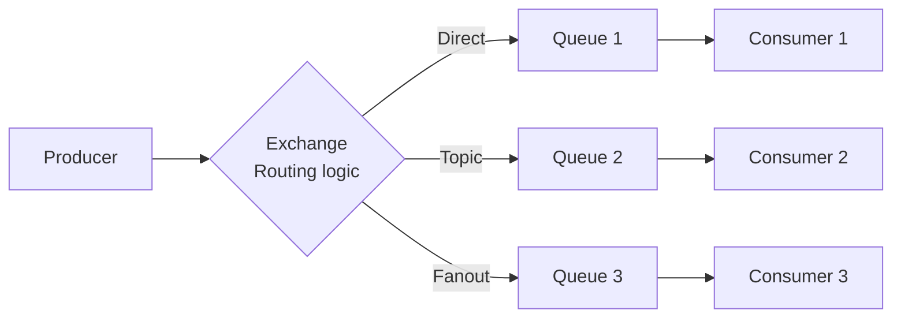

**Use RabbitMQ when**: Self-hosted preferred, need flexible routing, moderate throughput, traditional architecture, don't want cloud vendor lock-in

**Pros**:
- Flexible routing patterns
- Well-understood, mature
- Good documentation
- Can self-host or use managed services
- Lower operational complexity than Kafka

**Cons**:
- Lower throughput than Kafka
- No built-in ordering across queues
- Requires operational management if self-hosted
- Memory-based by default (can lose messages if crashed)

---

## Technology Comparison

| Aspect | Kafka | Service Bus | RabbitMQ |
|---|---|---|---|
| Throughput | Very High (1M+/sec) | High (100k+/sec) | Medium (50k/sec) |
| Ordering | Per partition | Per session | Per queue |
| Delivery Semantics | At-least-once | At-least-once | At-least-once |
| Replication | Built-in | Built-in | Via clustering |
| DLQ | Manual | Built-in | Via configuration |
| Cloud Native | On-premises, AWS, Azure, GCP | Azure only | Self-hosted or third-party |
| Complexity | High | Low-Medium | Medium |
| Cost | Infrastructure costs | Per-message pricing | Infrastructure or subscription |

---

# 4. Producer Design Patterns

## Simple Producer

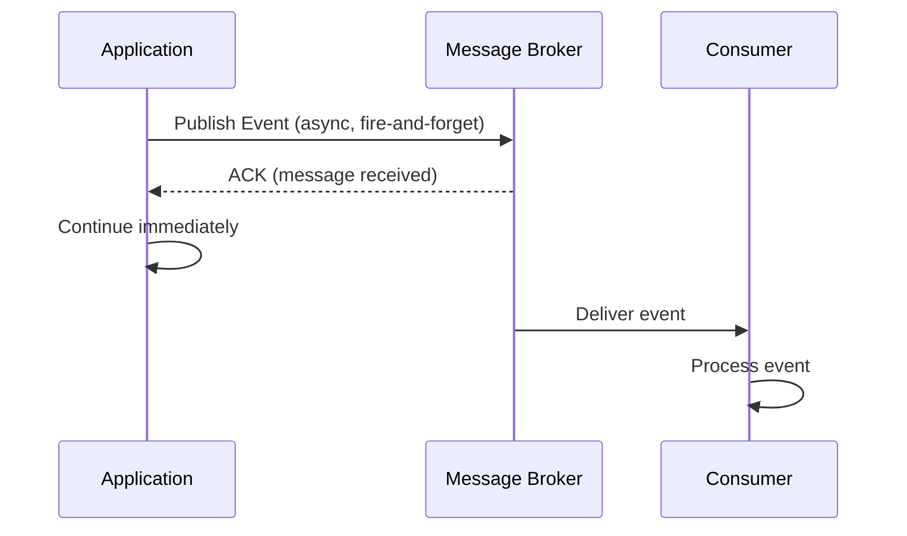

**Code Example (Azure Service Bus)**

```csharp
var client = new ServiceBusClient(connectionString);
var sender = client.CreateSender("orders-topic");

var message = new ServiceBusMessage
{
    Body = new BinaryData(JsonConvert.SerializeObject(new OrderCreated 
    { 
        OrderId = "ORD-1001", 
        CustomerId = "CUS-123" 
    })),
    CorrelationId = correlationId,
    ContentType = "application/json"
};

await sender.SendMessageAsync(message);
```

## Producer with Confirmation

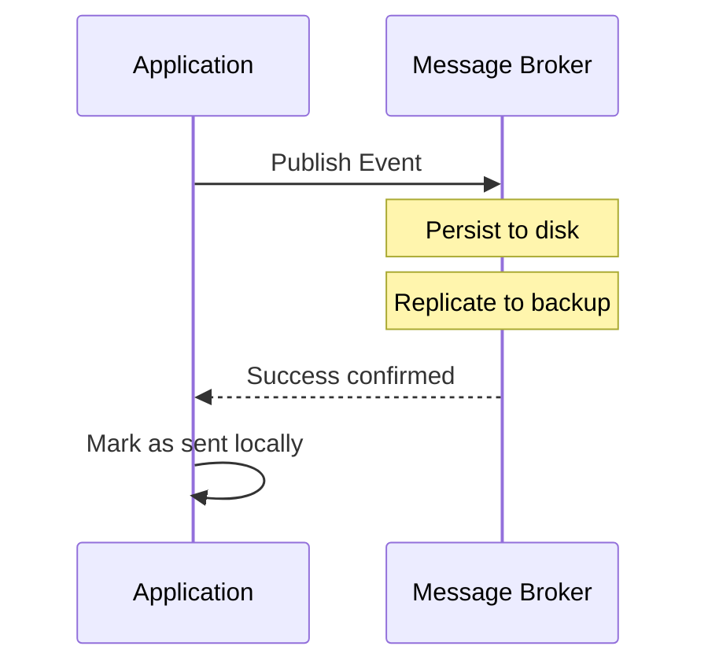

**Code Example**

```csharp
try 
{
    await sender.SendMessageAsync(message);
    // Message confirmed persisted
    logger.LogInformation($"Event published: {message.CorrelationId}");
}
catch (Exception ex) 
{
    logger.LogError($"Failed to publish event: {ex}");
    // Retry or mark for manual intervention
}
```

## Producer with Transactional Outbox

The safest pattern: database write and event publish are atomic.

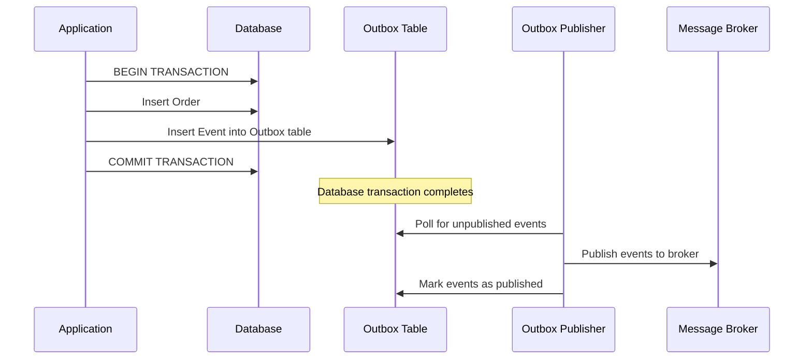

This ensures:
- If DB write succeeds, outbox record exists
- If event publish fails, outbox retry will catch it
- No "ghost" events or lost events

**Code Example**

```csharp
using (var transaction = _db.Database.BeginTransaction())
{
    try
    {
        // Create order
        var order = new Order { OrderId = "ORD-1001", Amount = 9999 };
        _db.Orders.Add(order);
        
        // Add to outbox in same transaction
        var outboxEvent = new OutboxEvent
        {
            EventType = "OrderCreated",
            EventData = JsonConvert.SerializeObject(order),
            IsPublished = false,
            CreatedAt = DateTime.UtcNow
        };
        _db.OutboxEvents.Add(outboxEvent);
        
        _db.SaveChanges();
        transaction.Commit();
    }
    catch (Exception)
    {
        transaction.Rollback();
        throw;
    }
}
```

---

# 5. Consumer Design Patterns

## Simple Consumer (Pull Model)

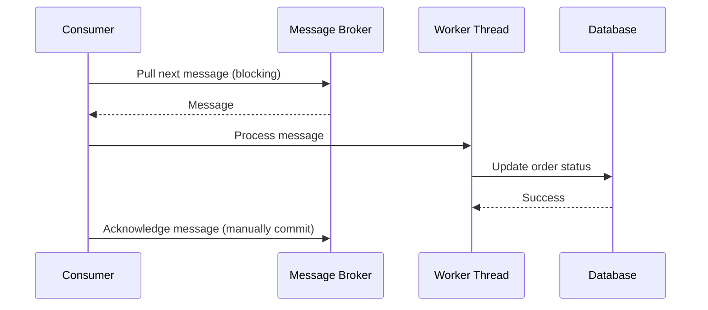

**Code Example**

```csharp
var client = new ServiceBusClient(connectionString);
var processor = client.CreateProcessor("orders-topic", "payment-subscription");

processor.ProcessMessageAsync += async args =>
{
    try
    {
        var message = args.Message;
        var orderCreated = JsonConvert.DeserializeObject<OrderCreated>(
            message.Body.ToString()
        );
        
        // Process message
        await _paymentService.AuthorizeAsync(orderCreated.OrderId, orderCreated.Amount);
        
        // Acknowledge after successful processing
        await args.CompleteMessageAsync(args.CancellationToken);
    }
    catch (Exception ex)
    {
        logger.LogError($"Failed to process message: {ex}");
        // Don't acknowledge; message will be retried
    }
};

processor.ProcessErrorAsync += args =>
{
    logger.LogError($"Error: {args.Exception}");
    return Task.CompletedTask;
};

await processor.StartProcessingAsync();
```

## Consumer with Idempotent Processing

Since messages can be delivered multiple times, consumer must handle duplicates.

```csharp
processor.ProcessMessageAsync += async args =>
{
    var messageId = args.Message.MessageId;
    
    // Check if already processed
    var processed = await _db.ProcessedMessages
        .FirstOrDefaultAsync(p => p.MessageId == messageId);
    
    if (processed != null)
    {
        logger.LogInformation($"Message {messageId} already processed, skipping");
        await args.CompleteMessageAsync(args.CancellationToken);
        return;  // Idempotent return
    }
    
    try
    {
        var orderCreated = JsonConvert.DeserializeObject<OrderCreated>(
            args.Message.Body.ToString()
        );
        
        // Process message
        await _paymentService.AuthorizeAsync(orderCreated.OrderId);
        
        // Record as processed
        _db.ProcessedMessages.Add(new ProcessedMessage 
        { 
            MessageId = messageId, 
            ProcessedAt = DateTime.UtcNow 
        });
        await _db.SaveChangesAsync();
        
        await args.CompleteMessageAsync(args.CancellationToken);
    }
    catch (Exception ex)
    {
        logger.LogError($"Failed to process: {ex}");
        throw;
    }
};
```

---

# 6. Retry Strategies

## Retry with Exponential Backoff

Failed messages are retried with increasing delay.

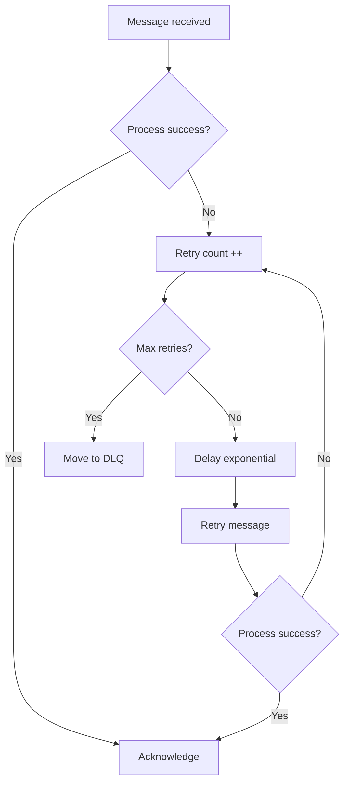

**Azure Service Bus Configuration**

```csharp
var options = new ServiceBusProcessorOptions
{
    MaxConcurrentCalls = 10,
    ReceiveMode = ServiceBusReceiveMode.PeekLock,
    MaxAutoLockRenewalDuration = TimeSpan.FromSeconds(300)
};

var processor = client.CreateProcessor("topic", "subscription", options);

processor.ProcessErrorAsync += args =>
{
    // DeadLetter thrown exception count
    if (args.Exception is ServiceBusException sbe)
    {
        logger.LogError($"Service Bus error: {sbe.Reason}");
    }
    return Task.CompletedTask;
};
```

**Retry Attempt Table**

| Attempt | Delay | Total Time | Reason |
|---|---|---|---|
| 1 | Immediate | 0s | First try |
| 2 | 1s | 1s | Transient network hiccup |
| 3 | 2s | 3s | Database temporarily busy |
| 4 | 4s | 7s | Service still recovering |
| 5 | 8s | 15s | Service in overload |
| 6 | 16s | 31s | Deep issue, needs time |
| 7 | 32s | 63s | Last attempt before DLQ |

## Transient vs Permanent Failures

| Error | Type | Retry? |
|---|---|---|
| Network timeout | Transient | Yes |
| 500 Service error | Transient | Yes |
| 429 Rate limit | Transient | Yes (with backoff) |
| 503 Unavailable | Transient | Yes |
| Invalid message format | Permanent | No |
| Constraint violation | Permanent | No |
| Invalid data | Permanent | No |
| Authorization failed | Permanent | No |

Only retry transient errors; permanent errors should go to DLQ immediately.

```csharp
bool IsTransientError(Exception ex)
{
    return ex is TimeoutException
        || ex is ServiceBusException sbe && sbe.IsTransient
        || ex is HttpRequestException hre && hre.StatusCode >= 500
        || ex is IOException;
}
```

---

# 7. Dead-Letter Queue (DLQ)

When a message fails all retry attempts, it goes to a dead-letter queue for manual inspection.

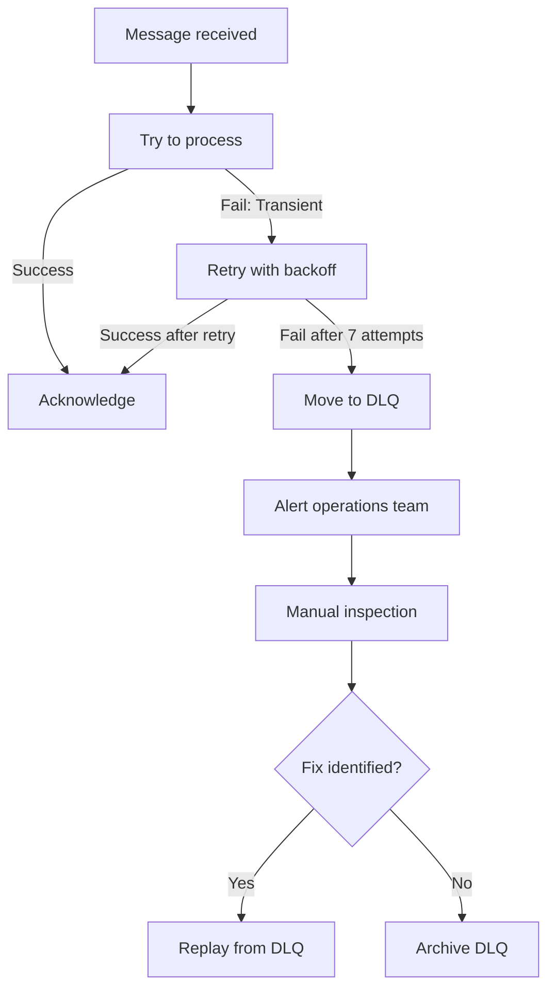

**Azure Service Bus DLQ Configuration**

```csharp
var queueProperties = new CreateQueueOptions("orders-queue")
{
    DeadLetteringOnMessageExpiration = true,
    DefaultMessageTimeToLive = TimeSpan.FromDays(7),
    LockDuration = TimeSpan.FromSeconds(30),
    MaxDeliveryCount = 10  // After 10 attempts, move to DLQ
};
```

**DLQ Message Structure**

When a message is moved to DLQ, it includes metadata:

```csharp
var dlqClient = new ServiceBusClient(connectionString);
var dlqReceiver = dlqClient.CreateReceiver("orders-queue/$DeadLetterQueue");

await foreach (var message in dlqReceiver.ReceiveMessagesAsync())
{
    logger.LogError($"DLQ Message:");
    logger.LogError($"  MessageId: {message.MessageId}");
    logger.LogError($"  DeadLetterReason: {message.DeadLetterReason}");
    logger.LogError($"  DeadLetterErrorDescription: {message.DeadLetterErrorDescription}");
    logger.LogError($"  CorrelationId: {message.CorrelationId}");
    logger.LogError($"  Body: {message.Body}");
    logger.LogError($"  Attempt count: {message.DeliveryCount}");
}
```

**Monitoring DLQ**

```csharp
// Alert if DLQ has messages
[FunctionName("MonitorDLQ")]
public async Task MonitorDLQAsync([TimerTrigger("0 */5 * * * *")] TimerInfo timer)
{
    var dlqReceiver = _client.CreateReceiver("orders-queue/$DeadLetterQueue");
    var dlqMessages = await dlqReceiver.PeekMessagesAsync(10);
    
    if (dlqMessages.Count > 0)
    {
        logger.LogError($"DLQ has {dlqMessages.Count} messages");
        // Send alert to PagerDuty / Teams
    }
}
```

---

# 8. Message Ordering

## Requirement: Process Order Events in Sequence

Events for the same order must be processed in order:
1. OrderCreated
2. InventoryReserved
3. PaymentAuthorized
4. ShipmentCreated

Processing out of order would be incorrect.

## Solution: Session-Based Processing (Azure Service Bus)

Group messages by session ID. Each session is processed by one consumer at a time.

```mermaid
flowchart LR
    Topic[Topic: orders] --> Sub[Subscription]
    
    Sub -->|Session ID: ORD-1001| Queue1[Queue for ORD-1001<br/>Event 1, Event 2, Event 3]
    Sub -->|Session ID: ORD-1002| Queue2[Queue for ORD-1002<br/>Event A, Event B, Event C]
    Sub -->|Session ID: ORD-1003| Queue3[Queue for ORD-1003<br/>Event X, Event Y, Event Z]
    
    Queue1 --> Consumer1[Consumer 1]
    Queue2 --> Consumer2[Consumer 2]
    Queue3 --> Consumer3[Consumer 3]
    
    Note over Consumer1: Processes ORD-1001 events in order
    Note over Consumer2: Processes ORD-1002 events in order
    Note over Consumer3: Processes ORD-1003 events in order
```

**Code Example**

```csharp
// Producer sets session ID
var message = new ServiceBusMessage
{
    Body = new BinaryData(orderEvent),
    SessionId = orderEvent.OrderId,  // Route by order ID
    CorrelationId = correlationId
};
await sender.SendMessageAsync(message);

// Consumer: Service Bus ensures one session at a time
var options = new ServiceBusSessionProcessorOptions
{
    MaxConcurrentSessions = 10  // Process up to 10 orders in parallel
};

var processor = client.CreateSessionProcessor("orders-topic", "subscription", options);

processor.ProcessMessageAsync += async args =>
{
    var orderId = args.Message.SessionId;
    logger.LogInformation($"Processing session: {orderId}");
    
    // Process events for this order in order
    await ProcessOrderEventAsync(args.Message);
    await args.CompleteMessageAsync(args.CancellationToken);
};

await processor.StartProcessingAsync();
```

## Alternative: Kafka Partition-Based Ordering

All messages for the same order go to the same partition.

```text
Partition 0: ORD-1001/OrderCreated, ORD-1001/InventoryReserved, ORD-1001/PaymentAuthorized
Partition 1: ORD-1002/OrderCreated, ORD-1002/InventoryReserved
Partition 2: ORD-1003/OrderCreated

Consumer for Partition 0 processes ORD-1001 events in order
Consumer for Partition 1 processes ORD-1002 events in order
Consumer for Partition 2 processes ORD-1003 events in order
```

**Kafka Producer Code**

```java
ProducerRecord<String, String> record = new ProducerRecord<>(
    "orders",           // topic
    order.getOrderId(), // key (determines partition)
    orderEvent          // value
);

producer.send(record, (metadata, exception) -> {
    if (exception != null) {
        logger.error("Send failed", exception);
    } else {
        logger.info("Message sent to partition: " + metadata.partition());
    }
});
```

---

# 9. Duplicate Message Handling

## Root Cause: At-Least-Once Delivery

Message brokers guarantee at-least-once (never zero-times), but can result in duplicates:

```text
Producer sends message
Broker persists
Broker ACKs to producer
Consumer receives message
Consumer processes
Consumer crashes before ACKing

Broker hasn't received ACK, retransmits same message
New consumer picks up message (duplicate)
```

## Solution: Idempotent Consumer

Store message ID of processed messages. If message ID seen before, skip processing.

```csharp
public async Task ProcessOrderEventAsync(ServiceBusReceivedMessage message)
{
    var messageId = message.MessageId;
    
    // Check if already processed
    var processed = await _db.ProcessedMessages
        .FirstOrDefaultAsync(p => p.MessageId == messageId);
    
    if (processed != null)
    {
        logger.LogInformation($"Message {messageId} already processed");
        return;  // Idempotent: safe to process again
    }
    
    try
    {
        var orderEvent = JsonConvert.DeserializeObject<OrderEvent>(message.Body.ToString());
        
        // Perform idempotent operation
        await AuthorizePaymentAsync(orderEvent);
        
        // Record message as processed
        _db.ProcessedMessages.Add(new ProcessedMessage
        {
            MessageId = messageId,
            MessageType = orderEvent.EventType,
            ProcessedAt = DateTime.UtcNow
        });
        await _db.SaveChangesAsync();
    }
    catch (Exception ex)
    {
        logger.LogError($"Failed to process: {ex}");
        throw;  // Will trigger retry
    }
}
```

## Idempotent Operations

Ensure operations are idempotent (running twice = running once):

**❌ Not Idempotent**
```csharp
// Bad: Each call increments
inventory.Quantity -= orderQty;
```

**✅ Idempotent**
```csharp
// Good: Can run multiple times safely
reservation = await _db.InventoryReservations
    .FirstOrDefaultAsync(r => r.OrderId == orderId);

if (reservation == null)
{
    reservation = new InventoryReservation { OrderId = orderId, Quantity = orderQty };
    _db.Add(reservation);
}
else
{
    reservation.Quantity = orderQty;  // Update, don't add again
}
```

---

# 10. Kafka Implementation Example

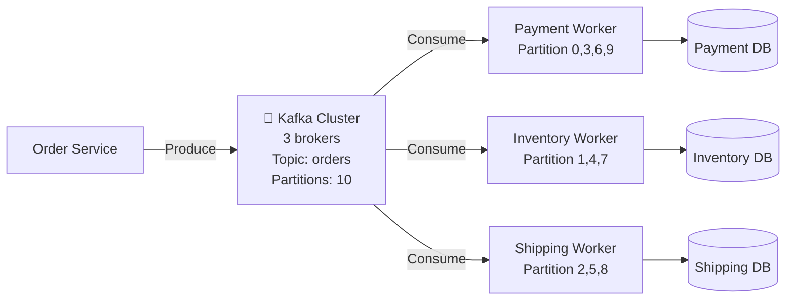

**Producer Code (Java/Spring)**

```java
@SpringBootApplication
public class OrderProducer {
    
    @Autowired
    private KafkaTemplate<String, OrderEvent> kafkaTemplate;
    
    public void publishOrderCreated(OrderEvent event) {
        ListenableFuture<SendResult<String, OrderEvent>> future = 
            kafkaTemplate.send("orders", event.getOrderId(), event);
        
        future.addCallback(
            result -> logger.info("Published: " + result.getRecordMetadata().partition()),
            ex -> logger.error("Failed to publish", ex)
        );
    }
}
```

**Consumer Code (Java/Spring)**

```java
@Component
public class PaymentConsumer {
    
    @KafkaListener(
        topics = "orders", 
        groupId = "payment-group",
        containerFactory = "kafkaListenerContainerFactory"
    )
    public void consume(OrderEvent event, Acknowledgment ack) {
        try {
            logger.info("Processing: " + event.getOrderId());
            
            // Check if already processed (idempotent)
            if (isAlreadyProcessed(event.getEventId())) {
                logger.info("Duplicate, skipping");
                ack.acknowledge();
                return;
            }
            
            // Process event
            paymentService.authorize(event.getOrderId(), event.getAmount());
            
            // Record as processed
            markAsProcessed(event.getEventId());
            
            ack.acknowledge();
        } catch (Exception ex) {
            logger.error("Failed to process", ex);
            // Don't acknowledge; message will be redelivered on consumer restart
        }
    }
}
```

---

# 11. Azure Service Bus Implementation

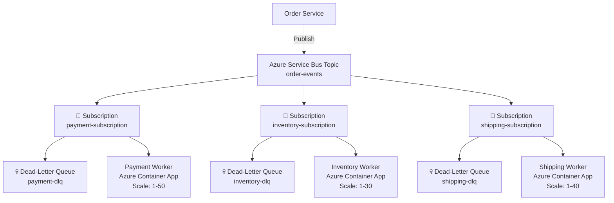

**Producer Code (C# / .NET)**

```csharp
public class OrderEventPublisher
{
    private readonly ServiceBusSender _sender;
    
    public async Task PublishOrderCreatedAsync(Order order)
    {
        var message = new ServiceBusMessage
        {
            Subject = "OrderCreated",
            ContentType = "application/json",
            Body = BinaryData.FromObjectAsJson(new OrderCreatedEvent
            {
                EventId = Guid.NewGuid().ToString(),
                OrderId = order.Id,
                CustomerId = order.CustomerId,
                Amount = order.TotalAmount,
                Timestamp = DateTime.UtcNow
            }),
            CorrelationId = $"order-{order.Id}",
            MessageId = $"order-created-{order.Id}-{DateTime.UtcNow.Ticks}"
        };
        
        try
        {
            await _sender.SendMessageAsync(message);
            logger.LogInformation($"Event published: {message.MessageId}");
        }
        catch (Exception ex)
        {
            logger.LogError($"Failed to publish: {ex}");
            throw;
        }
    }
}
```

**Consumer Code (C# / .NET)**

```csharp
public class PaymentEventProcessor
{
    private readonly ServiceBusProcessor _processor;
    private readonly IPaymentService _paymentService;
    private readonly IDbContext _db;
    
    public async Task StartAsync()
    {
        _processor = _client.CreateProcessor(
            "order-events", 
            "payment-subscription",
            new ServiceBusProcessorOptions
            {
                MaxConcurrentCalls = 10,
                MaxAutoLockRenewalDuration = TimeSpan.FromSeconds(300)
            }
        );
        
        _processor.ProcessMessageAsync += ProcessMessageAsync;
        _processor.ProcessErrorAsync += ProcessErrorAsync;
        
        await _processor.StartProcessingAsync();
    }
    
    private async Task ProcessMessageAsync(ProcessMessageEventArgs args)
    {
        try
        {
            var message = args.Message;
            var eventId = message.MessageId;
            
            // Check if already processed (idempotent)
            var existing = await _db.ProcessedEvents
                .FirstOrDefaultAsync(e => e.EventId == eventId);
            
            if (existing != null)
            {
                logger.LogInformation($"Event already processed: {eventId}");
                await args.CompleteMessageAsync(args.CancellationToken);
                return;
            }
            
            // Deserialize event
            var orderCreatedEvent = JsonConvert.DeserializeObject<OrderCreatedEvent>(
                message.Body.ToString()
            );
            
            // Process payment authorization
            logger.LogInformation($"Authorizing payment for order: {orderCreatedEvent.OrderId}");
            var paymentResult = await _paymentService.AuthorizeAsync(
                orderCreatedEvent.OrderId,
                orderCreatedEvent.Amount
            );
            
            // Record as processed
            _db.ProcessedEvents.Add(new ProcessedEvent
            {
                EventId = eventId,
                EventType = "OrderCreated",
                OrderId = orderCreatedEvent.OrderId,
                ProcessedAt = DateTime.UtcNow,
                Status = "SUCCESS"
            });
            await _db.SaveChangesAsync();
            
            // Acknowledge successful processing
            await args.CompleteMessageAsync(args.CancellationToken);
            
            logger.LogInformation($"Event processed successfully: {eventId}");
        }
        catch (Exception ex)
        {
            logger.LogError($"Error processing message: {ex}");
            // Don't complete; message will be retried
            // After max retries, moved to DLQ
            throw;
        }
    }
    
    private Task ProcessErrorAsync(ProcessErrorEventArgs args)
    {
        logger.LogError($"Processing error: {args.Exception}");
        return Task.CompletedTask;
    }
}
```

---

# 12. Complete Event Flow with Error Handling

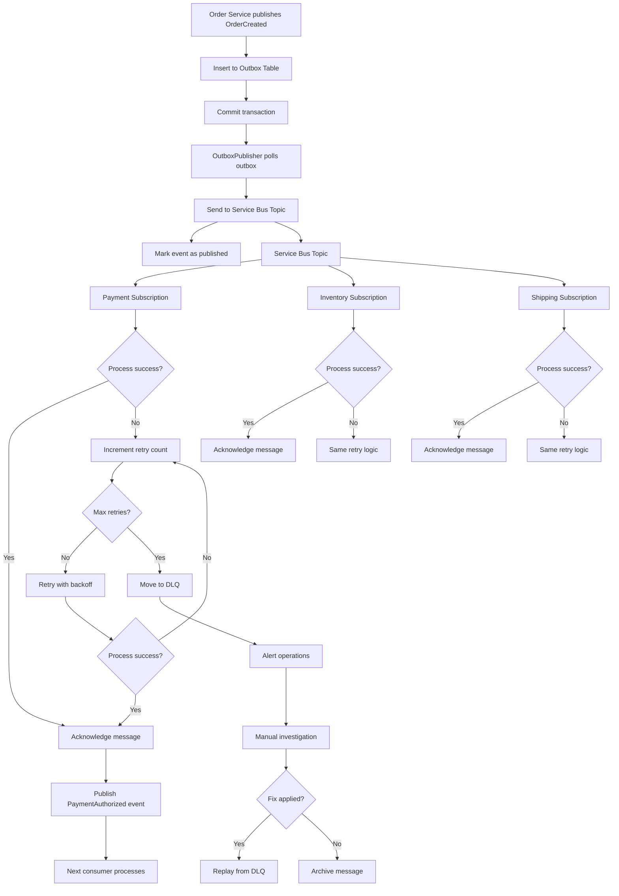

---

# 13. Exactly-Once vs At-Least-Once Semantics

## At-Least-Once (Default)

Message is guaranteed to be delivered at least once, possibly multiple times.

```text
Message may be delivered:
- 1 time (perfect case)
- 2+ times (if consumer crashes, network failure, etc)

Consumer must be idempotent
```

## Exactly-Once (Hard to achieve)

Message delivered exactly once, never lost, no duplicates.

Requires:
1. Atomicity: message processing and state update are atomic
2. Idempotency: reprocessing is safe
3. Ordering: messages processed in order

**Approaching Exactly-Once in Azure Service Bus**

```csharp
// Use transactions for atomic processing
using (var transaction = _db.Database.BeginTransaction())
{
    try
    {
        // Check if already processed
        var eventId = message.MessageId;
        var existing = await _db.ProcessedEvents
            .FirstOrDefaultAsync(e => e.EventId == eventId);
        
        if (existing != null)
        {
            transaction.Rollback();
            await message.CompleteAsync();
            return;  // Already processed
        }
        
        // Process message
        await _paymentService.AuthorizeAsync(orderId, amount);
        
        // Record as processed in same transaction
        _db.ProcessedEvents.Add(new ProcessedEvent { EventId = eventId });
        _db.SaveChanges();
        
        transaction.Commit();
        
        // Only after DB transaction commits, acknowledge to broker
        await message.CompleteAsync();
    }
    catch (Exception ex)
    {
        transaction.Rollback();
        logger.LogError($"Failed: {ex}");
        throw;  // Retry
    }
}
```

---

# 14. Monitoring and Observability

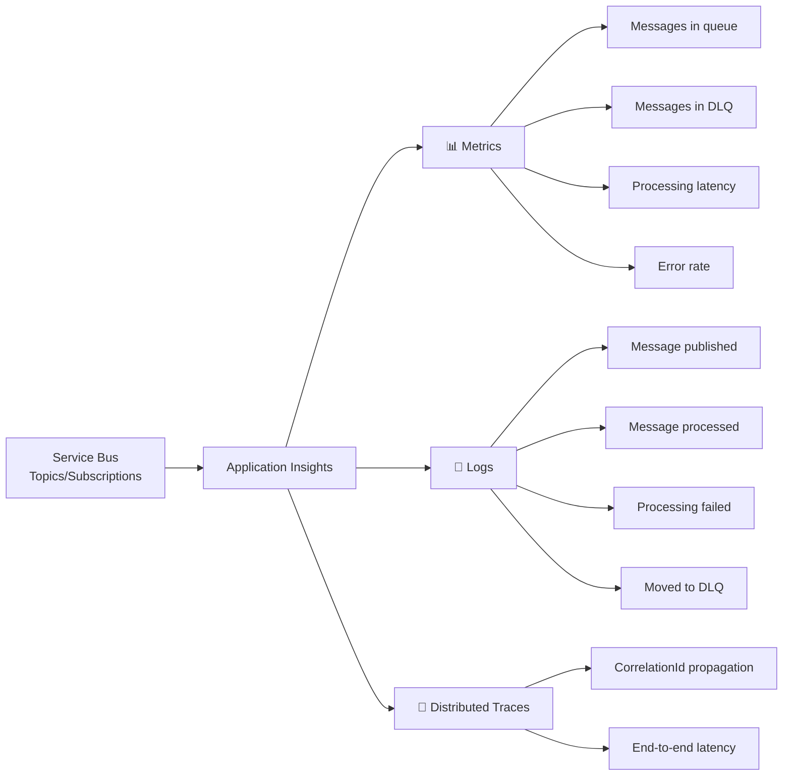

**Key Metrics to Monitor**

```text
Queue/Topic Metrics:
├── Active message count
├── Dead-letter message count
├── Processing time (P50, P95, P99)
└── Message throughput (msg/sec)

Consumer Metrics:
├── Success rate
├── Error rate
├── Retry count
└── Max delivery attempts reached

SLA Metrics:
├── P99 latency < 5 seconds
├── Availability > 99.95%
└── DLQ messages < 10/hour
```

**Alerts**

```csharp
[FunctionName("MonitorEventProcessing")]
public async Task MonitorAsync([TimerTrigger("0 */5 * * * *")] TimerInfo timer)
{
    var dlqClient = _client.CreateReceiver("orders-topic/$DeadLetterQueue");
    
    // Check DLQ depth
    var dlqProperties = await _client.GetSubscriptionRuntimePropertiesAsync(
        "orders-topic",
        "payment-subscription"
    );
    
    if (dlqProperties.DeadLetterMessageCount > 100)
    {
        await _alertService.SendAlertAsync(
            "DLQ Depth High",
            $"Dead-letter queue has {dlqProperties.DeadLetterMessageCount} messages"
        );
    }
}
```

---

# 15. Comparing Technologies for Different Scenarios

## Scenario 1: E-Commerce Order Processing

**Requirements**:
- High volume (100k+ orders/day)
- Exact ordering per order
- Reliable delivery
- Easy DLQ handling
- Managed service preferred

**Recommendation**: **Azure Service Bus with Sessions**

- Topics for event broadcasting
- Sessions for per-order ordering
- Built-in DLQ
- Managed service

---

## Scenario 2: Real-Time Analytics Streaming

**Requirements**:
- Very high throughput (1M+ events/sec)
- Event replay capability
- Partition-based ordering
- Distributed system OK

**Recommendation**: **Apache Kafka**

- Designed for streaming
- Good throughput
- Event log for replay
- Partition ordering

---

## Scenario 3: Small to Medium SaaS Application

**Requirements**:
- Moderate throughput
- Simple setup
- Self-hosted preferred
- Flexible routing

**Recommendation**: **RabbitMQ**

- Proven, mature
- Flexible exchanges
- Easy to deploy
- Good documentation

---

# 16. Event Schema Versioning

Events evolve over time. Support multiple versions:

```json
// V1 (old)
{
  "eventType": "OrderCreated",
  "orderId": "ORD-1001",
  "customerId": "CUS-123",
  "amount": 9999
}

// V2 (new, backward compatible)
{
  "eventType": "OrderCreated",
  "version": "2",
  "orderId": "ORD-1001",
  "customerId": "CUS-123",
  "amount": 9999,
  "currency": "USD",  // NEW FIELD
  "shippingAddress": {...}  // NEW FIELD
}
```

**Consumer handles both versions**

```csharp
dynamic eventData = JsonConvert.DeserializeObject(message.Body.ToString());
var version = eventData.version ?? "1";

if (version == "1")
{
    ProcessV1Event(eventData);
}
else if (version == "2")
{
    ProcessV2Event(eventData);
}
```

---

# 17. How to Answer the Interview Question

A concise interview answer could be:

> I'd design an event-driven architecture where services publish domain events to a message broker rather than making synchronous calls to each other, decoupling producers and consumers.
>
> **Technology Choice**: For a managed Azure solution, I'd use Azure Service Bus with Topics and Subscriptions. For very high throughput (millions/sec), I'd use Kafka. For self-hosted flexibility, RabbitMQ.
>
> **Producer Design**: Use the transactional outbox pattern — in a single database transaction, insert the business object (order) and publish the event to an outbox table. A background publisher polls the outbox and publishes to the broker, ensuring no events are lost if the app crashes.
>
> **Consumer Design**: Process messages asynchronously, maintaining an inbox table to track processed messages (event IDs). When a message arrives, check if that event ID was already processed. If yes, return success idempotently. If no, process the event, record the event ID, and commit atomically. This handles duplicate delivery.
>
> **Retries**: Use exponential backoff with jitter — retry after 1s, 2s, 4s, 8s, etc. Only retry transient errors (timeouts, 5xx). After 7 failed attempts, move the message to a dead-letter queue. Operations team monitors the DLQ, investigates root cause, and replays fixed messages.
>
> **Ordering**: For events that must be processed in order (e.g., OrderCreated → PaymentAuthorized → ShipmentCreated), use Service Bus Sessions or Kafka partitions. All events for the same order go to the same session/partition, ensuring sequential processing.
>
> **Duplicate Handling**: Messages can be delivered multiple times. Every consumer implementation checks if the event ID was already processed. If so, skip processing (idempotent return). Ensure all operations are idempotent — can safely run twice with same result.
>
> **Observability**: Every event carries a CorrelationId propagated across all services. Use Application Insights to track: message throughput, P50/P95/P99 latency, error rates, DLQ depth. Alert if DLQ has messages or latency exceeds threshold.

---

# 18. Key Design Decisions

| Concern | Decision | Azure Implementation |
|---|---|---|
| Delivery guarantee | At-least-once + idempotent consumers | Service Bus + inbox pattern |
| Ordering | Per-order ordering | Service Bus Sessions |
| Event replay | Store events for historical analysis | Service Bus 90-day retention |
| Failed messages | Move to DLQ after N retries | Built-in DLQ in Service Bus |
| Scaling | Independent consumer scaling | Container Apps with auto-scaling |
| Monitoring | Central observability | Application Insights + Log Analytics |
| Coupling | Loose via events | Topics with multiple subscriptions |

---

# 19. Common Pitfalls to Avoid

| Pitfall | Problem | Solution |
|---|---|---|
| No idempotency | Duplicate charges, data corruption | Track processed event IDs, idempotent operations |
| Infinite retries | System hangs, resource exhaustion | Limit retries, use exponential backoff + circuit breaker |
| No DLQ monitoring | Silent failures | Alert when DLQ has messages |
| Synchronous calls inside event handlers | Blocking, tight coupling | Keep event handlers async, publish new events |
| No ordering | Messages processed out of order | Use sessions or partitions for ordered events |
| Storing state in handler | Loss on crash | Use persistent inbox table |
| No CorrelationId | Can't trace events end-to-end | Include CorrelationId in every event |
| No schema versioning | Breaking changes | Version events, handle multiple versions in consumers |

---

# 20. Final Event-Driven Architecture

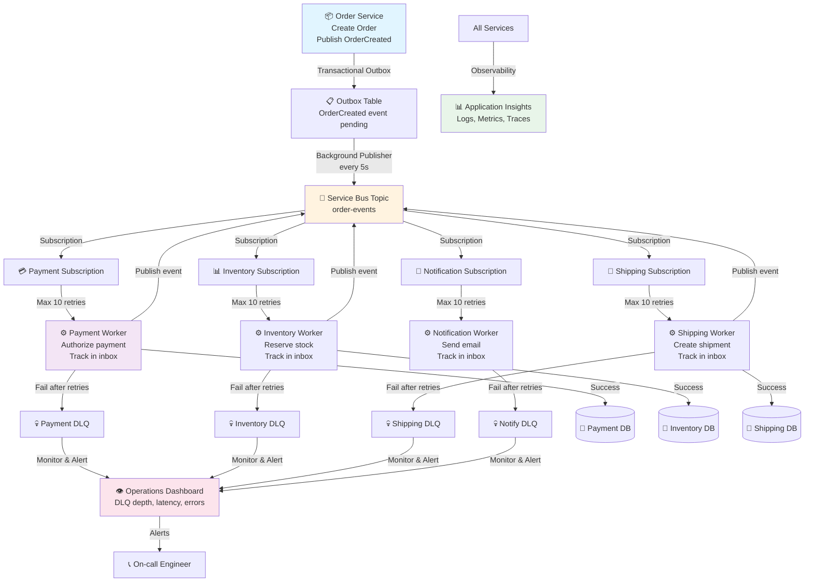

The main principle is:

> Event-driven architectures decouple services through asynchronous messaging. Use the transactional outbox pattern to ensure events are reliably published. Design idempotent consumers that track processed event IDs to handle at-least-once delivery. Implement retries with exponential backoff, move failures to dead-letter queues, and monitor everything. This enables independent scaling, fault isolation, and eventual consistency across distributed systems.
