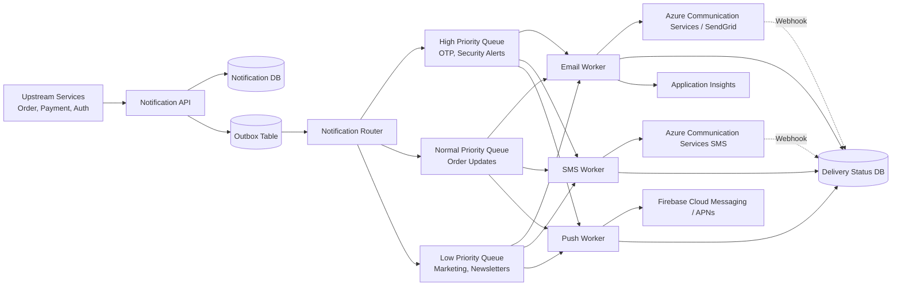
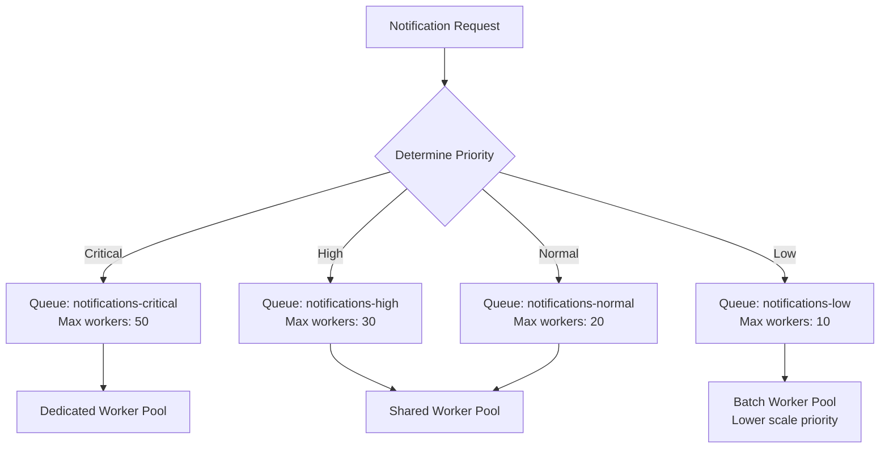
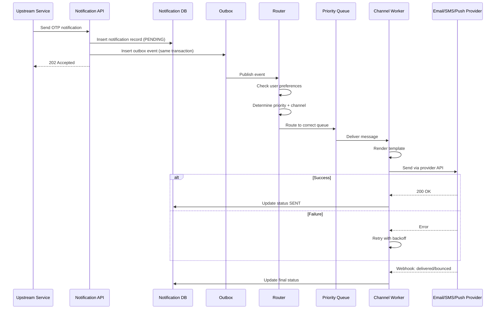
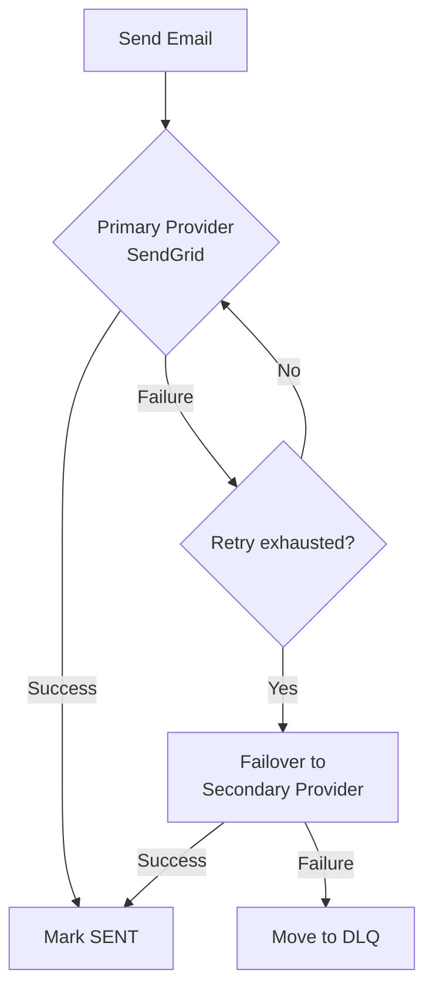
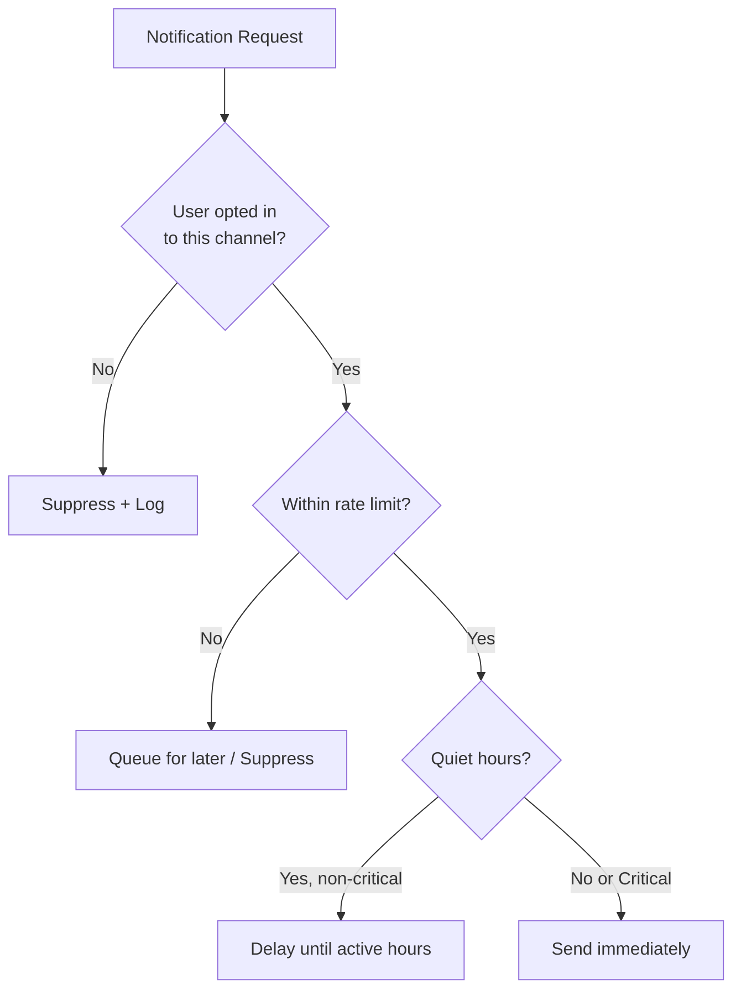
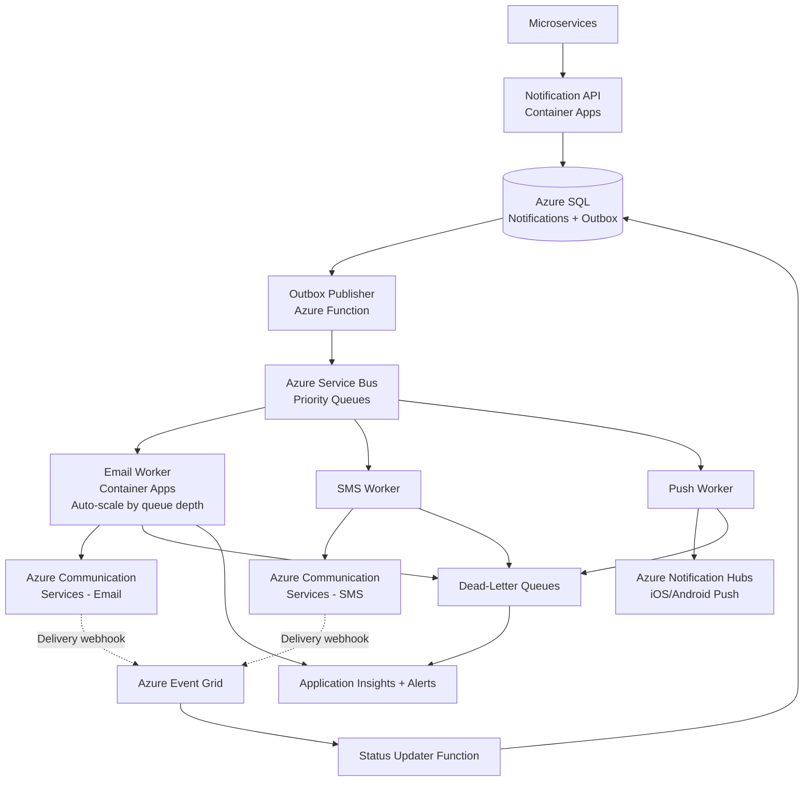
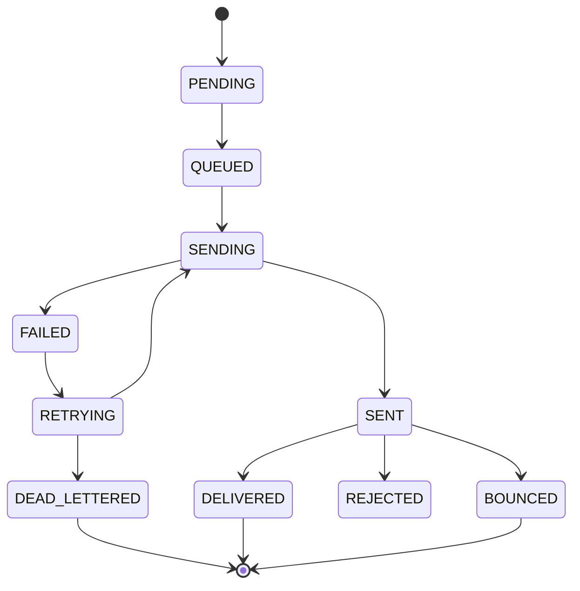
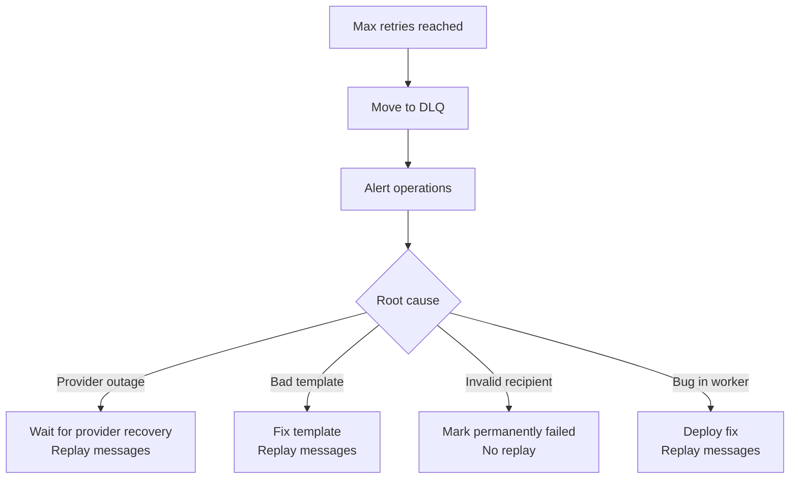

## Notification System Design (Email, SMS, Push)

## Interview Preparation Guide

This guide explains how to design a notification system that delivers Email, SMS, and Push notifications to millions of users, covering queues, priorities, retries, failures, and Azure implementation.

---

## 1. Problem Statement

Design a system that:

- Sends Email, SMS, and Push notifications
- Scales to millions of notifications per day
- Supports different priorities (critical OTP vs marketing)
- Handles provider failures and retries safely
- Avoids duplicate notifications
- Tracks delivery status
- Respects user preferences and rate limits (don't spam users)

---

# 2. High-Level Architecture



---

# 3. Core Components

| Component | Responsibility |
|---|---|
| Notification API | Accepts notification requests from other services |
| Outbox Table | Reliable event storage (same pattern as order processing) |
| Router | Determines channel (email/SMS/push) and priority queue |
| Priority Queues | Separate queues for critical, normal, low priority |
| Channel Workers | Process queue messages, call external providers |
| Template Service | Renders content (subject, body) from templates + variables |
| User Preference Service | Checks opt-in/opt-out, quiet hours, channel preference |
| Delivery Status Store | Tracks sent/delivered/failed/bounced status |
| Dead-Letter Queue | Holds permanently failed messages |

---

# 4. Priority-Based Queueing

## Why Priorities Matter

```text
Critical: OTP codes, security alerts, password reset (must be near-instant)
High: Order confirmation, payment receipt
Normal: Shipping updates, account changes
Low: Marketing, newsletters, promotions
```

A marketing blast of 5 million emails should never delay an OTP code.

## Azure Service Bus Queue Design



Separate queues per priority ensure:

- Critical queue workers always have capacity available
- Low priority (bulk) traffic doesn't starve critical messages
- Each queue can scale independently (autoscale by queue depth)

## Message Priority Metadata

```json
{
  "notificationId": "NOTIF-1001",
  "priority": "CRITICAL",
  "channel": "SMS",
  "userId": "USER-123",
  "templateId": "OTP_CODE",
  "variables": { "code": "482913" },
  "correlationId": "corr-789",
  "createdAt": "2026-09-30T10:00:00Z"
}
```

---

# 5. Notification Flow



---

# 6. Retry Strategy

## Transient vs Permanent Failures

| Error | Type | Action |
|---|---|---|
| Provider timeout | Transient | Retry with backoff |
| Rate limited (429) | Transient | Retry after delay |
| Invalid phone number | Permanent | Fail immediately, don't retry |
| Invalid email format | Permanent | Fail immediately |
| Provider outage (503) | Transient | Retry, use backup provider |
| Unsubscribed user | Permanent | Skip send, log suppression |

## Exponential Backoff

```text
Attempt 1: immediate
Attempt 2: 5 seconds
Attempt 3: 30 seconds
Attempt 4: 2 minutes
Attempt 5: 10 minutes
After 5 attempts: move to DLQ
```

## Multi-Provider Failover



```csharp
public async Task SendEmailAsync(EmailNotification notification)
{
    try
    {
        await _primaryProvider.SendAsync(notification);
        await MarkAsSentAsync(notification.Id);
    }
    catch (Exception ex) when (IsTransient(ex))
    {
        logger.LogWarning($"Primary provider failed, trying secondary: {ex}");
        try
        {
            await _secondaryProvider.SendAsync(notification);
            await MarkAsSentAsync(notification.Id);
        }
        catch (Exception ex2)
        {
            logger.LogError($"Both providers failed: {ex2}");
            throw;  // Will go to DLQ after retries
        }
    }
}
```

---

# 7. Idempotency and Duplicate Prevention

Each notification has a unique ID. Consumers check before sending:

```csharp
public async Task ProcessNotificationAsync(ServiceBusReceivedMessage message)
{
    var notificationId = message.MessageId;

    var existing = await _db.SentNotifications
        .FirstOrDefaultAsync(n => n.NotificationId == notificationId);

    if (existing != null)
    {
        logger.LogInformation($"Already sent: {notificationId}");
        return;  // Idempotent skip
    }

    // Send and record
    await SendAsync(notification);
    await RecordSentAsync(notificationId);
}
```

Also deduplicate at the request level — if Order Service accidentally publishes the same "OrderShipped" event twice, the notification system should not send two emails.

---

# 8. Rate Limiting and User Preferences

## Prevent Notification Fatigue

```text
Max 1 marketing email per day per user
Max 3 push notifications per hour per user
No notifications during user's quiet hours (10 PM - 8 AM local time)
Respect unsubscribe/opt-out preferences per channel
```



## User Preference Table

```sql
CREATE TABLE UserNotificationPreferences (
    UserId VARCHAR(50) PRIMARY KEY,
    EmailOptIn BIT NOT NULL DEFAULT 1,
    SMSOptIn BIT NOT NULL DEFAULT 1,
    PushOptIn BIT NOT NULL DEFAULT 1,
    QuietHoursStart TIME,
    QuietHoursEnd TIME,
    Timezone VARCHAR(50),
    MarketingOptIn BIT NOT NULL DEFAULT 1
);
```

---

# 9. Azure Cloud Implementation



## Azure Services

| Need | Azure Service |
|---|---|
| Email sending | Azure Communication Services (Email) or SendGrid |
| SMS sending | Azure Communication Services (SMS) |
| Push notifications | Azure Notification Hubs (iOS/Android/Windows) |
| Message queue | Azure Service Bus (separate queues per priority) |
| Event distribution | Azure Event Grid (for provider webhooks) |
| Compute | Azure Container Apps with KEDA autoscaling |
| Database | Azure SQL (notifications, preferences, status) |
| Template storage | Azure Blob Storage or Cosmos DB |
| Monitoring | Application Insights |

## Autoscaling by Queue Depth

```yaml
# KEDA scaler example for Service Bus queue
triggers:
- type: azure-servicebus
  metadata:
    queueName: notifications-critical
    messageCount: "5"      # Scale out if >5 messages per instance
```

---

# 10. Delivery Status Tracking



## Webhook Handling (Provider Delivery Confirmation)

```csharp
[Function("EmailWebhook")]
public async Task HandleEmailWebhookAsync(
    [HttpTrigger] HttpRequest req)
{
    var payload = await ParseWebhookAsync(req);
    
    foreach (var evt in payload.Events)
    {
        var notification = await _db.Notifications
            .FirstOrDefaultAsync(n => n.ProviderMessageId == evt.MessageId);
        
        if (notification != null)
        {
            notification.Status = MapProviderStatus(evt.EventType);
            notification.UpdatedAt = DateTime.UtcNow;
            await _db.SaveChangesAsync();
        }
    }
}
```

---

# 11. Template Management

```json
{
  "templateId": "ORDER_SHIPPED",
  "channel": "EMAIL",
  "subject": "Your order {{orderId}} has shipped!",
  "body": "Hi {{customerName}}, your order is on its way. Tracking: {{trackingNumber}}",
  "locale": "en-US"
}
```

Store templates in Blob Storage or a database table, versioned, and support multiple locales for internationalization.

---

# 12. Dead-Letter Queue and Manual Recovery



---

# 13. Monitoring and Key Metrics

```text
Notifications sent per minute (by channel)
Delivery success rate (by channel, by provider)
Average delivery latency
Bounce rate / rejection rate
DLQ depth (by priority queue)
Provider API error rate
Queue depth and processing lag
Critical notification latency (must be < 5 seconds)
```

**Alerts:**

```text
Alert if critical queue latency > 10 seconds
Alert if DLQ depth > 100 for any queue
Alert if email bounce rate > 5%
Alert if provider error rate > 10%
```

---

# 14. How to Answer the Interview Question

> I'd design the notification system around an API that upstream services call to request notifications. Using the transactional outbox pattern, the API would persist the notification and an outbox event in the same database transaction, then an outbox publisher pushes it to Azure Service Bus.
>
> For priorities, I'd use separate Service Bus queues — critical (OTP, security alerts), high, normal, and low (marketing). Each queue has its own dedicated worker pool with independent autoscaling via KEDA, so bulk marketing traffic never delays critical OTP messages.
>
> Channel-specific workers (Email, SMS, Push) consume from these queues, render templates, check user preferences and rate limits, then call the appropriate Azure service — Azure Communication Services for email/SMS and Azure Notification Hubs for push.
>
> For retries, I distinguish transient failures (timeouts, rate limits) from permanent failures (invalid phone number, unsubscribed user). Transient failures retry with exponential backoff and can fail over to a secondary provider. After exhausting retries, messages move to a dead-letter queue for manual review.
>
> Idempotency is critical — each notification has a unique ID, and workers check a 'sent notifications' table before sending to prevent duplicates from message redelivery.
>
> I'd track delivery status through provider webhooks (delivered, bounced, rejected) via Azure Event Grid, updating a status table. Application Insights monitors queue depth, delivery latency, and error rates, with alerts for critical queue delays or high DLQ counts.

---

The main principle is:

> Separate notifications by priority into independent queues with dedicated scaling, use the outbox pattern for reliable publishing, make all sending operations idempotent, retry transient failures with backoff and provider failover, and route permanently failed messages to a dead-letter queue for manual recovery.
