## Payment System Design

## Interview Preparation Guide

This document explains how to design a robust payment system covering:

- Duplicate payment prevention
- Idempotency and idempotency keys
- Retry strategies
- Reconciliation
- Saga compensation patterns
- Failure scenarios
- Payment state machines
- Azure cloud implementation
- PCI compliance and security

---

## 1. Problem Statement

Design a payment system that can:

- Accept payment requests from orders
- Authorize and capture payments reliably
- Prevent duplicate charges (same customer, same order charged twice)
- Recover from transient failures (network timeout, provider unavailable)
- Reconcile payment state with external providers
- Handle partial failures (payment succeeds but confirmation fails)
- Support refunds and chargebacks
- Audit all payment transactions
- Maintain PCI compliance

The system must interface with external payment providers (Stripe, Square, PayPal) and survive network failures, service restarts, and concurrent requests.

---

# 2. High-Level Architecture

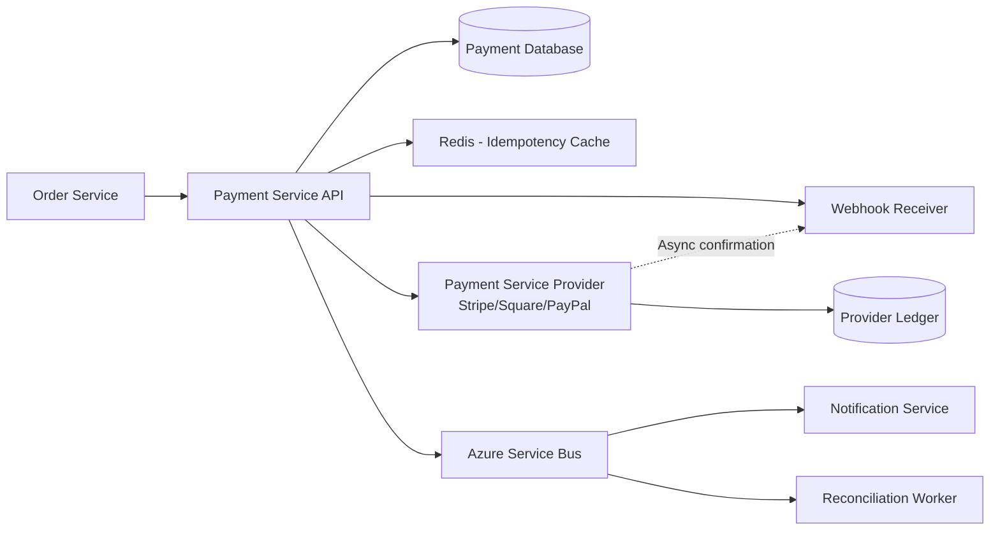

## Key Components

| Component | Responsibility |
|---|---|
| Payment Service | Accepts payment requests, validates, calls provider, stores results |
| Payment Database | Persistent payment transaction records with state |
| Idempotency Store | Caches payment results by idempotency key |
| Payment Provider | External service (Stripe, Square, PayPal) |
| Webhook Receiver | Processes async confirmations from payment provider |
| Reconciliation Worker | Queries provider for truth, fixes local state mismatches |
| Service Bus | Publishes payment events (success, failure, refund) |
| Monitoring | Alerts on payment failures, reconciliation gaps |

---

# 3. Payment Flow (Happy Path)

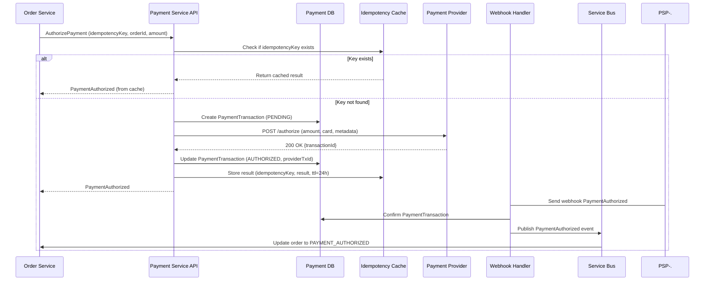

---

# 4. Idempotency and Idempotency Keys

## Why Idempotency

In distributed systems, requests are retried:

```text
POST /payments/authorize (timeout)
Retry: POST /payments/authorize (timeout)
Retry: POST /payments/authorize (success)
```

Without idempotency, the third attempt charges the customer again.

## Idempotency Key

The client (Order Service) generates or uses a deterministic identifier:

```text
idempotencyKey = SHA256(orderId + paymentAttempt + timestamp)
```

Or simpler:

```text
idempotencyKey = ORDER-1001-PAY-1
```

The key **uniquely identifies this logical operation**, not the physical HTTP request.

## Server-Side Idempotency Implementation

```text
POST /payments/authorize
Header: Idempotency-Key: ORDER-1001-PAY-1
Body: {
  "orderId": "ORD-1001",
  "amount": 9999,
  "currency": "USD",
  "cardToken": "pm_token_123"
}
```

Server logic:

```text
1. Check if Idempotency-Key exists in cache/database
2. If yes:
     - Return cached result with same status code
     - Do NOT call payment provider again
3. If no:
     - Call payment provider
     - Store result in database
     - Cache result with idempotencyKey as key
     - Return result
```

## Example Payment Database Schema

```sql
CREATE TABLE PaymentTransactions (
    PaymentTransactionId  VARCHAR(100) PRIMARY KEY,
    OrderId               VARCHAR(50) NOT NULL,
    IdempotencyKey        VARCHAR(200) UNIQUE NOT NULL,
    ProviderTransactionId VARCHAR(200),
    Amount                DECIMAL(18, 2) NOT NULL,
    Currency              VARCHAR(10) NOT NULL,
    Status                VARCHAR(30) NOT NULL,  -- PENDING, AUTHORIZED, CAPTURED, FAILED, REFUNDED
    AuthorizationCode     VARCHAR(100),
    FailureReason         VARCHAR(500),
    CreatedAt             DATETIME2 NOT NULL,
    UpdatedAt             DATETIME2 NOT NULL,
    ProviderCreatedAt     DATETIME2,
    ProviderExpiresAt     DATETIME2
);

CREATE UNIQUE INDEX idx_idempotency_key ON PaymentTransactions(IdempotencyKey);
```

---

# 5. Retry Strategy

## Transient vs Permanent Failures

| Error | Type | Retry? |
|---|---|---|
| Network timeout | Transient | Yes |
| 500 Server error | Transient | Yes |
| 429 Rate limited | Transient | Yes (with backoff) |
| Invalid card | Permanent | No |
| Declined (insufficient funds) | Permanent | No |
| Invalid request (bad JSON) | Permanent | No |
| Authorization expired | Transient | Yes (re-authorize) |

## Exponential Backoff with Jitter

```text
Attempt 1: Immediate
Attempt 2: 1s + random(0-1s)
Attempt 3: 2s + random(0-2s)
Attempt 4: 4s + random(0-4s)
Attempt 5: 8s + random(0-8s)
Attempt 6: 16s + random(0-16s)
Attempt 7: 32s + random(0-32s)
Attempt 8+: Give up, move to manual review
```

Max total time: ~63 seconds, allowing time for transient issues to resolve.

Jitter prevents thundering herd — if 1000 orders timeout simultaneously, jitter spreads the retries.

## Implementation Using Polly (.NET)

```csharp
var retryPolicy = Policy
    .Handle<HttpRequestException>()
    .Or<TimeoutException>()
    .Or<HttpStatusCode>(code => (int)code >= 500)  // 500-599 errors
    .OrResult<HttpResponseMessage>(r => (int)r.StatusCode == 429)  // Rate limit
    .WaitAndRetryAsync(
        retryCount: 7,
        sleepDurationProvider: retryAttempt =>
            TimeSpan.FromSeconds(Math.Pow(2, retryAttempt))
            + TimeSpan.FromMilliseconds(Random.Shared.Next(0, 1000)),
        onRetry: (outcome, timespan, retryCount, context) =>
            Logger.LogWarning($"Retry {retryCount} after {timespan.TotalSeconds}s")
    );

var result = await retryPolicy.ExecuteAsync(
    () => PaymentProvider.AuthorizeAsync(orderId, amount, cardToken)
);
```

## Circuit Breaker + Retry

Combine retry with circuit breaker to fail fast if the provider is consistently down:

```text
5 failures in 30 seconds -> Open circuit
Provider calls fast-fail for 60s
After 60s, allow a test call
If test succeeds -> Close circuit
If test fails -> Back to Open
```

```csharp
var circuitPolicy = Policy
    .Handle<HttpRequestException>()
    .CircuitBreakerAsync(
        handledEventsAllowedBeforeBreaking: 5,
        durationOfBreak: TimeSpan.FromSeconds(60)
    );

var combinedPolicy = Policy.WrapAsync(retryPolicy, circuitPolicy);
```

---

# 6. Payment State Machine

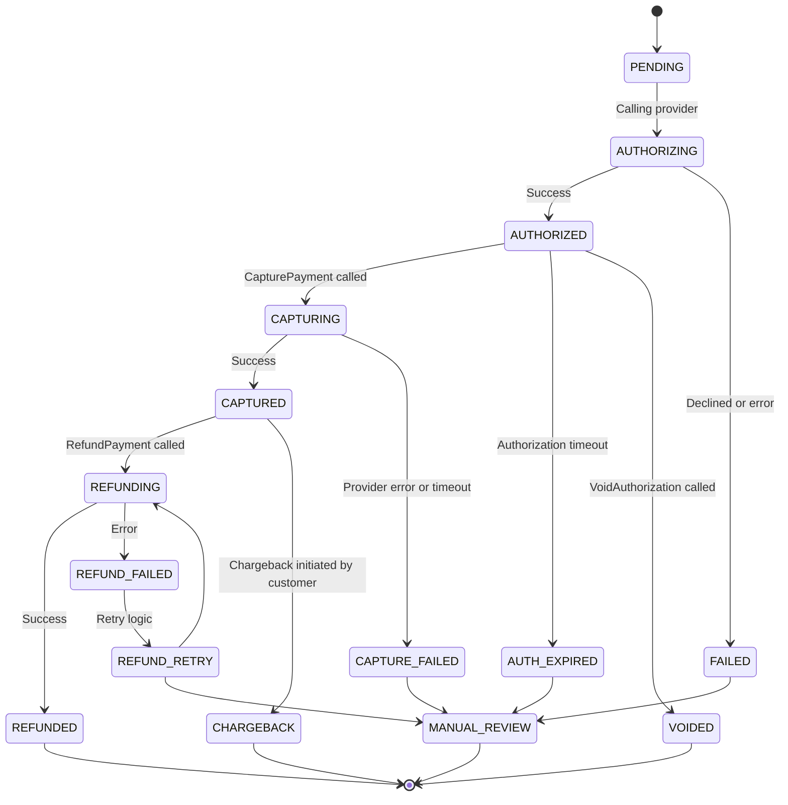

---

# 7. Capture vs Authorization-Only

## Strategy 1: Authorize-Only (Recommended for Physical Goods)

```text
1. Customer places order
2. Authorize payment (card is approved, money held)
3. Inventory reserved
4. Shipment created
5. Capture payment (money transferred)
```

**Advantages:**
- If shipment fails, void authorization (no refund needed)
- Authorization expires after 7 days (provider-specific), reducing held funds

**Disadvantages:**
- Two API calls to payment provider
- Authorization expiry must be tracked

## Strategy 2: Immediate Capture (Digital Goods)

```text
1. Customer places order
2. Capture payment (money immediately transferred)
3. Deliver digital goods
```

**Advantages:**
- Single API call
- Simpler flow

**Disadvantages:**
- If delivery fails, must issue refund
- More refund overhead

## Recommended Flow

For e-commerce with physical goods:

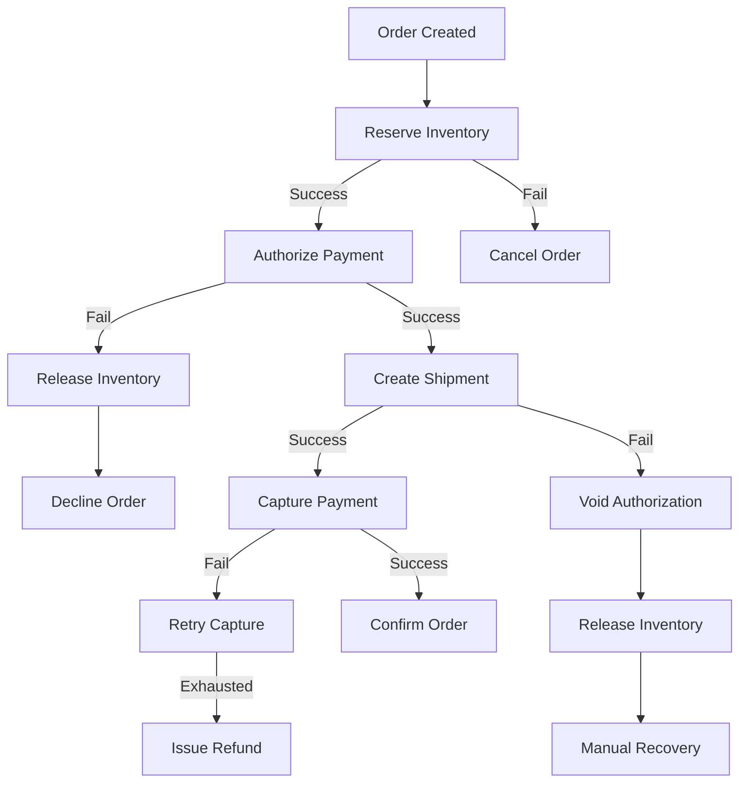

---

# 8. Webhook Handling and Async Confirmation

Payment providers send webhooks to confirm payment events:

```text
POST /payments/webhooks/stripe
Payload: {
  "type": "charge.succeeded",
  "data": {
    "object": {
      "id": "ch_1234567890",
      "amount": 9999,
      "status": "succeeded",
      "metadata": {
        "orderId": "ORD-1001"
      }
    }
  }
}
```

## Webhook Receiver Implementation

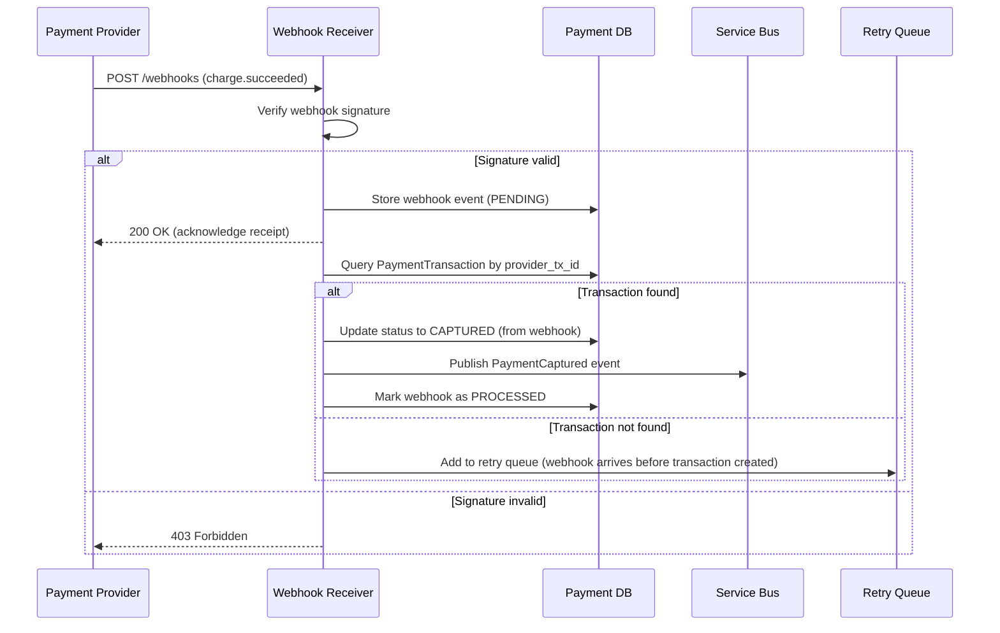

## Important: Webhook Idempotency

Webhooks can be delivered multiple times. Store webhook event ID in database:

```sql
CREATE TABLE WebhookEvents (
    WebhookEventId       VARCHAR(200) PRIMARY KEY,
    ProviderEventId      VARCHAR(200) UNIQUE NOT NULL,
    EventType            VARCHAR(50) NOT NULL,
    Payload              NVARCHAR(MAX) NOT NULL,
    Status               VARCHAR(30) NOT NULL,  -- PENDING, PROCESSED, FAILED
    CreatedAt            DATETIME2 NOT NULL
);
```

Webhook processing:

```text
1. Check if ProviderEventId already exists in WebhookEvents table
2. If yes and PROCESSED: return 200 OK (idempotent)
3. If no: process webhook, update local payment record, mark as PROCESSED
```

---

# 9. Reconciliation

## Why Reconciliation

Certain failures can cause state mismatch:

```text
Local database:         AUTHORIZED
Payment provider:       CAPTURED

Cause:
  1. Capture API call succeeded
  2. Response was lost (network partition)
  3. Local database was not updated
```

Reconciliation queries the provider to find truth.

## Reconciliation Flow

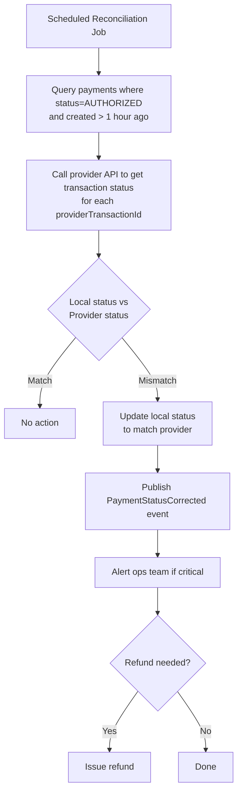

## Reconciliation Implementation

```csharp
public async Task ReconcilePaymentsAsync()
{
    var stalePayments = await _db.PaymentTransactions
        .Where(p => p.Status == PaymentStatus.AUTHORIZED 
                 && p.CreatedAt < DateTime.UtcNow.AddHours(-1))
        .ToListAsync();

    foreach (var payment in stalePayments)
    {
        var providerStatus = await _paymentProvider.GetTransactionStatusAsync(
            payment.ProviderTransactionId
        );

        if (providerStatus.Status != payment.Status)
        {
            logger.LogWarning(
                $"Payment reconciliation mismatch: OrderId={payment.OrderId}, " +
                $"Local={payment.Status}, Provider={providerStatus.Status}"
            );

            payment.Status = providerStatus.Status;
            await _db.SaveChangesAsync();
            
            await _serviceBus.PublishAsync(
                new PaymentReconciliated
                {
                    PaymentTransactionId = payment.PaymentTransactionId,
                    PreviousStatus = payment.Status,
                    NewStatus = providerStatus.Status
                }
            );
        }
    }
}
```

---

# 10. Saga Compensation

When payment fails in the middle of an order workflow, compensating actions must roll back prior successful steps.

## Scenario: Payment Fails After Inventory Reserved

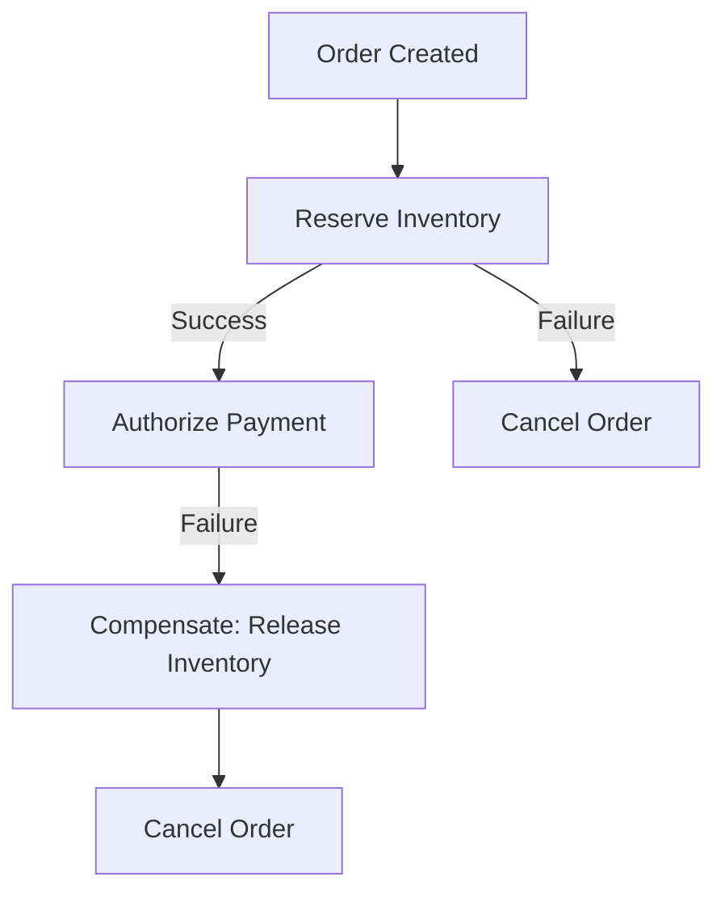

## Scenario: Payment Succeeds But Shipment Creation Fails

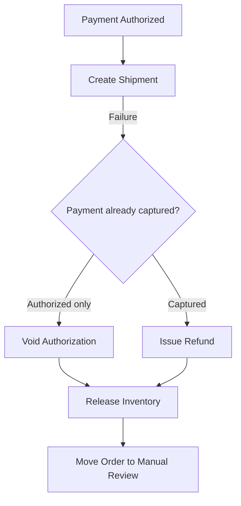

## Compensation Patterns

| Forward Action | Compensating Action | Condition |
|---|---|---|
| Reserve inventory | Release inventory | Payment fails |
| Authorize payment | Void authorization | Shipment fails (before capture) |
| Capture payment | Issue refund | Shipment fails (after capture) |
| Create shipment | Cancel shipment | Payment fails after shipment created |
| Send notification | Mark for retry | Email fails (eventually consistent) |

## Idempotent Compensation

Compensation actions must be idempotent — calling them multiple times should be safe:

```csharp
public async Task VoidAuthorizationAsync(string paymentTransactionId)
{
    var payment = await _db.PaymentTransactions.FindAsync(paymentTransactionId);

    // Check if already voided
    if (payment.Status == PaymentStatus.VOIDED)
    {
        logger.LogInformation($"Payment {paymentTransactionId} already voided");
        return;  // Idempotent: return success without calling provider again
    }

    if (payment.Status != PaymentStatus.AUTHORIZED)
    {
        throw new InvalidOperationException(
            $"Cannot void payment in {payment.Status} state"
        );
    }

    try
    {
        await _paymentProvider.VoidAsync(payment.ProviderTransactionId);
        payment.Status = PaymentStatus.VOIDED;
        await _db.SaveChangesAsync();
    }
    catch (Exception ex)
    {
        logger.LogError($"Void failed: {ex}");
        // Mark for retry by reconciliation job
        payment.Status = PaymentStatus.VOID_PENDING;
        await _db.SaveChangesAsync();
        throw;
    }
}
```

---

# 11. Duplicate Payment Prevention

## Root Causes of Duplicates

1. **Client retry**: customer submits payment form twice
2. **Network timeout**: client retries thinking first call failed
3. **Webhook retry**: provider re-sends webhook believing first delivery failed
4. **Service restart**: payment service crashes before recording result

## Prevention Strategy

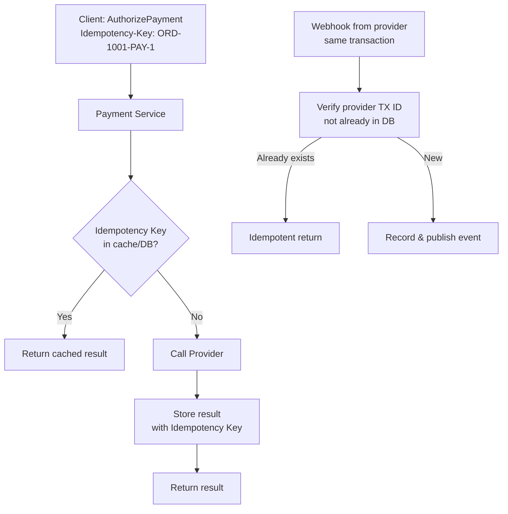

## Multiple Layers of Duplicate Prevention

| Layer | Mechanism |
|---|---|
| **Application** | Idempotency key in request header |
| **Service** | Check idempotency key before calling provider |
| **Cache** | Cache result for 24 hours |
| **Database** | Unique index on idempotency key |
| **Provider** | Webhook de-duplication by event ID |
| **Database** | Unique index on provider transaction ID |
| **Inbox Pattern** | Consumers check if event already processed |

---

# 12. Failure Scenarios and Recovery

## Scenario 1: Network Timeout During Authorization

```text
Time 1: POST /authorize (timeout)
Time 2: POST /authorize (retry with same idempotencyKey)
Time 3: First request completes on provider (charge applied)
Time 4: Second request completes on provider (charge applied again?)
```

**Solution**: Use idempotency key. Provider returns same result for same idempotency key within TTL (24-48 hours).

---

## Scenario 2: Provider Returns Success But Response Lost

```text
POST /authorize
Provider charges card and returns 200 OK with transactionId
Network partition: response never reaches Payment Service
Payment Service timeout: marks as FAILED

Result: Card was charged but order marked as payment failed
```

**Solution**:
1. Retry with same idempotency key (provider returns success again).
2. Webhook arrives with confirmation.
3. Reconciliation job detects mismatch and fixes it.

---

## Scenario 3: Authorization Expires Before Capture

Depending on payment provider, authorization can expire after 7-30 days.

```text
Day 1: Order placed, payment authorized, inventory reserved
Day 8: Inventory still reserved, shipment delayed
Day 10: Try to capture authorization, provider rejects (expired)
```

**Solution**:
1. Re-authorize payment (generate new authorization).
2. If re-authorization fails, cancel order and release inventory.
3. Notify customer to retry payment.

---

## Scenario 4: Duplicate Webhook Events

```text
Provider sends: charge.succeeded with event_id = evt_123
Webhook receiver processes and updates database
Network issue causes timeout

Provider retries: charge.succeeded with event_id = evt_123 (same ID)
Webhook receiver must detect duplicate
```

**Solution**: Store webhook event_id in database, check for duplicate:

```sql
CREATE TABLE WebhookEvents (
    ProviderEventId VARCHAR(200) PRIMARY KEY,
    EventType VARCHAR(50),
    ...
);

INSERT INTO WebhookEvents (ProviderEventId, EventType, ...)
VALUES ('@event_id', '@type', ...)
```

---

# 13. PCI Compliance

Do NOT store raw card data locally.

```text
❌ Don't store: card numbers, CVV, expiration date
✅ Do: use payment provider's tokenization
```

## Payment Flow with Tokenization

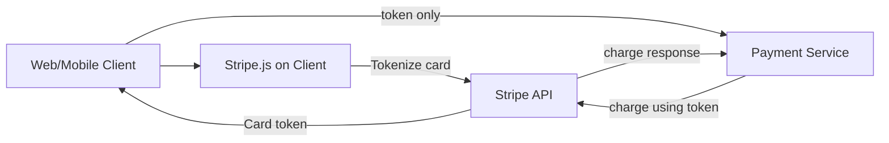

The client tokenizes the card using Stripe.js, sends only the token to your backend. Your Payment Service never touches raw card data.

---

# 14. Refund Handling

Refunds are the reverse of captures and must also be idempotent.

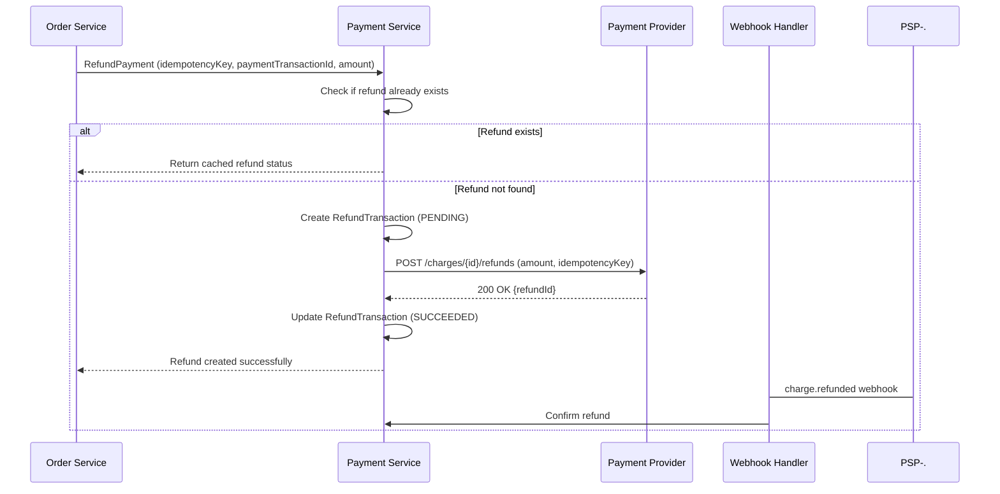

## Refund Database Schema

```sql
CREATE TABLE RefundTransactions (
    RefundTransactionId    VARCHAR(100) PRIMARY KEY,
    PaymentTransactionId   VARCHAR(100) NOT NULL,
    IdempotencyKey         VARCHAR(200) UNIQUE NOT NULL,
    ProviderRefundId       VARCHAR(200),
    Amount                 DECIMAL(18, 2) NOT NULL,
    Status                 VARCHAR(30) NOT NULL,  -- PENDING, SUCCEEDED, FAILED
    Reason                 VARCHAR(100),  -- CUSTOMER_REQUEST, FRAUD, etc
    CreatedAt              DATETIME2 NOT NULL,
    FOREIGN KEY (PaymentTransactionId) REFERENCES PaymentTransactions(PaymentTransactionId)
);
```

---

# 15. Azure Cloud Implementation

## Architecture

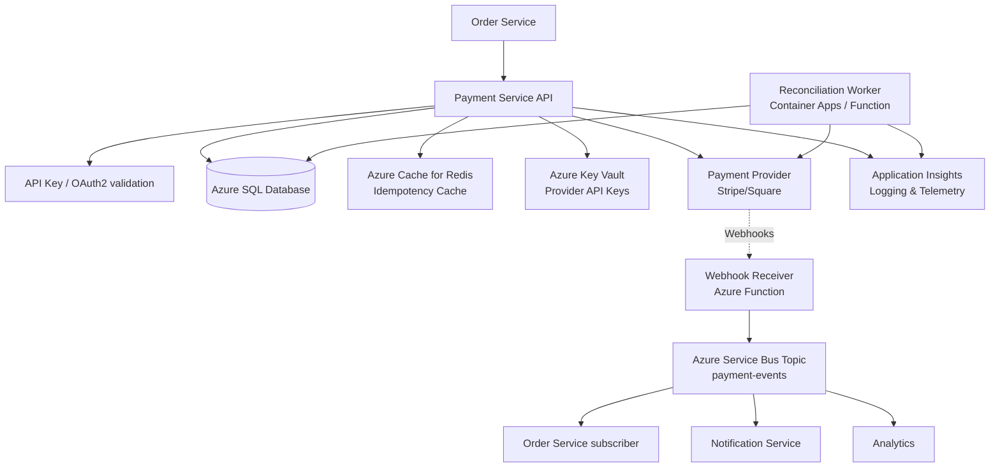

## Azure Services

| Service | Purpose |
|---|---|
| Azure SQL Database | Payment transactions, refunds, webhook events |
| Azure Cache for Redis | Idempotency cache (fast lookup) |
| Azure Key Vault | Payment provider API keys, encryption keys |
| Azure API Management | Rate limiting, authentication |
| Azure Service Bus Topic | Publish payment events to multiple subscribers |
| Azure Functions | Webhook receiver (serverless) |
| Azure Container Apps | Reconciliation worker (scheduled jobs) |
| Application Insights | Logging, metrics, distributed tracing |
| Azure Queue Storage | Failed webhook retry queue |

## Implementation Example

### Payment Service API (ASP.NET Core)

```csharp
[ApiController]
[Route("api/v1/payments")]
public class PaymentController : ControllerBase
{
    private readonly IPaymentService _paymentService;
    private readonly IIdempotencyService _idempotencyService;

    [HttpPost("authorize")]
    public async Task<IActionResult> AuthorizePayment(
        [FromHeader(Name = "Idempotency-Key")] string idempotencyKey,
        [FromBody] AuthorizePaymentRequest request
    )
    {
        // Check cache first
        var cachedResult = await _idempotencyService.GetAsync(idempotencyKey);
        if (cachedResult != null)
        {
            logger.LogInformation($"Returning cached result for {idempotencyKey}");
            return Ok(cachedResult);
        }

        try
        {
            var payment = await _paymentService.AuthorizeAsync(
                orderId: request.OrderId,
                amount: request.Amount,
                cardToken: request.CardToken,
                idempotencyKey: idempotencyKey
            );

            // Cache for 24 hours
            await _idempotencyService.SetAsync(idempotencyKey, payment, TimeSpan.FromHours(24));

            return Accepted(new { payment.PaymentTransactionId, payment.Status });
        }
        catch (DuplicateIdempotencyKeyException)
        {
            return Conflict("Idempotency key already processing");
        }
        catch (PaymentProviderException ex)
        {
            logger.LogError($"Provider error: {ex}");
            return StatusCode(502, "Payment provider unavailable");
        }
    }
}
```

### Webhook Receiver (Azure Function)

```csharp
[FunctionName("StripeWebhook")]
public async Task StripeWebhookAsync(
    [HttpTrigger(AuthorizationLevel.Anonymous, "post", Route = "webhooks/stripe")] HttpRequest req,
    IAsyncCollector<PaymentWebhookEvent> serviceBusCollector
)
{
    try
    {
        var json = await new StreamReader(req.Body).ReadToEndAsync();

        // Verify Stripe signature
        var stripeSignature = req.Headers["Stripe-Signature"];
        var @event = EventUtility.ConstructEvent(
            json, 
            stripeSignature, 
            _stripeWebhookSecret
        );

        // Store webhook with idempotency check
        var webhookEvent = new PaymentWebhookEvent
        {
            ProviderEventId = @event.Id,
            EventType = @event.Type,
            Payload = json,
            Status = WebhookStatus.PENDING,
            CreatedAt = DateTime.UtcNow
        };

        var existing = await _db.WebhookEvents
            .FirstOrDefaultAsync(w => w.ProviderEventId == @event.Id);

        if (existing != null && existing.Status == WebhookStatus.PROCESSED)
        {
            logger.LogInformation($"Webhook already processed: {@event.Id}");
            return;  // Idempotent
        }

        // Process based on event type
        if (@event.Type == "charge.succeeded")
        {
            var charge = @event.Data.Object as Charge;
            var payment = await _db.PaymentTransactions
                .FirstOrDefaultAsync(p => p.ProviderTransactionId == charge.Id);

            if (payment != null)
            {
                payment.Status = PaymentStatus.CAPTURED;
                _db.PaymentTransactions.Update(payment);
                
                await serviceBusCollector.AddAsync(
                    new PaymentWebhookEvent { EventType = "charge.succeeded", ... }
                );
            }
        }

        webhookEvent.Status = WebhookStatus.PROCESSED;
        await _db.SaveChangesAsync();
    }
    catch (StripeException ex)
    {
        logger.LogError($"Stripe webhook error: {ex}");
        throw;
    }
}
```

---

# 16. Observability and Monitoring

## Key Metrics

```text
Payment authorization success rate
Payment authorization latency (P50, P95, P99)
Provider error rate by error type
Refund success rate
Idempotency cache hit rate
Webhook processing latency
Reconciliation gap count
Duplicate payment attempts detected
```

## Example Azure Monitor Alert

```text
Alert Name: Payment Authorization Failure Rate High
Condition: Authorization success rate < 95% for 5 minutes
Severity: Critical
Action: Page on-call engineer
```

## Distributed Tracing

Every payment request carries a correlation ID:

```text
CorrelationId: corr-xyz
OrderId: ORD-1001
PaymentTransactionId: PAY-2001
EventId: evt-3001
ProviderId: ch_1234567890
```

Application Insights automatically builds a transaction map showing:

- Order Service -> Payment Service latency
- Payment Service -> Provider latency
- Webhook latency
- Failed retries

---

# 17. How to Answer the Interview Question

A concise interview answer could be:

> I would design a payment system with these key components:
>
> **Duplicate Prevention**: Every payment request includes an Idempotency-Key header. The Payment Service checks if that key already exists in Redis cache (fast) or database (fallback). If it exists, return the cached result without calling the provider again. This is idempotent — calling with the same key always returns the same result.
>
> **Idempotency Implementation**: Store the idempotency key, orderId, and result in the database with a unique index on the key. Use Redis cache for quick 24-hour lookups. Never call the payment provider twice for the same logical operation.
>
> **Retry Strategy**: Use exponential backoff with jitter for transient failures (timeouts, 5xx errors, rate limits). Attempt up to 7 times over ~60 seconds. Use a circuit breaker to fail fast if the provider is down. Combine with idempotency keys so retries are safe.
>
> **Reconciliation**: Run a scheduled job that queries the payment provider for transactions older than 1 hour. Compare provider status with local status. If mismatch (e.g., local says PENDING but provider says CAPTURED), update the local database and publish a PaymentReconciliated event so the order workflow can continue.
>
> **Saga Compensation**: If payment authorization succeeds but shipment creation fails, I check if payment was already captured. If only authorized, void the authorization. If captured, issue a refund. All compensating actions must be idempotent — calling them multiple times should be safe.
>
> **Failure Handling**:
> - Payment provider timeout: Retry with same idempotency key
> - Webhook delivery failure: Store event ID and check for duplicates
> - Authorization expiry: Query provider status and re-authorize if needed
> - Double-charge: Prevented by idempotency key uniqueness and database constraints
>
> **Architecture**: Use Azure SQL for transactions (strong consistency), Redis for idempotency cache (fast), Azure Key Vault for provider API keys, and Azure Service Bus for publishing payment events to the order and notification services. Instrument with Application Insights for full distributed tracing so we can diagnose any payment issue in production.

---

# 18. Key Design Decisions

| Concern | Decision | Implementation |
|---|---|---|
| Duplicate prevention | Idempotency keys | Unique index on `IdempotencyKey` column |
| Result caching | Fast lookup | Redis cache, 24-hour TTL |
| Retry strategy | Exponential backoff + circuit breaker | Polly library for .NET |
| Async confirmation | Webhook + reconciliation | Service Bus topics + scheduled worker |
| State consistency | Transactional outbox | Write payment + outbox event in same transaction |
| Recovery | Reconciliation job | Query provider, fix mismatches |
| Compensation | Explicit actions | Void authorization or issue refund based on state |
| PCI compliance | No raw card storage | Use provider tokenization |

---

# 19. Common Pitfalls to Avoid

| Pitfall | Problem | Solution |
|---|---|---|
| No idempotency key | Duplicate charges on retry | Require idempotency key, store results |
| Infinite retries | Service hangs, cascading failures | Limit to 7 attempts, use circuit breaker |
| No webhook deduplication | Process same event twice | Store webhook event ID, check for duplicates |
| Missing reconciliation | State drift from provider | Run hourly reconciliation job |
| No compensation logic | Money charged but order cancelled | Void authorization or refund payment |
| Storing raw card data | PCI compliance violation, security breach | Use provider tokenization only |
| No observability | Cannot diagnose payment issues | Log correlation IDs, use distributed tracing |
| Assuming HTTP success = payment success | Confirms before provider confirms | Verify with webhook or query provider |

---

# 20. Final Payment Flow Diagram

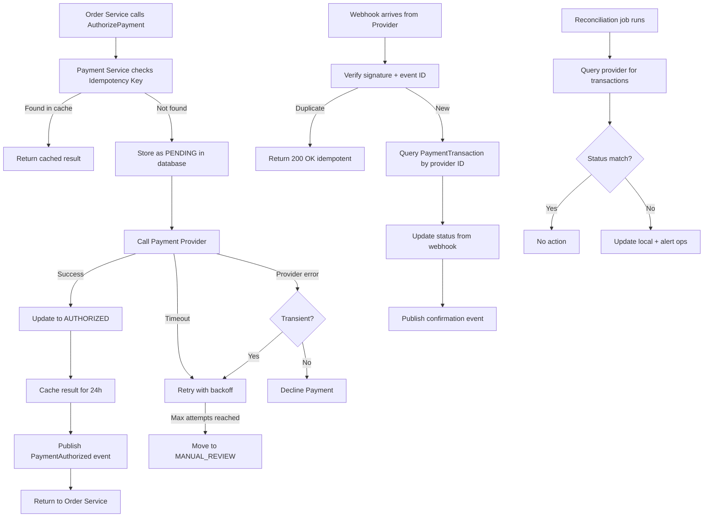

The main principle is:

> Payment systems must guarantee exactly-once semantics in a distributed environment where network failures are common. Use idempotency keys for client-side deduplication, webhooks for async confirmation, reconciliation for eventual consistency, and compensating actions for failure recovery. Never assume an HTTP response means a charge was applied; query the provider or wait for a webhook to confirm.
