## Highly Scalable Microservices Architecture

## Interview Preparation Guide

This document explains how to design a highly scalable microservices architecture covering:

- API Gateway
- Service boundaries
- Database-per-service
- Messaging
- Caching
- Resiliency
- Security
- Observability
- Azure cloud implementation

---

## 1. Problem Statement

Design a microservices architecture that can scale to millions of users, support independent deployment of services, isolate failures, and remain observable and secure in production.

The design must address:

- How clients reach backend services
- How to split a monolith into services with clear boundaries
- How each service owns its own data
- How services communicate synchronously and asynchronously
- How to reduce latency and load using caching
- How to survive partial failures (resiliency)
- How to secure service-to-service and client-to-service communication
- How to monitor, trace, and debug a distributed system

---

# 2. High-Level Architecture

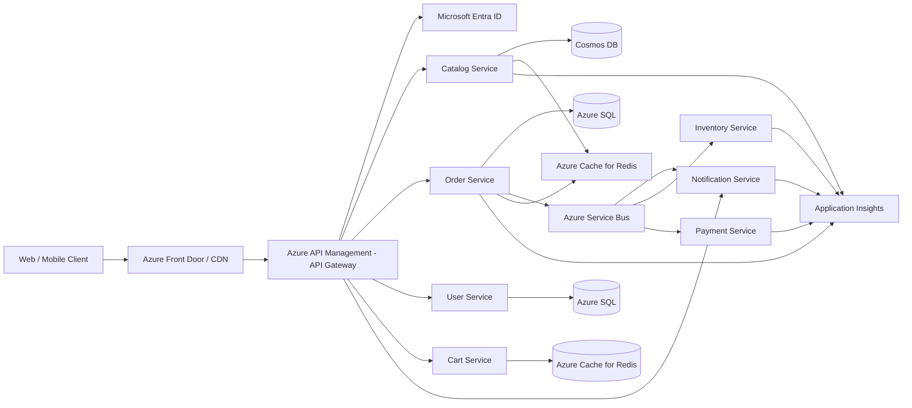

---

# 3. API Gateway

## Responsibilities

- Single entry point for clients
- Routing to backend services
- Authentication and token validation
- Rate limiting and throttling
- Request/response transformation
- SSL termination
- API versioning
- Aggregation for backend-for-frontend scenarios
- Caching of read-heavy responses

## Azure Implementation

Use **Azure API Management (APIM)** as the API Gateway.

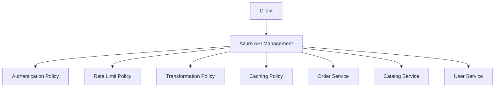

## Example APIM Policy (Rate Limiting)

```xml
<policies>
  <inbound>
    <rate-limit-by-key calls="100" renewal-period="60"
      counter-key="@(context.Request.IpAddress)" />
    <validate-jwt header-name="Authorization" failed-validation-httpcode="401">
      <openid-config url="https://login.microsoftonline.com/common/.well-known/openid-configuration" />
    </validate-jwt>
  </inbound>
</policies>
```

## Backend for Frontend (BFF)

For different client types (web, mobile), consider separate lightweight gateways:

```text
Web BFF -> aggregates Order + Catalog + User for web dashboard
Mobile BFF -> optimized payload for mobile
```

Azure Functions or Azure Container Apps can host BFF layers behind APIM.

---

# 4. Service Boundaries

## Principles

- Use **Domain-Driven Design (DDD)** to identify bounded contexts.
- Each service should own a single business capability.
- Services should not share databases.
- Avoid chatty communication between services; batch or aggregate where possible.
- Favor high cohesion within a service and loose coupling between services.

## Example Bounded Contexts

```text
Catalog Service       -> Product information, pricing, search
Cart Service          -> Shopping cart state
Order Service         -> Order lifecycle
Inventory Service     -> Stock management
Payment Service       -> Payment processing
Shipping Service      -> Shipment and delivery
User Service          -> Authentication profile, preferences
Notification Service  -> Email, SMS, push notifications
Review Service        -> Product reviews and ratings
```

## Anti-Patterns to Avoid

```text
- A "Utility Service" that has no clear business capability
- Services that require synchronous calls to 5+ other services to complete one request
- Shared database accessed by multiple services
- Distributed monolith (services deployed independently but tightly coupled through synchronous chains)
```

## Service Communication Matrix

| From | To | Style | Reason |
|---|---|---|---|
| Order | Inventory | Async (Service Bus) | Long-running, retry-safe |
| Order | Payment | Async (Service Bus) | External provider latency |
| Catalog | Client | Sync (REST/GraphQL) | Immediate response needed |
| Cart | Catalog | Sync (REST) | Needs current price/stock |
| Order | Notification | Async (Event) | Fire-and-forget |

---

# 5. Database-per-Service

## Why

- Enables independent scaling of storage per service.
- Prevents tight coupling through shared schema.
- Allows different services to choose the best-fit database technology (polyglot persistence).
- Improves fault isolation — one database going down doesn't take down every service.

## Polyglot Persistence Example

| Service | Database | Reason |
|---|---|---|
| Catalog | Azure Cosmos DB | Flexible schema, global distribution, high read throughput |
| Order | Azure SQL Database | Strong consistency, relational integrity |
| Cart | Azure Cache for Redis | Fast, ephemeral, session-like data |
| Inventory | Azure SQL Database | Transactional consistency for stock counts |
| Notification | Azure Table Storage | Simple, cheap, high volume logs |
| Search | Azure Cognitive Search | Full-text search and indexing |

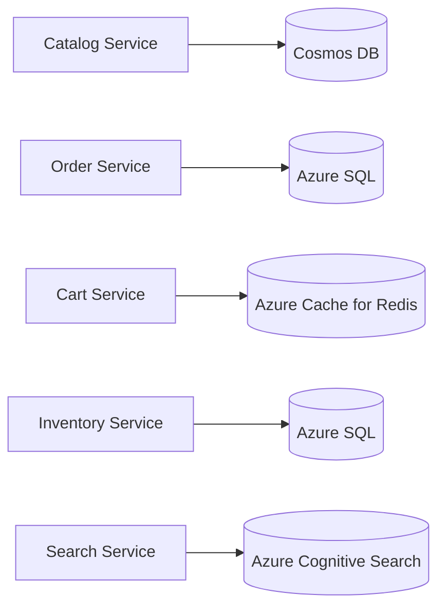

## Cross-Service Data Access

Since services cannot join across databases, use one of these patterns:

1. **API Composition** — the gateway or a BFF calls multiple services and combines results.
2. **CQRS with Read Models** — maintain a denormalized read-optimized view updated via events.
3. **Materialized Views** — Order Service subscribes to `ProductUpdated` events and stores a local cached copy of product name/price for display, avoiding a live cross-service call.

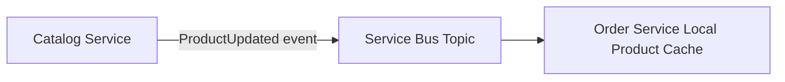

---

# 6. Messaging

## Why Asynchronous Messaging

- Decouples producer and consumer lifecycles.
- Absorbs traffic spikes with buffering.
- Enables retries without blocking the caller.
- Supports fan-out to multiple subscribers.

## Azure Messaging Options

| Need | Azure Service |
|---|---|
| Point-to-point commands with ordering and dead-lettering | Azure Service Bus Queue |
| Publish/subscribe events to multiple consumers | Azure Service Bus Topic |
| High-throughput event streaming/telemetry | Azure Event Hubs |
| IoT device event ingestion | Azure IoT Hub |
| Simple pub/sub for lightweight notifications | Azure Event Grid |

## Example: Order Events via Service Bus Topic

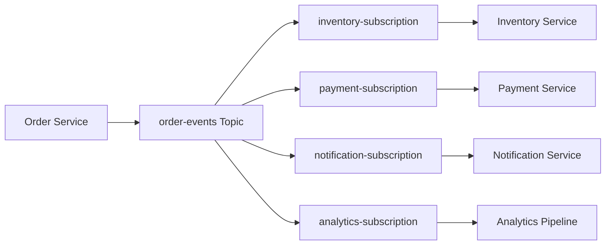

## Message Design Best Practices

- Include `eventId`, `correlationId`, `eventType`, `timestamp`, and `version` in every message.
- Use the **Transactional Outbox Pattern** so database writes and event publication are atomic.
- Use **idempotent consumers** (inbox pattern) to handle duplicate delivery.
- Version your event schemas (`OrderCreatedV1`, `OrderCreatedV2`) to allow backward compatibility.

```json
{
  "eventId": "evt-9001",
  "eventType": "OrderCreated",
  "version": "1.0",
  "correlationId": "corr-789",
  "timestamp": "2026-09-30T10:15:00Z",
  "payload": {
    "orderId": "ORD-1001",
    "customerId": "CUS-123"
  }
}
```

---

# 7. Caching

## Why Cache

- Reduce load on databases and downstream services.
- Improve latency for read-heavy operations (catalog browsing, pricing).
- Absorb traffic spikes (flash sales, promotions).

## Caching Layers

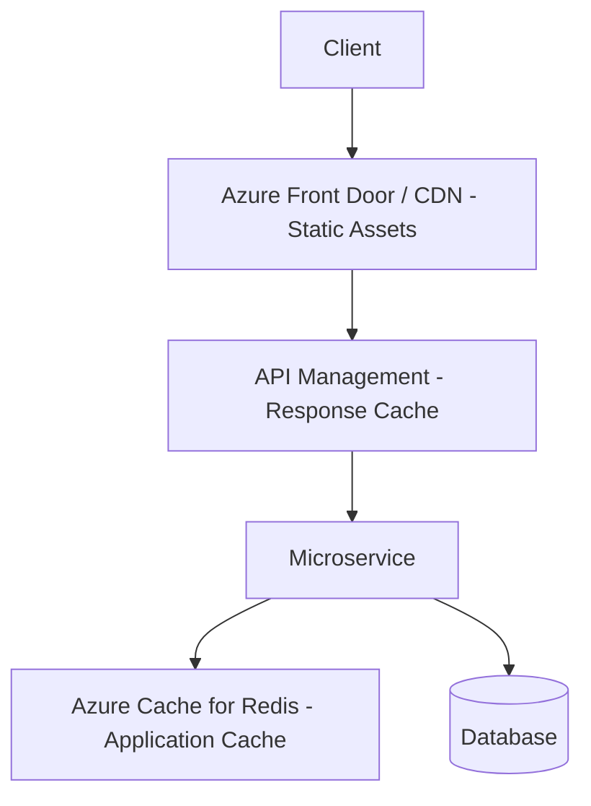

| Layer | Technology | Use Case |
|---|---|---|
| Edge/CDN | Azure Front Door | Static assets, images, cached GET responses |
| Gateway | APIM built-in cache | Cache catalog/product responses at the gateway |
| Application | Azure Cache for Redis | Session data, cart data, computed aggregates |
| Database | Materialized views | Precomputed joins across services |

## Cache Strategies

- **Cache-aside (lazy loading)**: application checks cache first, falls back to database, then populates cache.
- **Write-through**: writes go to cache and database simultaneously.
- **TTL-based expiration**: set sensible TTLs for product pricing (short) vs. static content (long).
- **Cache invalidation via events**: when `ProductUpdated` event fires, invalidate/refresh the corresponding cache key.

```python
# Cache-aside example (pseudocode)
def get_product(product_id):
    product = redis.get(f"product:{product_id}")
    if product is None:
        product = db.query_product(product_id)
        redis.set(f"product:{product_id}", product, ttl=300)
    return product
```

---

# 8. Resiliency

## Why

Distributed systems fail partially. A single slow or unavailable dependency should not cascade into a full system outage.

## Key Resiliency Patterns

### Retry with Exponential Backoff

```text
Attempt 1: immediate
Attempt 2: 2s
Attempt 3: 8s
Attempt 4: 20s (+ jitter)
```

### Circuit Breaker

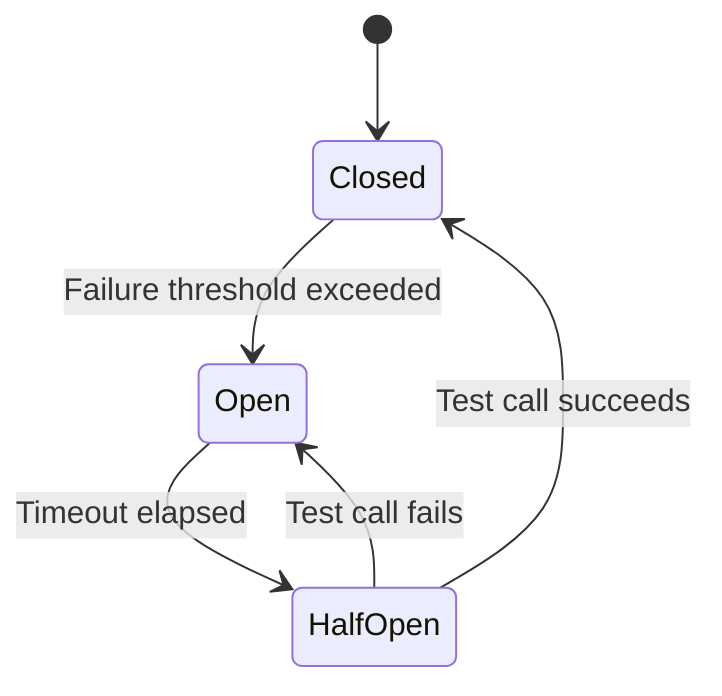

### Bulkhead Isolation

Isolate resources (thread pools, connection pools) per downstream dependency so one slow dependency cannot exhaust resources needed by others.

```text
Payment call pool: 20 threads max
Shipping call pool: 20 threads max
```

If the Payment provider is slow, only its dedicated pool is exhausted — Shipping calls keep working.

### Timeouts

Every synchronous call must have an explicit timeout. Never rely on default/infinite timeouts.

### Fallback / Graceful Degradation

```text
If Recommendation Service is down:
    Show generic "Best Sellers" list instead of personalized recommendations
```

### Load Shedding and Rate Limiting

Reject excess requests early (at the gateway) rather than letting them queue up and overwhelm downstream services.

## Azure Implementation

- Use **Polly** (in .NET) or equivalent libraries for retry, circuit breaker, timeout, and bulkhead policies inside services.
- Use **Azure API Management rate-limit and quota policies** at the edge.
- Use **Azure Service Bus** dead-letter queues for messages that repeatedly fail processing.
- Use **Azure Load Testing** to validate resiliency under load before production release.

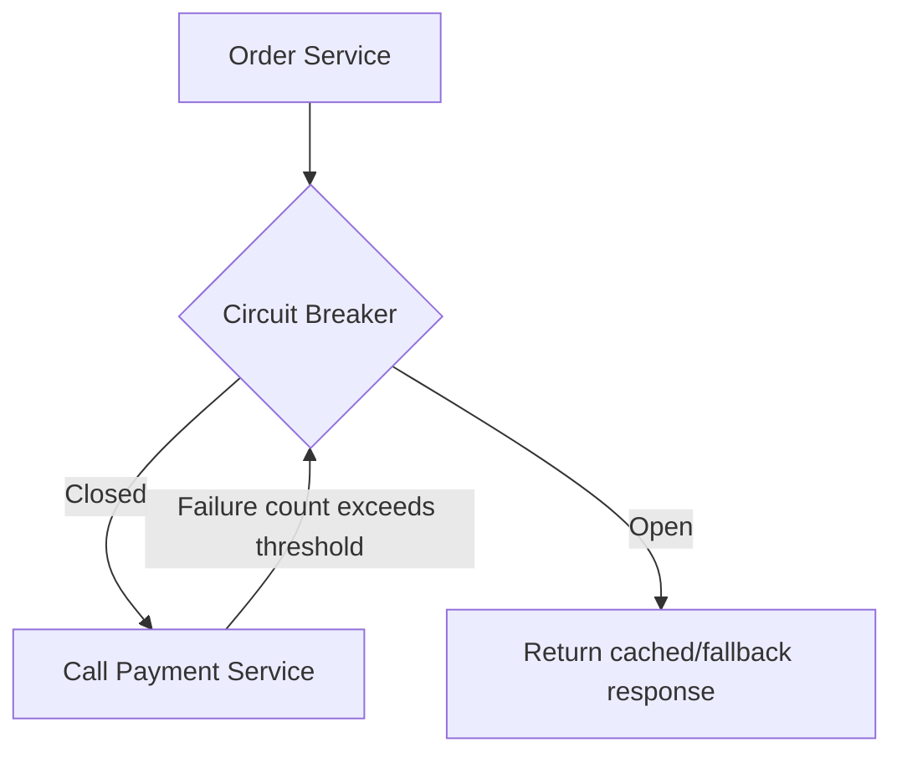

---

# 9. Security

## Layers of Security

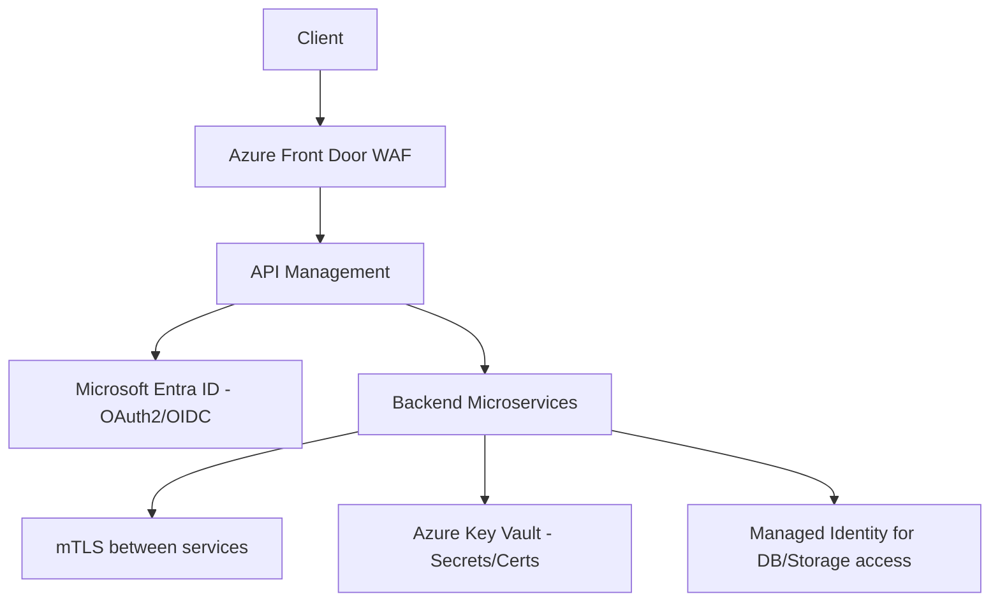

## Key Practices

- **Client authentication**: OAuth2/OIDC via Microsoft Entra ID; APIM validates JWT tokens at the edge.
- **Service-to-service authentication**: use **mTLS** or Managed Identity + Azure AD tokens instead of shared secrets.
- **Secrets management**: store connection strings, API keys, and certificates in **Azure Key Vault**; never hardcode secrets.
- **Managed Identity**: services authenticate to Azure SQL, Cosmos DB, and Key Vault using Managed Identity instead of credentials.
- **Network isolation**: use **Azure Virtual Network (VNet)** integration and **Private Endpoints** so databases aren't publicly accessible.
- **Web Application Firewall (WAF)**: enabled on Azure Front Door to block common attacks (SQL injection, XSS).
- **Least privilege**: each service's managed identity should only have access to the specific resources it needs (Azure RBAC).
- **Data protection**: encrypt data at rest (Transparent Data Encryption) and in transit (TLS 1.2+).
- **API security**: validate all inputs, apply rate limiting, and use API keys/subscription keys for partner integrations.

---

# 10. Observability

## Three Pillars

```text
Logs    -> What happened (structured logs per service)
Metrics -> How much / how often (latency, throughput, error rate)
Traces  -> End-to-end request flow across services
```

## Azure Implementation

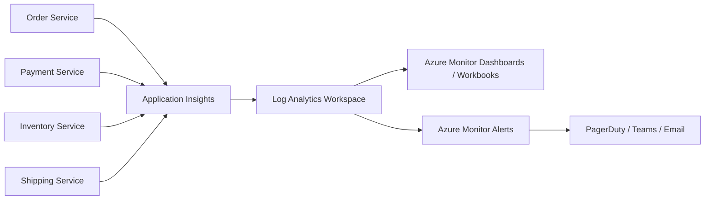

## Distributed Tracing

Every request should carry a `correlationId` propagated across all service calls and messages so a single customer request can be traced end-to-end.

```text
CorrelationId: corr-789
  -> Order Service span
     -> Inventory Service span
     -> Payment Service span
     -> Shipping Service span
```

Application Insights automatically builds an **end-to-end transaction map** using this correlation.

## Key Metrics to Monitor

```text
Request rate per service
P50 / P95 / P99 latency per endpoint
Error rate (4xx / 5xx) per service
Saturation (CPU, memory, connection pool usage)
Message queue depth and dead-letter count
Cache hit ratio
Dependency call duration (DB, external APIs)
```

## Alerting Examples

```text
Alert if P95 latency > 2s for 5 minutes
Alert if error rate > 5% for 10 minutes
Alert if dead-letter queue depth > 50
Alert if circuit breaker is open for > 2 minutes
```

## Health Checks

Each service should expose:

```text
/health/live   -> is the process running
/health/ready  -> can it serve traffic (DB connection, dependencies OK)
```

Azure Container Apps / AKS use these for liveness and readiness probes to automatically restart or remove unhealthy instances.

---

# 11. Scalability Patterns

## Horizontal Scaling

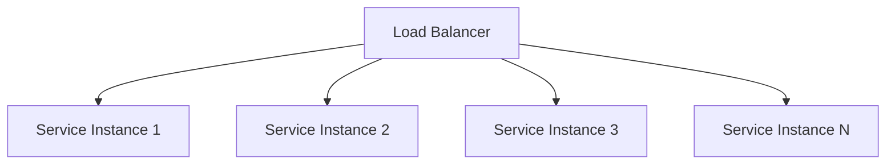

- Use **Azure Container Apps** or **AKS with Horizontal Pod Autoscaler (HPA)** to scale service instances based on CPU, memory, or custom metrics (e.g., queue length).
- Stateless services scale horizontally with ease; stateful data lives in the database/cache layer, not in-process.

## Autoscaling Based on Queue Length

```text
If Service Bus queue depth > 1000 messages:
    Scale out worker instances
If queue depth < 100:
    Scale in
```

Azure Container Apps supports **KEDA (Kubernetes Event-Driven Autoscaling)** scalers for Service Bus, enabling this pattern natively.

## CQRS for Read-Heavy Workloads

Separate read and write models so read replicas / caches can scale independently of the write path.

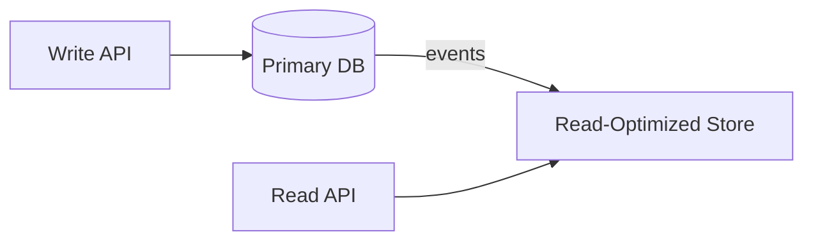

## Global Distribution

- **Azure Front Door**: global load balancing and failover across regions.
- **Cosmos DB multi-region writes**: for globally distributed low-latency reads/writes.
- **Azure Traffic Manager**: DNS-based routing for multi-region active-active or active-passive setups.

---

# 12. Deployment and CI/CD

```mermaid
flowchart LR
    Dev[Developer commits code] --> GitHub[GitHub Repository]
    GitHub --> Actions[GitHub Actions Pipeline]
    Actions --> Build[Build & Unit Tests]
    Build --> ContainerRegistry[Azure Container Registry]
    ContainerRegistry --> Deploy[Deploy to Azure Container Apps / AKS]
    Deploy --> Staging[Staging Slot]
    Staging --> Tests[Integration / Load Tests]
    Tests --> Prod[Production Slot]
```

- Each microservice has its own independent pipeline and release cadence.
- Use **blue-green** or **canary deployments** to reduce risk of new releases.
- Use **feature flags** (Azure App Configuration) to decouple deployment from release.

---

# 13. How to Answer the Interview Question

A concise interview answer could be:

> I would design each microservice around a bounded context using Domain-Driven Design, with each service owning its own database to avoid tight coupling — for example Cosmos DB for the catalog, Azure SQL for orders, and Redis for the cart.
>
> Clients would go through Azure API Management as the API Gateway, which handles authentication via Microsoft Entra ID, rate limiting, routing, and response caching. Behind the gateway, services communicate synchronously for real-time reads and asynchronously via Azure Service Bus for workflows like order processing, using the outbox and idempotent-consumer patterns to guarantee reliable delivery.
>
> For performance, I'd add multiple caching layers — CDN at the edge, gateway-level response caching, and Redis at the application layer — with cache invalidation driven by domain events.
>
> For resiliency, I'd apply retries with exponential backoff, circuit breakers, bulkhead isolation, and explicit timeouts for every synchronous call, backed by dead-letter queues for message failures.
>
> Security would be layered: WAF and TLS at the edge, OAuth2/OIDC at the gateway, mTLS or managed identities between services, and all secrets stored in Azure Key Vault.
>
> Finally, I'd instrument every service with Application Insights for logs, metrics, and distributed tracing using a correlation ID propagated across all calls, with Azure Monitor alerts on latency, error rate, and queue depth so we can detect and respond to issues before customers are impacted.

---

# 14. Key Design Decisions Summary

| Concern | Decision | Azure Service |
|---|---|---|
| Entry point | Centralized API Gateway | Azure API Management |
| Service boundaries | Domain-Driven Design bounded contexts | N/A |
| Data ownership | Database-per-service, polyglot persistence | Cosmos DB, Azure SQL, Redis |
| Async communication | Event-driven messaging with outbox/inbox | Azure Service Bus |
| Performance | Multi-layer caching | Front Door, APIM cache, Redis |
| Fault tolerance | Retry, circuit breaker, bulkhead, timeout | Polly, Service Bus DLQ |
| Security | OAuth2/OIDC, mTLS, Key Vault, WAF | Entra ID, Key Vault, Front Door WAF |
| Observability | Centralized logs, metrics, distributed tracing | Application Insights, Log Analytics |
| Scalability | Horizontal autoscaling, CQRS, global distribution | Container Apps/AKS + KEDA, Front Door |

---

# 15. Final Architecture Diagram

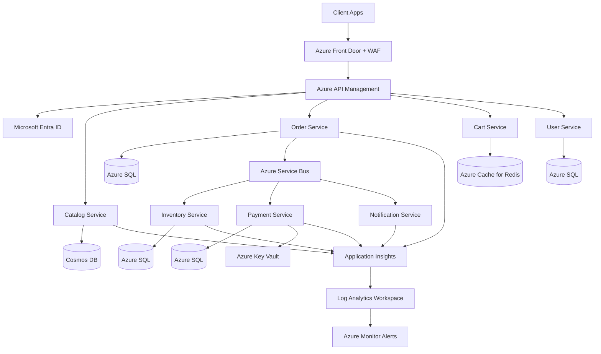

The main principle is:

> Build small, independently deployable services with clear domain boundaries and their own databases. Connect them through a secure, observable API Gateway for synchronous traffic and reliable messaging for asynchronous workflows. Layer in caching for performance, resiliency patterns for fault isolation, and end-to-end observability so failures are detected and diagnosed quickly in a distributed environment.
