## Scaling Systems for Millions of Users

## Interview Preparation Guide

This document explains how to design a system that scales to millions of requests and users, covering:

- Load balancing strategies
- Horizontal scaling patterns
- Multi-layer caching
- Database partitioning and sharding
- Asynchronous processing
- Database scaling techniques
- Azure cloud implementation
- Performance optimization

---

## 1. Problem Statement

Design a system architecture that can handle:

- 1 million+ concurrent users
- Hundreds of thousands of requests per second
- Consistent performance under load
- Sub-second latency for critical operations
- High availability with automatic failover
- Cost-effective infrastructure scaling

Key challenges:

- Single server cannot handle all traffic
- Databases become bottlenecks
- Network bandwidth is limited
- Cache invalidation is complex
- Distributed systems are inherently complex
- Debugging failures across many instances is difficult

---

# 2. Architecture Overview

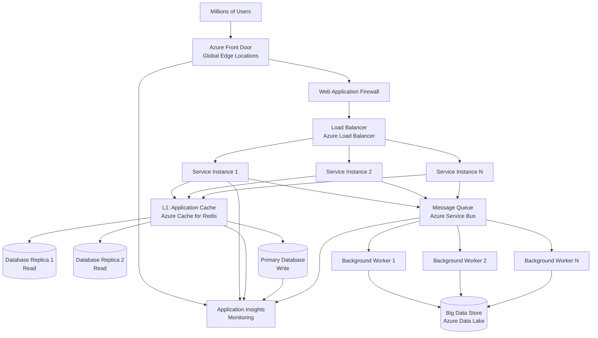

---

# 3. Load Balancing

## Purpose

Distribute incoming traffic across multiple instances so no single server is overwhelmed.

## Load Balancing Strategies

### 1. Round-Robin

Send requests to instances in sequence: 1, 2, 3, 1, 2, 3...

```text
Request 1 -> Instance 1
Request 2 -> Instance 2
Request 3 -> Instance 3
Request 4 -> Instance 1
```

**Pros**: Simple, fair distribution
**Cons**: Doesn't consider instance load or capacity

### 2. Least Connections

Send request to the instance with fewest active connections.

```text
Instance 1: 50 active connections
Instance 2: 30 active connections
Instance 3: 40 active connections

New request -> Instance 2 (least loaded)
```

**Pros**: Better load distribution than round-robin
**Cons**: Still doesn't consider CPU/memory usage

### 3. Weighted Round-Robin

Send more requests to more powerful instances.

```text
Instance 1 (8 vCPU): weight 2
Instance 2 (4 vCPU): weight 1
Instance 3 (4 vCPU): weight 1

Send 2 requests to Instance 1, 1 to Instance 2, 1 to Instance 3
```

**Pros**: Accounts for instance capacity
**Cons**: Requires manual configuration

### 4. IP Hash / Sticky Sessions

Route all requests from a client to the same instance.

```text
Client IP 192.168.1.1 -> Always Instance 2
Client IP 192.168.1.2 -> Always Instance 3
```

**Pros**: Session state stays on same instance, cache locality
**Cons**: Bad load distribution if few clients dominate, instance failure loses session

### 5. Least Latency

Send request to instance with lowest response time.

```text
Instance 1: P95 latency = 100ms
Instance 2: P95 latency = 200ms
Instance 3: P95 latency = 80ms

New request -> Instance 3 (lowest latency)
```

**Pros**: Optimizes user experience
**Cons**: Requires real-time latency measurement

## Azure Implementation

Use **Azure Load Balancer** or **Azure Application Gateway**:

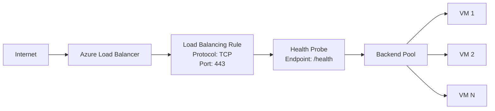

---

# 4. Horizontal Scaling

## Stateless vs Stateful Services

### Stateless Services (Scalable)

Service doesn't store session state locally. Each request is independent.

```text
Request 1 from User A -> Instance 1
Request 2 from User A -> Instance 3 (can go to any instance)
Request 3 from User A -> Instance 2
```

All instances serve the same request equally.

**Advantage**: Easy to scale horizontally — add more instances.

### Stateful Services (Complex to Scale)

Service stores session state in process memory.

```text
User A logs in -> Instance 1 (session stored in memory)
User A makes request -> Must route to Instance 1 (only instance with session)
User A makes request -> Must route to Instance 1 again
```

If Instance 1 crashes, User A's session is lost.

**Solution**: Store state in external store (Redis, database), not in process.

## Horizontal Scaling Pattern

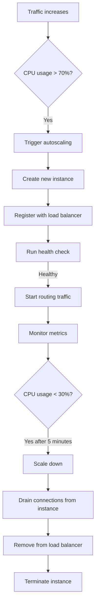

## Azure Implementation with Container Apps

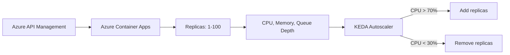

## Scaling Rules Example

```text
Metric: CPU usage
Scale out if: CPU > 70% for 2 minutes
Scale in if: CPU < 30% for 5 minutes
Min replicas: 3
Max replicas: 100
```

---

# 5. Multi-Layer Caching

Caching reduces latency and load on databases by storing frequently accessed data closer to the consumer.

## Cache Layers

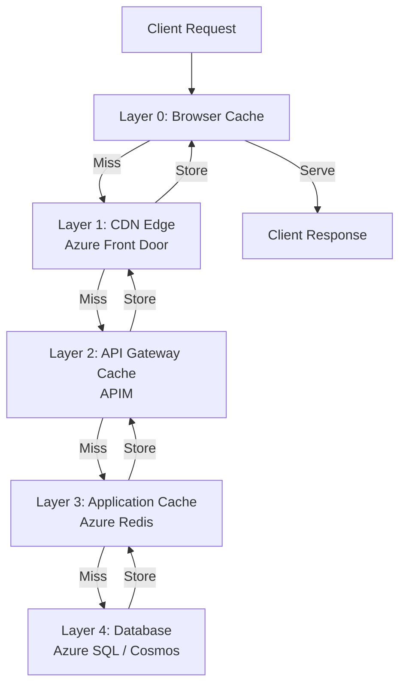

### Layer 0: Browser Cache

Client-side caching using HTTP headers.

```http
HTTP/1.1 200 OK
Cache-Control: public, max-age=3600
ETag: "abc123"
```

Browser stores response for 1 hour. Subsequent requests within that time served locally without hitting the server.

### Layer 1: CDN / Edge Caching

Content Delivery Network caches static assets globally.

Example: User in Singapore requests `/products/1001/image.jpg`

```text
Request hits Singapore CDN edge node
Edge node checks cache: not found
Edge node queries origin (US): /products/1001/image.jpg
Origin returns image with Cache-Control: 1 week
Edge node caches for 1 week
User gets image from local edge (low latency)
```

**Azure**: Use **Azure Front Door** for global distribution.

### Layer 2: API Gateway Caching

API Management layer caches responses for read operations.

```text
GET /api/v1/products/1001
Response cached for 5 minutes
Subsequent GET requests within 5 minutes served from cache
Cache key: method + path + query params
```

Only cache GET requests (idempotent).

### Layer 3: Application Cache

In-memory cache at application layer using Redis.

```csharp
async Task<Product> GetProductAsync(string productId)
{
    // Check cache first
    var cached = await _redis.GetAsync($"product:{productId}");
    if (cached != null)
        return JsonConvert.DeserializeObject<Product>(cached);

    // Cache miss, query database
    var product = await _database.GetProductAsync(productId);

    // Store in cache for 1 hour
    await _redis.SetAsync(
        $"product:{productId}",
        JsonConvert.SerializeObject(product),
        TimeSpan.FromHours(1)
    );

    return product;
}
```

### Layer 4: Database Caching

Some databases provide built-in caching (query result cache).

Example: Azure SQL Database **Query Store** caches frequently executed queries.

## Cache Invalidation

The hardest problem in caching: keeping cache consistent with source.

### Strategy 1: Time-Based (TTL)

Set expiration time on cache entries.

```text
Product cache: 1 hour TTL
User profile: 30 minutes TTL
Shopping cart: 15 minutes TTL
Pricing: 5 minutes TTL (changes often)
```

**Pros**: Simple, no complex logic
**Cons**: Stale data for up to TTL duration

### Strategy 2: Event-Based Invalidation

When data changes, explicitly invalidate cache.

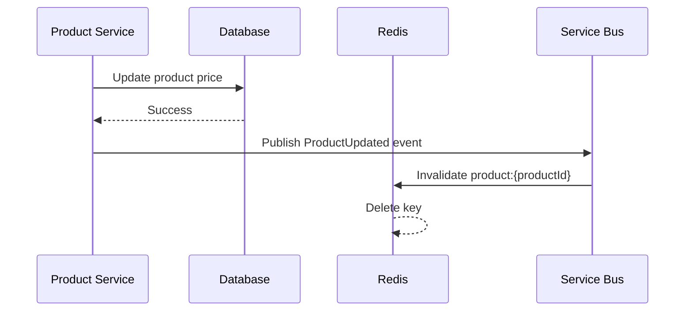

```csharp
public async Task UpdateProductAsync(Product product)
{
    // Update database
    await _database.SaveAsync(product);

    // Invalidate cache
    await _redis.DeleteAsync($"product:{product.Id}");

    // Publish event to notify other services
    await _serviceBus.PublishAsync(new ProductUpdated { ProductId = product.Id });
}
```

**Pros**: Cache always fresh
**Cons**: Complex to implement, event ordering issues

### Strategy 3: Cache-Aside with Version Numbers

Store version number in cache key. When data changes, version increments.

```text
Cache key: product:1001:version:3
When product updates, version becomes 4
Old cache entries (version 3) automatically invalid
```

---

# 6. Database Partitioning and Sharding

As data grows, a single database becomes slow. Partitioning splits data across multiple databases.

## Vertical Partitioning (by feature)

Split data by business domain.

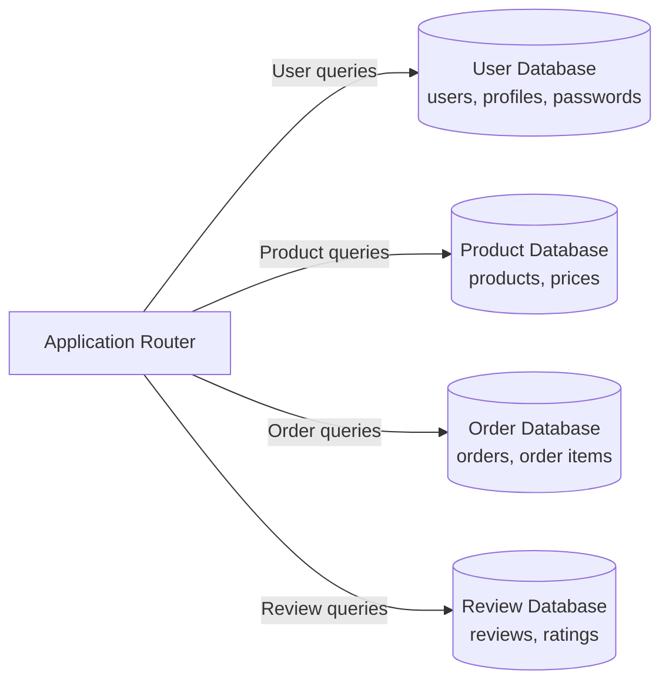

**Pros**: Simple to implement, good for microservices
**Cons**: Can still have hot spots (if one service gets more traffic)

## Horizontal Partitioning / Sharding (by key range)

Split data by key range across multiple databases.

### Shard by User ID (Range-Based)

```text
Shard 0: UserID 0-999,999
Shard 1: UserID 1,000,000-1,999,999
Shard 2: UserID 2,000,000-2,999,999
...
Shard N: UserID N*1,000,000 to (N+1)*1,000,000
```

Query routing:

```csharp
int shardId = userId % numShards;
var connectionString = shardConnections[shardId];
var db = new Database(connectionString);
var user = await db.GetUserAsync(userId);
```

**Pros**: Distributes load evenly, can scale linearly
**Cons**: Uneven shard sizes over time (hot shards), resharding is complex

### Shard by Hash (Consistent Hashing)

Use hash function to determine shard.

```text
shardId = hash(userId) % numShards
```

Better distribution than range-based, handles resharding more gracefully.

### Shard by Geographic Location

```text
Shard US: Users in North America
Shard EU: Users in Europe
Shard APAC: Users in Asia-Pacific
```

**Pros**: Lower latency (local data center), compliance (data residency)
**Cons**: Complex cross-region queries

## Sharding Challenges

| Challenge | Solution |
|---|---|
| Resharding (adding new shards) | Use consistent hashing, shadow writes during migration |
| Cross-shard queries | Scatter-gather (query all shards, merge results) |
| Distributed transactions | Use saga pattern, eventual consistency |
| Hotspot shards | Monitor and rebalance traffic |
| Shard key selection | Choose key with good cardinality and even distribution |

## Azure Implementation

Use **Azure Cosmos DB** for built-in partitioning:

```json
{
  "id": "user-123",
  "userId": "123",
  "partitionKey": "123",
  "name": "John Doe",
  "email": "john@example.com"
}
```

Cosmos DB automatically shards data across physical partitions based on partition key.

---

# 7. Asynchronous Processing

Some operations take time and don't need immediate response.

## Synchronous Operations

Client waits for response:

```text
GET /products/1001
Response: 200 OK (fast)
```

## Asynchronous Operations

Client gets immediate ack, work happens later:

```text
POST /orders
Response: 202 Accepted (immediate)
{
  "orderId": "ORD-1001",
  "status": "PROCESSING"
}

(Async worker processes order later)
Email confirmation sent to customer after processing
```

## Async Processing Pattern

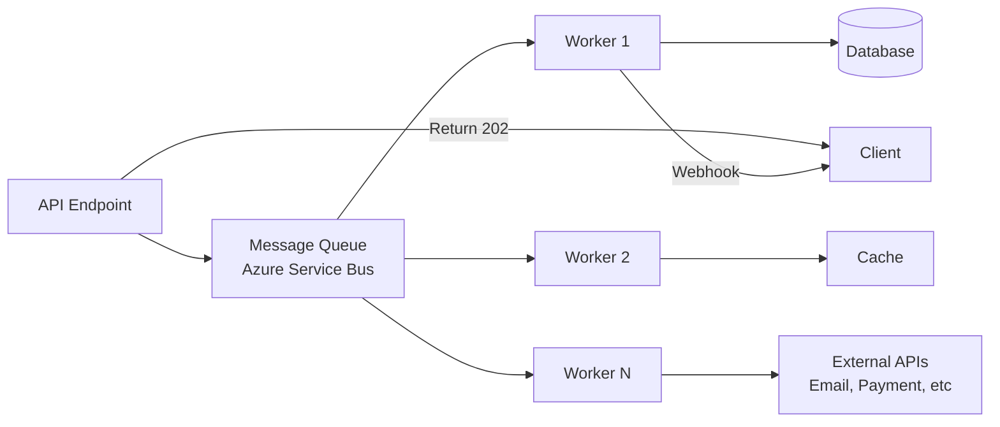

### Message Queue

```text
Order placed:
1. API creates order record (PENDING status)
2. API publishes "OrderCreated" message to queue
3. API returns 202 Accepted to client

Worker processes:
1. Dequeue "OrderCreated" message
2. Reserve inventory
3. Authorize payment
4. Create shipment
5. Mark order as CONFIRMED
6. Publish "OrderConfirmed" event
7. Send email to customer
```

## Azure Service Bus Configuration

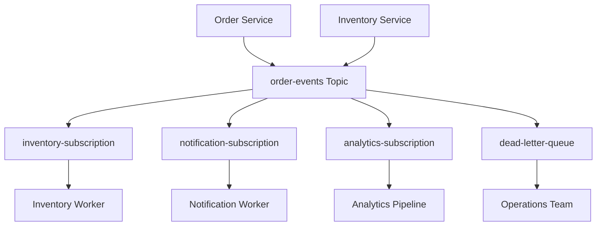

## Benefits of Async Processing

```text
1. Decouples producer and consumer
2. Absorbs traffic spikes (queue buffers excess traffic)
3. Enables retry without blocking caller
4. Improves overall throughput
5. Services can scale independently
6. Failure in one service doesn't cascade to others
```

---

# 8. Database Scaling Techniques

## Read Replicas

For read-heavy workloads, replicate data to read-only instances.

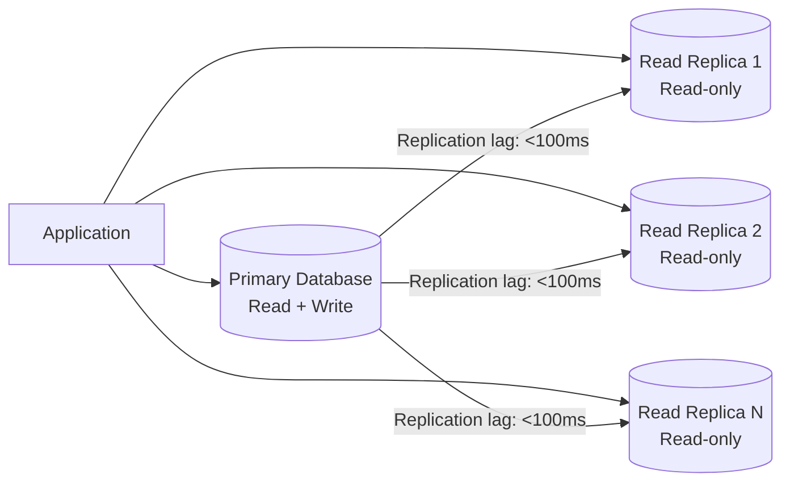

Routing logic:

```csharp
if (isWriteOperation)
    connection = _primaryDatabase;
else
    connection = _readReplicas[Random.Next(_readReplicas.Count)];
```

## Connection Pooling

Reuse database connections rather than creating new ones.

```text
Without pooling:
Request 1 -> Create connection -> Query -> Close connection
Request 2 -> Create connection -> Query -> Close connection
```

Connection creation is expensive (SSL handshake, authentication).

```text
With pooling (min 10, max 100):
Request 1 -> Borrow from pool -> Query -> Return to pool
Request 2 -> Borrow from pool -> Query -> Return to pool
Pool maintains 10 connections always available
```

## Query Optimization

```text
Inefficient: SELECT * FROM Orders WHERE CustomerId = @customerId
Efficient: SELECT OrderId, Amount, Status FROM Orders WHERE CustomerId = @customerId
           (fetch only needed columns)

Inefficient: JOIN with 5 tables
Efficient: Denormalized read model (CQRS pattern)
          Store pre-computed joins for reads
```

## Materialized Views

Pre-compute expensive queries.

```sql
CREATE MATERIALIZED VIEW OrderSummary AS
SELECT
    o.OrderId,
    COUNT(*) as ItemCount,
    SUM(oi.Quantity) as TotalQuantity,
    SUM(oi.Price * oi.Quantity) as TotalAmount
FROM Orders o
JOIN OrderItems oi ON o.OrderId = oi.OrderId
GROUP BY o.OrderId;
```

Query the view instead of computing join every time.

## Database Scaling - Write Heavy

For write-heavy systems:

1. **Database Replication**: Use write-ahead logging, replicate writes to multiple nodes
2. **Write Buffering**: Queue writes, batch them together
3. **CQRS**: Separate read and write databases
4. **Event Sourcing**: Store events instead of state, derive current state from events

---

# 9. Complete High-Scalability Architecture

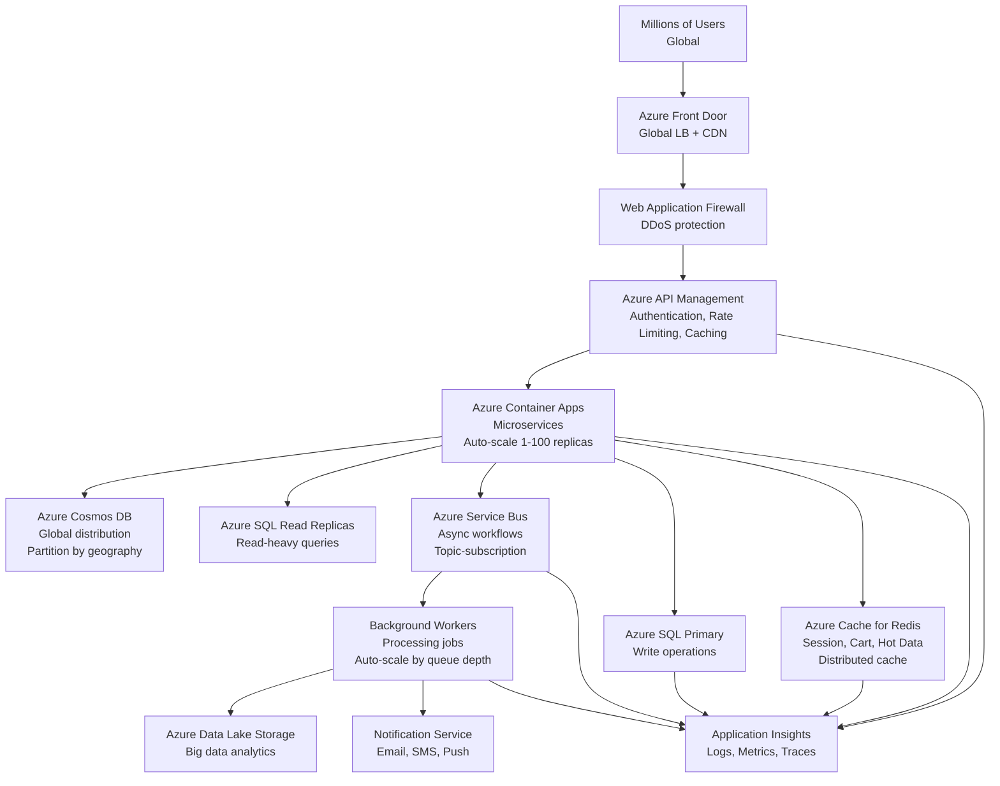

---

# 10. Performance Benchmarks and Targets

## Common Targets for High-Scale Systems

| Metric | Target | How to Achieve |
|---|---|---|
| P50 latency (median) | < 100ms | Caching, optimized queries |
| P99 latency (99th percentile) | < 500ms | Read replicas, async processing |
| Availability | > 99.95% (4.38 hours downtime/year) | Multi-region, auto-failover |
| Throughput | 100k-1M req/sec | Horizontal scaling, load balancing |
| Cache hit ratio | > 80% | Proper TTL, event-driven invalidation |
| Database connection pool utilization | 60-80% | Right pool size, connection reuse |
| Message queue processing latency | < 1 second | Enough workers, fast operations |

## Load Testing with Azure

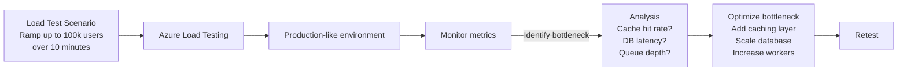

---

# 11. Auto-Scaling Configuration Examples

## CPU-Based Scaling (Container Apps)

```yaml
apiVersion: apps/v1
kind: Deployment
metadata:
  name: order-service
spec:
  replicas: 3
---
apiVersion: autoscaling/v2
kind: HorizontalPodAutoscaler
metadata:
  name: order-service-hpa
spec:
  scaleTargetRef:
    apiVersion: apps/v1
    kind: Deployment
    name: order-service
  minReplicas: 3
  maxReplicas: 100
  metrics:
  - type: Resource
    resource:
      name: cpu
      target:
        type: Utilization
        averageUtilization: 70
  - type: Resource
    resource:
      name: memory
      target:
        type: Utilization
        averageUtilization: 80
  behavior:
    scaleDown:
      stabilizationWindowSeconds: 300
      policies:
      - type: Percent
        value: 50
        periodSeconds: 60
    scaleUp:
      stabilizationWindowSeconds: 0
      policies:
      - type: Percent
        value: 100
        periodSeconds: 30
```

## Custom Metrics Scaling

Scale based on application-specific metrics:

```yaml
metrics:
- type: Pods
  pods:
    metric:
      name: http_request_queue_depth
    target:
      type: AverageValue
      averageValue: 100
```

If average queue depth per pod > 100, scale out.

---

# 12. How to Answer the Interview Question

A concise interview answer could be:

> To scale a system to millions of users and requests/sec, I'd layer multiple strategies:
>
> **Load Balancing**: Use Azure Load Balancer or Application Gateway to distribute incoming traffic across multiple service instances using least connections or latency-based algorithms. Route all user requests from the same session to the same instance using sticky sessions if needed, or better yet, make services stateless so any instance can serve any request.
>
> **Horizontal Scaling**: Deploy services in containers (Azure Container Apps or AKS) with autoscaling rules — scale up when CPU exceeds 70% for 2 minutes, scale down when it drops below 30% for 5 minutes. Maintain a minimum of 3 instances for high availability and a max of 100+ to handle load spikes.
>
> **Multi-Layer Caching**: Cache at every layer:
> - Browser cache with long TTLs for static assets
> - CDN (Azure Front Door) for global edge caching
> - API Gateway cache for read responses
> - Redis for application cache (user sessions, cart, product data)
> - Database query result cache
>
> Invalidate caches using event-driven pub/sub so when data changes, cache entries are immediately invalidated rather than waiting for TTL expiration.
>
> **Database Partitioning**: For very large datasets, partition data by business domain (user database, product database, order database) or shard by a key like user ID to split data across multiple database instances. Use consistent hashing for graceful resharding.
>
> **Asynchronous Processing**: For long-running operations like order processing, email notifications, and analytics, publish events to Azure Service Bus queues/topics and have background workers process them. This decouples the producer (API) from the consumer (worker), allows the API to respond immediately, and lets workers scale independently based on queue depth.
>
> **Database Scaling**:
> - Read replicas for read-heavy workloads — split SELECT queries across read replicas, writes go to primary
> - Connection pooling to reuse DB connections efficiently
> - Query optimization and indexing to reduce latency
> - CQRS pattern to separate read and write models
>
> **Monitoring**: Instrument everything with Application Insights — track P50/P95/P99 latency, cache hit ratio, database connection pool utilization, queue depth, error rates per service. Alert on anomalies so we can detect and respond to issues before customers are impacted.
>
> With these layered strategies, a system can scale to millions of concurrent users and hundreds of thousands of requests per second while maintaining sub-second latency.

---

# 13. Scaling Checklist

Before going to production with high traffic:

- [ ] Load balancing configured with health checks
- [ ] Services are stateless (session data in Redis/DB, not process memory)
- [ ] Horizontal autoscaling configured with appropriate thresholds
- [ ] Multi-layer caching implemented and tested
- [ ] Database has read replicas or sharding for read/write distribution
- [ ] Connection pooling configured at every database connection point
- [ ] Async processing set up for long-running operations
- [ ] Circuit breakers configured for external service calls
- [ ] Timeouts set on all synchronous calls
- [ ] Load testing completed, bottlenecks identified and fixed
- [ ] Monitoring and alerting in place for all critical metrics
- [ ] Runbooks created for common incidents
- [ ] On-call rotation established

---

# 14. Common Scaling Pitfalls

| Pitfall | Problem | Solution |
|---|---|---|
| Scaling without removing bottleneck | Adding instances doesn't help if DB is slow | Profile first, fix bottleneck, then scale |
| Stateful services | Session stored in-process, can't scale | Move state to Redis/DB, make services stateless |
| No connection pooling | Each request opens new DB connection | Use connection pooling, reuse connections |
| Cache stampede | Many requests hit DB simultaneously after cache expires | Use probabilistic early expiration, background refresh |
| Hot shard | One shard gets more traffic than others | Redistribute data, monitor shard load |
| Insufficient monitoring | Can't diagnose why system is slow | Instrument everything, distributed tracing |
| Database not scaled for write volume | Master database becomes bottleneck | Add write buffering, event sourcing, or write-through cache |
| Ignoring network latency | Assumes calls to services/DB are free | Account for latency, use batching, minimize RPC calls |

---

# 15. Scaling Path Example

### Day 1: MVP (1,000 users)

```text
Single server
Monolithic application
SQLite database
No caching
```

### Week 4: Growing (10,000 users)

```text
Separate API server and database server
SQLite -> PostgreSQL
Add Redis cache for hot data
Simple load balancer
```

### Month 3: Scale (100,000 users)

```text
Multiple API servers behind load balancer
Read replicas for database
Async job processing with queue
Multiple caching layers (CDN, Redis)
Container orchestration (AKS)
```

### Month 12: High Scale (1,000,000+ users)

```text
Global load balancing (Front Door)
Database sharding by geography
Multiple cache layers with event-driven invalidation
CQRS pattern for read/write separation
Background worker pools for async processing
Comprehensive monitoring and auto-scaling
```

---

# 16. Key Metrics to Monitor

```text
Request Rate
├── Requests per second (RPS)
├── Peak RPS (handle 10x average)
└── Requests per user (profile traffic patterns)

Latency
├── P50 (median)
├── P95 (95th percentile)
├── P99 (99th percentile)
└── P99.9 (tail latency)

Error Rates
├── 4xx errors (client errors)
├── 5xx errors (server errors)
└── Errors by service

Resource Utilization
├── CPU usage per service
├── Memory usage per service
├── Network bandwidth
├── Disk I/O
└── Database connections

Cache
├── Cache hit ratio (target > 80%)
├── Cache eviction rate
└── Cache size / memory usage

Database
├── Query latency (P50, P99)
├── Slow query count
├── Connection pool usage
├── Replication lag (for read replicas)
└── Query execution plan analysis

Scaling
├── Number of instances per service
├── Auto-scale trigger frequency
├── Scale-out/scale-in events
└── Failed health checks
```

---

# 17. Azure Architecture for Millions of Users

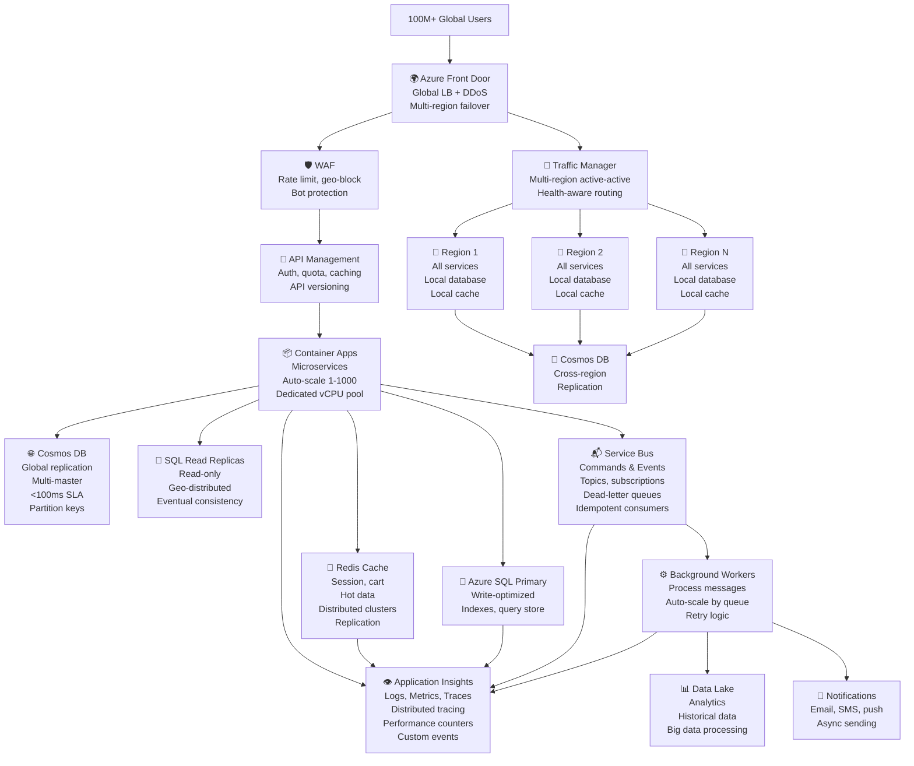

---

# 18. Final Summary

| Layer | Technology | Purpose |
|---|---|---|
| Entry | Azure Front Door | Global load balancing, CDN, DDoS protection |
| API | Azure API Management | Rate limiting, authentication, response caching |
| Compute | Container Apps / AKS | Stateless microservices, auto-scaling |
| Cache L1 | Azure Cache for Redis | Session, cart, hot data, distributed |
| Cache L2 | Cosmos DB Indexing | Query result caching |
| Database Read | Azure SQL Read Replicas | Scale read throughput |
| Database Write | Azure SQL Primary | Transactional consistency |
| Data Partitioning | Cosmos DB Partition Keys | Distribute data, scale linearly |
| Async | Service Bus Topics | Decouple services, scale independently |
| Background | Container Apps Workers | Process async jobs, scale by queue |
| Analytics | Data Lake Storage | Historical data, big data processing |
| Monitoring | Application Insights | Observability, alerting |

The main principle is:

> Scale systems by distributing load across multiple layers: load balancing for traffic, horizontal service scaling, caching to reduce database load, asynchronous processing to decouple components, and database replication/sharding to handle data volume and query rate. Measure everything with comprehensive monitoring so bottlenecks are identified and addressed before they impact users.

