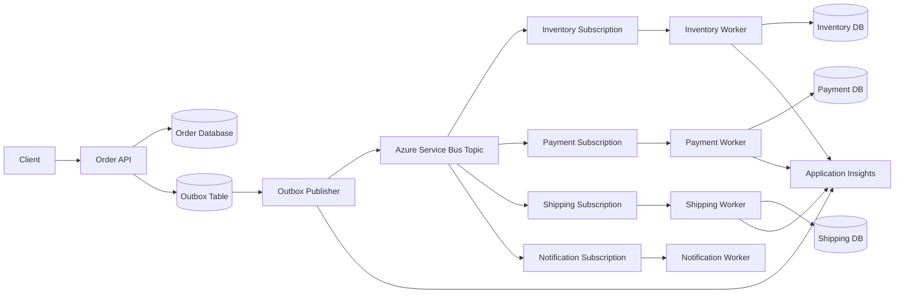
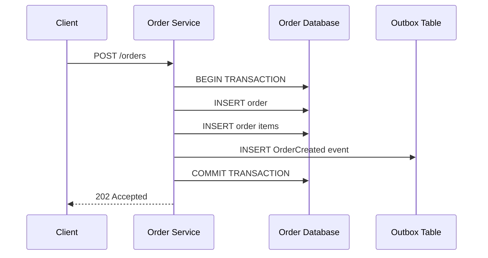
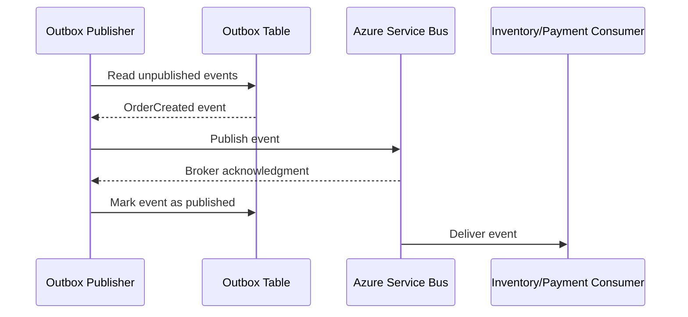
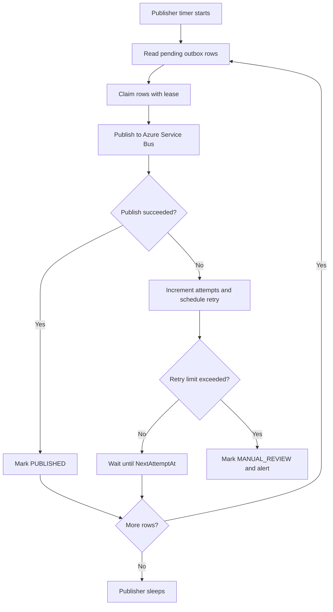
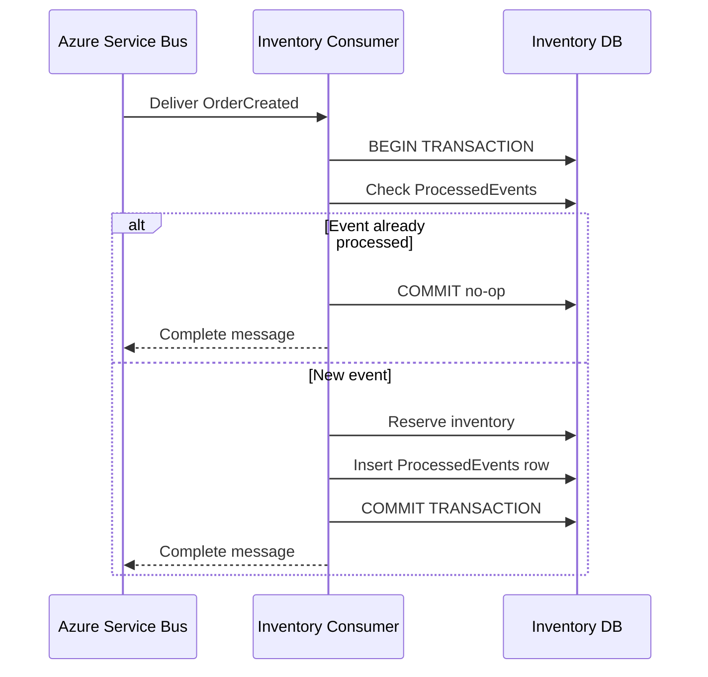
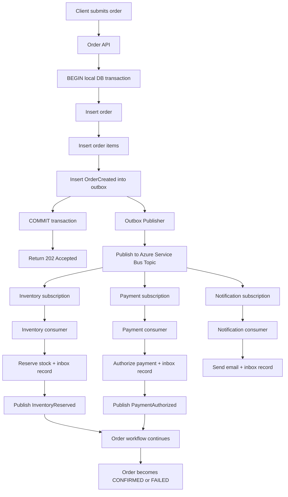
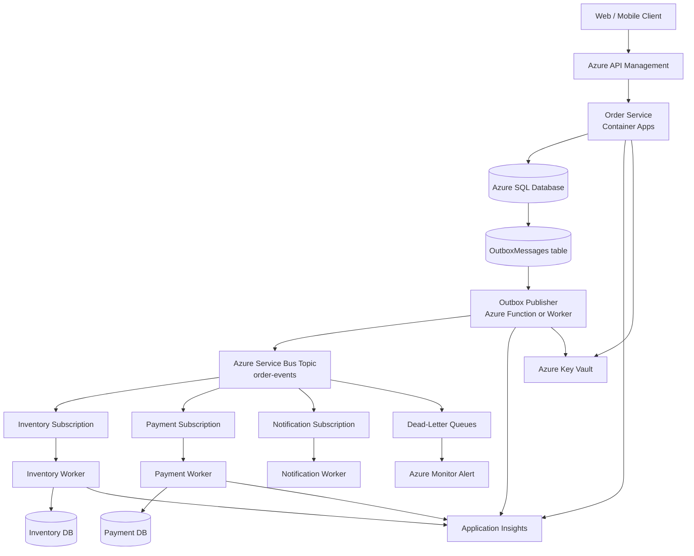
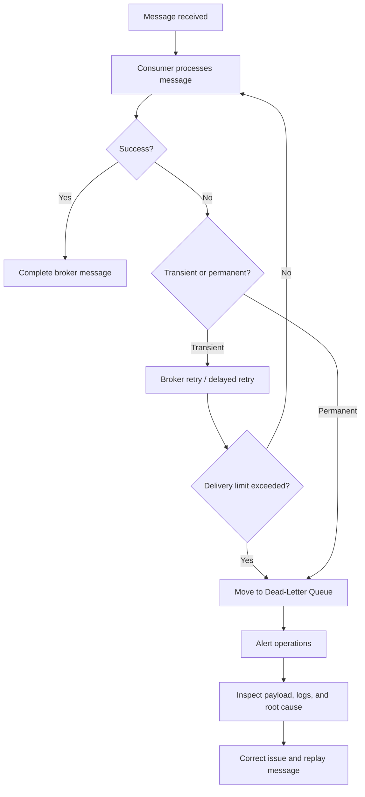
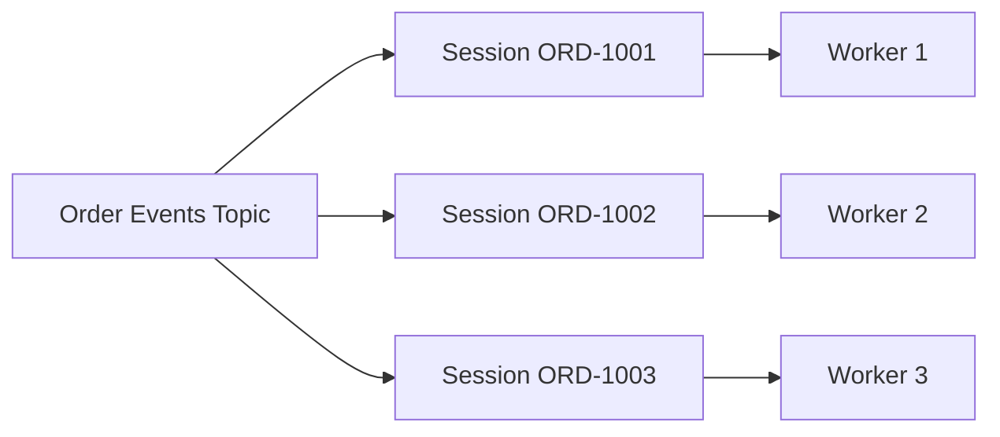
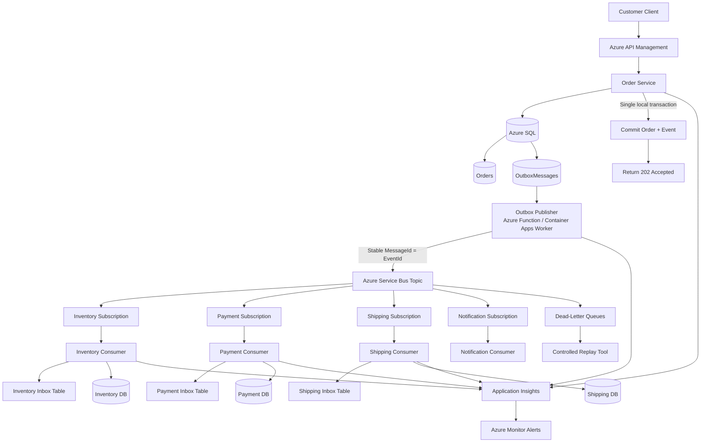

# Reliable Order Processing System with the Transactional Outbox Pattern

## Interview Preparation Guide

This guide explains how to design a reliable order-processing system and solve the **database + message-broker dual-write problem** using the **Transactional Outbox Pattern**.

It covers:

- Why database and message-broker dual writes are unsafe
- Transactional Outbox implementation
- Reliable event publishing
- Consumer idempotency and the Inbox Pattern
- Retries and dead-letter queues
- Ordering and concurrency
- Failure recovery and reconciliation
- Azure cloud implementation
- Interview-ready explanation

---

## 1. Problem Statement

An order-processing workflow commonly performs two operations:

1. Save an order to a database.
2. Publish an `OrderCreated` event to a message broker.

A naive implementation might look like this:

```text
1. INSERT order into database
2. Publish OrderCreated to message broker
```

The problem is that these are two independent systems. There is no single local transaction covering both operations.

If the application crashes between the two steps, the system can become inconsistent:

```text
Database:       Order exists
Message broker: OrderCreated event does not exist

Result:         Inventory, payment, and shipping services never process the order
```

The reverse order is also dangerous:

```text
1. Publish OrderCreated
2. Application crashes before database commit

Database:       Order does not exist
Message broker: OrderCreated event exists

Result:         Consumers process an order that the Order Service does not know about
```

This is called the **dual-write problem**.

---

# 2. Why a Distributed Transaction Is Usually Not the Answer

One possible approach is a distributed transaction such as two-phase commit, but it is usually a poor fit for modern microservices.

Reasons include:

- Message brokers and external services may not support the same transaction protocol.
- Locks can be held for a long time.
- Network failures can leave participants uncertain.
- Throughput decreases as more participants join the transaction.
- Cloud-native services are designed around independent ownership and availability.
- Payment gateways, shipping carriers, and external APIs do not participate in the transaction.

The preferred approach is:

> Commit the business data and an event record in one local database transaction, then publish the event asynchronously from that durable event record.

That is the **Transactional Outbox Pattern**.

---

# 3. High-Level Architecture



## Main Components

| Component | Responsibility |
|---|---|
| Order API | Validates the request and starts the local transaction |
| Order Database | Stores orders, order items, and transactional state |
| Outbox Table | Stores events that must eventually be published |
| Outbox Publisher | Reads pending events and sends them to the broker |
| Azure Service Bus | Delivers events to interested subscribers |
| Consumer Services | Process events independently and update their own databases |
| Inbox / Processed Events Table | Prevents duplicate event processing |
| Reconciliation Worker | Finds stuck or inconsistent records |
| Application Insights | Provides logs, metrics, and distributed tracing |

---

# 4. The Transactional Outbox Pattern

## Core Idea

The business entity and the event are written to the same database in one local transaction.



The message is not published directly during the request. Instead, the event is stored durably in the outbox.

A separate publisher later sends it to Azure Service Bus.



## Reliability Guarantee

The outbox pattern gives this important guarantee:

```text
If the order transaction commits,
then the event record also commits.

If the event record exists,
then a publisher can retry publishing it later.
```

It does not provide exactly-once delivery by itself. The publisher may send an event more than once, so consumers must be idempotent.

---

# 5. Database Schema

## Orders Table

```sql
CREATE TABLE Orders (
    OrderId        VARCHAR(50) PRIMARY KEY,
    CustomerId     VARCHAR(50) NOT NULL,
    Status         VARCHAR(40) NOT NULL,
    TotalAmount    DECIMAL(18, 2) NOT NULL,
    Currency       VARCHAR(10) NOT NULL,
    CreatedAt      DATETIME2 NOT NULL,
    UpdatedAt      DATETIME2 NOT NULL,
    Version        INT NOT NULL DEFAULT 1
);
```

## Order Items Table

```sql
CREATE TABLE OrderItems (
    OrderItemId    VARCHAR(50) PRIMARY KEY,
    OrderId        VARCHAR(50) NOT NULL,
    ProductId      VARCHAR(50) NOT NULL,
    Quantity       INT NOT NULL,
    UnitPrice      DECIMAL(18, 2) NOT NULL
);
```

## Outbox Table

```sql
CREATE TABLE OutboxMessages (
    OutboxMessageId    VARCHAR(100) PRIMARY KEY,
    AggregateId        VARCHAR(100) NOT NULL,
    AggregateType      VARCHAR(100) NOT NULL,
    EventType          VARCHAR(200) NOT NULL,
    EventVersion       INT NOT NULL,
    Payload            NVARCHAR(MAX) NOT NULL,
    CorrelationId      VARCHAR(100) NOT NULL,
    Status             VARCHAR(30) NOT NULL,
    AttemptCount       INT NOT NULL DEFAULT 0,
    NextAttemptAt      DATETIME2 NULL,
    PublishedAt        DATETIME2 NULL,
    LastError          VARCHAR(2000) NULL,
    CreatedAt          DATETIME2 NOT NULL
);

CREATE INDEX IX_Outbox_Pending
ON OutboxMessages(Status, NextAttemptAt, CreatedAt);
```

Recommended statuses:

```text
PENDING
PUBLISHING
PUBLISHED
FAILED
MANUAL_REVIEW
```

In many implementations, a message can remain `PENDING` until publication is confirmed. The publisher should use a lease or lock so multiple workers do not process the same row concurrently.

---

# 6. Order Creation Transaction

The Order Service must write the order and its event in the same local database transaction.

```csharp
public async Task<CreateOrderResult> CreateOrderAsync(CreateOrderRequest request)
{
    await using var transaction = await _db.Database.BeginTransactionAsync();

    try
    {
        var orderId = $"ORD-{Guid.NewGuid():N}";
        var correlationId = $"CORR-{Guid.NewGuid():N}";
        var eventId = $"EVT-{Guid.NewGuid():N}";

        var order = new Order
        {
            OrderId = orderId,
            CustomerId = request.CustomerId,
            Status = "PENDING_PROCESSING",
            TotalAmount = request.TotalAmount,
            Currency = request.Currency,
            CreatedAt = DateTime.UtcNow,
            UpdatedAt = DateTime.UtcNow,
            Version = 1
        };

        _db.Orders.Add(order);

        foreach (var item in request.Items)
        {
            _db.OrderItems.Add(new OrderItem
            {
                OrderItemId = $"ITEM-{Guid.NewGuid():N}",
                OrderId = orderId,
                ProductId = item.ProductId,
                Quantity = item.Quantity,
                UnitPrice = item.UnitPrice
            });
        }

        var orderCreatedEvent = new OrderCreatedEvent
        {
            EventId = eventId,
            EventType = "OrderCreated",
            EventVersion = 1,
            OrderId = orderId,
            CustomerId = request.CustomerId,
            TotalAmount = request.TotalAmount,
            Currency = request.Currency,
            Items = request.Items,
            CorrelationId = correlationId,
            OccurredAt = DateTime.UtcNow
        };

        _db.OutboxMessages.Add(new OutboxMessage
        {
            OutboxMessageId = eventId,
            AggregateId = orderId,
            AggregateType = "Order",
            EventType = "OrderCreated",
            EventVersion = 1,
            Payload = JsonSerializer.Serialize(orderCreatedEvent),
            CorrelationId = correlationId,
            Status = "PENDING",
            AttemptCount = 0,
            CreatedAt = DateTime.UtcNow
        });

        await _db.SaveChangesAsync();
        await transaction.CommitAsync();

        return new CreateOrderResult(orderId, "PENDING_PROCESSING");
    }
    catch
    {
        await transaction.RollbackAsync();
        throw;
    }
}
```

## Important Rule

Do not publish to Azure Service Bus before the database transaction commits.

The request path should only do the local transaction. The publisher handles delivery asynchronously.

---

# 7. Outbox Publisher Design

The publisher is a background process that repeatedly:

1. Reads pending outbox records.
2. Claims or locks a batch.
3. Publishes each event to the broker.
4. Marks successfully published records.
5. Retries failed records.



## Pseudocode

```csharp
public async Task PublishPendingEventsAsync(CancellationToken cancellationToken)
{
    var messages = await _outboxRepository.ClaimPendingBatchAsync(
        batchSize: 100,
        leaseDuration: TimeSpan.FromMinutes(2),
        cancellationToken);

    foreach (var outboxMessage in messages)
    {
        try
        {
            var message = new ServiceBusMessage(
                BinaryData.FromString(outboxMessage.Payload))
            {
                MessageId = outboxMessage.OutboxMessageId,
                Subject = outboxMessage.EventType,
                CorrelationId = outboxMessage.CorrelationId,
                ContentType = "application/json"
            };

            await _sender.SendMessageAsync(message, cancellationToken);

            await _outboxRepository.MarkPublishedAsync(
                outboxMessage.OutboxMessageId,
                DateTime.UtcNow,
                cancellationToken);
        }
        catch (Exception ex) when (IsTransient(ex))
        {
            await _outboxRepository.ScheduleRetryAsync(
                outboxMessage.OutboxMessageId,
                CalculateNextAttempt(outboxMessage.AttemptCount),
                ex.Message,
                cancellationToken);
        }
        catch (Exception ex)
        {
            await _outboxRepository.MarkManualReviewAsync(
                outboxMessage.OutboxMessageId,
                ex.Message,
                cancellationToken);
        }
    }
}
```

---

# 8. The Publisher Crash Window

A common interview follow-up is:

> What happens if the publisher sends the message successfully but crashes before marking the outbox row as published?

The event may be sent twice:

```text
1. Publisher reads event E1
2. Publisher sends E1 to Service Bus successfully
3. Service Bus acknowledges E1
4. Publisher crashes before updating OutboxMessages
5. Publisher restarts
6. Publisher sends E1 again
```

This is expected. The outbox pattern provides **at-least-once publication**, not exactly-once publication.

The solution is:

- Use a stable event ID.
- Set the broker `MessageId` to that event ID.
- Make consumers idempotent.
- Use a consumer inbox or processed-event table.
- Make all side effects safe to repeat.

```text
At-least-once publishing + idempotent consumers = reliable processing
```

---

# 9. Consumer Inbox Pattern

Each consumer should record the event ID it has processed in the same local database transaction as its business change.

## Processed Events Table

```sql
CREATE TABLE ProcessedEvents (
    ConsumerName    VARCHAR(100) NOT NULL,
    EventId         VARCHAR(100) NOT NULL,
    EventType       VARCHAR(200) NOT NULL,
    ProcessedAt     DATETIME2 NOT NULL,
    PRIMARY KEY (ConsumerName, EventId)
);
```

The consumer name is part of the key because multiple consumers may process the same event independently.

## Consumer Transaction



## Consumer Example

```csharp
public async Task HandleOrderCreatedAsync(
    ServiceBusReceivedMessage message,
    CancellationToken cancellationToken)
{
    var eventId = message.MessageId;

    await using var transaction = await _db.Database.BeginTransactionAsync(
        cancellationToken);

    var alreadyProcessed = await _db.ProcessedEvents.AnyAsync(
        x => x.ConsumerName == "InventoryService" && x.EventId == eventId,
        cancellationToken);

    if (alreadyProcessed)
    {
        await transaction.CommitAsync(cancellationToken);
        return;
    }

    var orderEvent = JsonSerializer.Deserialize<OrderCreatedEvent>(
        message.Body.ToString());

    await _inventoryService.ReserveAsync(
        orderEvent.OrderId,
        orderEvent.Items,
        cancellationToken);

    _db.ProcessedEvents.Add(new ProcessedEvent
    {
        ConsumerName = "InventoryService",
        EventId = eventId,
        EventType = "OrderCreated",
        ProcessedAt = DateTime.UtcNow
    });

    await _db.SaveChangesAsync(cancellationToken);
    await transaction.CommitAsync(cancellationToken);
}
```

The broker message should be completed only after the local database transaction succeeds.

---

# 10. End-to-End Order Flow



---

# 11. Azure Cloud Implementation

## Recommended Azure Services

| Requirement | Azure Service |
|---|---|
| Order API | Azure Container Apps, AKS, or App Service |
| Relational order database | Azure SQL Database |
| Event broker | Azure Service Bus Topic |
| Background publisher | Azure Functions, Container Apps Job, or worker service |
| Distributed cache | Azure Cache for Redis, if needed for read optimization |
| Secrets | Azure Key Vault |
| Identity | Microsoft Entra ID and Managed Identity |
| Monitoring | Azure Monitor and Application Insights |
| Logs and queries | Log Analytics Workspace |
| Failed message handling | Service Bus Dead-Letter Queue |
| Scheduled reconciliation | Azure Functions Timer Trigger or Container Apps Job |

## Azure Architecture



## Azure Service Bus Configuration Concepts

Use a topic when multiple services need the same event:

```text
Topic: order-events

Subscriptions:
- inventory-subscription
- payment-subscription
- notification-subscription
- analytics-subscription
```

Use a queue when only one logical consumer should process a command:

```text
Queue: reserve-inventory-commands
Queue: authorize-payment-commands
```

Useful settings include:

- Duplicate detection using stable `MessageId` values where suitable
- Dead-lettering after maximum delivery attempts
- Lock duration and lock renewal for long-running handlers
- Scheduled messages for delayed retries
- Sessions when per-order ordering is required
- Managed identity instead of connection strings

---

# 12. Azure Function Publisher Example

A timer-triggered Azure Function can publish pending outbox messages.

```csharp
public class OutboxPublisherFunction
{
    private readonly IOutboxRepository _outboxRepository;
    private readonly ServiceBusSender _sender;

    [Function("PublishOutboxMessages")]
    public async Task RunAsync(
        [TimerTrigger("*/5 * * * * *")] TimerInfo timer,
        CancellationToken cancellationToken)
    {
        var batch = await _outboxRepository.ClaimPendingBatchAsync(
            batchSize: 100,
            leaseDuration: TimeSpan.FromMinutes(2),
            cancellationToken);

        foreach (var record in batch)
        {
            try
            {
                var message = new ServiceBusMessage(
                    BinaryData.FromString(record.Payload))
                {
                    MessageId = record.OutboxMessageId,
                    Subject = record.EventType,
                    CorrelationId = record.CorrelationId,
                    ContentType = "application/json"
                };

                await _sender.SendMessageAsync(message, cancellationToken);
                await _outboxRepository.MarkPublishedAsync(
                    record.OutboxMessageId,
                    DateTime.UtcNow,
                    cancellationToken);
            }
            catch (Exception ex)
            {
                await _outboxRepository.ScheduleRetryAsync(
                    record.OutboxMessageId,
                    DateTime.UtcNow.AddSeconds(30),
                    ex.Message,
                    cancellationToken);
            }
        }
    }
}
```

For higher throughput, run multiple publisher instances and claim rows using leases or database locking.

---

# 13. Claiming Outbox Rows Safely

Multiple publisher instances may run simultaneously. They must not continuously process the same rows.

Possible approaches:

## Option A: Database Lease

Add fields such as:

```sql
ALTER TABLE OutboxMessages ADD
    LeaseOwner VARCHAR(100) NULL,
    LeaseExpiresAt DATETIME2 NULL;
```

Claim rows where:

```text
Status = PENDING
AND (LeaseExpiresAt IS NULL OR LeaseExpiresAt < current time)
AND (NextAttemptAt IS NULL OR NextAttemptAt <= current time)
```

Then set:

```text
LeaseOwner = publisher instance ID
LeaseExpiresAt = current time + lease duration
Status = PUBLISHING
```

## Option B: SQL Row Locking

Use database-specific row locking such as `UPDLOCK` and `READPAST` where appropriate.

## Option C: Partitioned Publishers

Partition outbox work by hash of `AggregateId` or by time bucket.

The important requirement is that a publisher crash must not permanently lose a row. Leases need expiration so another publisher can reclaim abandoned work.

---

# 14. Retry Strategy

Retries should distinguish transient failures from permanent failures.

| Failure | Type | Action |
|---|---|---|
| Temporary Service Bus outage | Transient | Retry with exponential backoff |
| Network timeout | Transient | Retry with jitter |
| HTTP 429 | Transient | Honor retry-after and retry |
| Invalid event payload | Permanent | Send to manual review or DLQ |
| Schema incompatibility | Permanent | Alert and fix consumer/publisher |
| Authentication failure | Configuration | Alert immediately |
| Database unavailable | Transient | Retry, but apply limits |

Example retry schedule:

```text
Attempt 1: immediately
Attempt 2: after 2 seconds
Attempt 3: after 10 seconds
Attempt 4: after 30 seconds
Attempt 5: after 2 minutes
Attempt 6: after 10 minutes
```

Use jitter to prevent many publishers or consumers from retrying at exactly the same time.

---

# 15. Dead-Letter and Manual Recovery

A message should not retry forever.



For an outbox record that cannot be published:

```text
PENDING -> PUBLISHING -> FAILED -> PENDING
                         |
                         -> MANUAL_REVIEW
```

Operations should be able to:

- View the event payload.
- See the exception and attempt count.
- Determine whether the message was published but not acknowledged locally.
- Replay the event safely.
- Mark an event as intentionally ignored with an audit reason.

---

# 16. Ordering and Eventual Consistency

The outbox publisher may publish events asynchronously. Consumers may receive events at different times.

If order matters for a specific aggregate, use an ordering key:

```text
Ordering key = OrderId
```

Azure Service Bus can use sessions:

```text
SessionId = orderId
```

This allows events for the same order to be processed sequentially while different orders can process in parallel.



Do not require global ordering unless the business genuinely needs it. Global ordering limits scalability.

---

# 17. Handling Duplicate Events

Duplicates can happen when:

- The publisher crashes after broker acknowledgment.
- The consumer commits its database transaction but crashes before completing the broker message.
- The broker redelivers after lock expiration.
- An operator replays a message from a DLQ.

Use multiple safeguards:

```text
1. Stable event ID
2. Stable broker MessageId
3. Unique database constraint
4. Inbox / ProcessedEvents table
5. Idempotent business operations
6. Provider idempotency keys for external APIs
```

Example:

```sql
ALTER TABLE ProcessedEvents
ADD CONSTRAINT UQ_ProcessedEvents
UNIQUE (ConsumerName, EventId);
```

If two consumer instances race to process the same event, only one can insert the unique key. The other treats the duplicate-key result as an already-processed event and safely completes the broker message.

---

# 18. Failure Scenarios

## Scenario 1: Database Commit Fails

```text
Order insert fails
Outbox insert rolls back
No message is published
Client receives an error
```

This is safe because the business record and event are both absent.

## Scenario 2: Database Commit Succeeds, Publisher Is Down

```text
Order exists
Outbox event exists with PENDING status
Publisher is unavailable
```

When the publisher recovers, it reads and publishes the pending event.

## Scenario 3: Publisher Sends Event, Then Crashes

```text
Broker has event
Outbox row still appears PENDING
Publisher retries
Consumer receives duplicate
```

The consumer inbox detects the duplicate and performs no second side effect.

## Scenario 4: Consumer Commits, Then Crashes Before ACK

```text
Inventory reservation committed
Consumer crashes before completing broker message
Broker redelivers event
Inbox detects duplicate
Consumer completes message without reserving again
```

## Scenario 5: Consumer Fails Before Commit

```text
Consumer receives event
Database transaction fails
No inbox row exists
Broker redelivers event
Consumer retries safely
```

## Scenario 6: Poison Message

```text
Invalid payload or incompatible schema
Every attempt fails
Message is moved to DLQ
Operations team fixes publisher/consumer and replays
```

---

# 19. Outbox Cleanup and Retention

Published outbox rows should not grow forever.

Options:

- Keep published rows for a fixed audit period, such as 7–30 days.
- Archive old rows to Azure Blob Storage or Data Lake Storage.
- Delete rows after successful publication and retention requirements are satisfied.
- Partition the table by creation date for efficient cleanup.

Example cleanup policy:

```text
PUBLISHED records older than 30 days -> archive
Archived records older than 1 year -> delete according to policy
PENDING or FAILED records -> never delete automatically
```

Do not delete records that are still pending or under manual review.

---

# 20. Monitoring and Operational Metrics

Use Azure Monitor and Application Insights to observe the full workflow.

## Outbox Metrics

```text
Number of pending outbox records
Oldest pending outbox age
Publication success rate
Publication retry count
Events in MANUAL_REVIEW
Average publication latency
```

## Broker Metrics

```text
Active message count
Dead-letter message count
Message age
Delivery count
Queue/topic throughput
Lock lost count
```

## Consumer Metrics

```text
Processing success rate
Processing failure rate
Duplicate event count
Consumer lag
Database transaction duration
P50/P95/P99 processing latency
```

## Important Alerts

```text
Alert if oldest pending outbox record is older than 5 minutes
Alert if DLQ depth is greater than zero for critical workflows
Alert if consumer failure rate exceeds 5%
Alert if message age exceeds the order-processing SLA
Alert if publisher has not successfully published for 10 minutes
```

Every message should carry:

```text
EventId
CorrelationId
CausationId
AggregateId
EventType
EventVersion
OccurredAt
```

This makes it possible to trace:

```text
HTTP request -> database transaction -> outbox row -> broker message -> consumer transaction
```

---

# 21. Security Considerations

- Use Managed Identity for Azure SQL and Service Bus access.
- Store configuration and secrets in Azure Key Vault.
- Do not put sensitive payment data in event payloads.
- Encrypt messages in transit using TLS.
- Apply least-privilege RBAC to publishers and consumers.
- Validate event schemas before processing.
- Restrict who can replay DLQ messages.
- Audit manual changes and replay actions.
- Use private endpoints and VNet integration where required.

Example access model:

```text
Order Service identity:
- Read/write Orders database
- Send to Service Bus order-events topic

Inventory Worker identity:
- Receive from inventory subscription
- Read/write Inventory database
- Send inventory events

Operations identity:
- Read DLQ
- Replay approved messages
- Cannot alter payment data directly
```

---

# 22. Outbox Pattern vs Change Data Capture

The transactional outbox pattern is not the only solution.

## Transactional Outbox

```text
Application writes business row + event row in one transaction.
Publisher sends event row to broker.
```

Best when:

- The application owns the database.
- Business events need explicit payloads.
- You want clear control over event publication.
- You need event metadata and business intent.

## Change Data Capture

A CDC tool reads database transaction logs and publishes changes.

Azure examples may include:

- Azure Data Factory change data capture capabilities.
- Debezium with Kafka Connect.
- Azure Event Hubs or other streaming integrations.

Best when:

- You need database-change streaming.
- Many tables must be replicated.
- The source database is the authoritative change log.

Important distinction:

> CDC captures database changes. The Outbox Pattern publishes intentional business events.

For example, an `OrderCreated` event may contain a carefully designed contract, while CDC may expose every column change from the `Orders` table.

---

# 23. Interview-Ready Answer

A concise answer could be:

> The database and message broker are separate systems, so writing the order to the database and publishing `OrderCreated` in two independent operations creates a dual-write problem. If the service crashes between those operations, either the order exists without an event or the event exists without the order.
>
> I would solve this with the Transactional Outbox Pattern. The Order Service writes the order and an `OutboxMessage` row in the same local database transaction. Once the transaction commits, a background publisher reads pending outbox rows and publishes them to Azure Service Bus. After Service Bus acknowledges the message, the publisher marks the outbox row as published.
>
> The publisher must be designed for at-least-once delivery. It can crash after publishing but before marking the row as published, so the same event may be published again. I would use a stable event ID and make every consumer idempotent. Each consumer stores processed event IDs in an inbox table in the same database transaction as its business update. If a duplicate arrives, the consumer skips the business operation and completes the message.
>
> I would use Azure SQL for the order database, Azure Service Bus Topics and Subscriptions for event distribution, Azure Functions or Container Apps for the outbox publisher, Managed Identity and Key Vault for security, and Application Insights for monitoring. I would add exponential backoff, dead-letter queues, replay tooling, reconciliation jobs, and alerts for old pending outbox records and DLQ messages.
>
> This gives reliable eventual delivery without requiring a distributed transaction or two-phase commit.

---

# 24. Interview Follow-Up Questions

## Is the Outbox Pattern Exactly Once?

No. It provides reliable at-least-once publication. Duplicate publication is possible, so consumers must be idempotent.

## What If the Publisher Crashes After Sending?

The event may be published again. A stable event ID and idempotent consumer prevent duplicate side effects.

## What If the Database Is Down?

The order transaction fails, so no order or outbox event is committed. The client receives an error or retries using an API idempotency key.

## What If Service Bus Is Down?

The order is still committed with a pending outbox record. The publisher retries later. The order remains in a pending-processing state until downstream services receive the event.

## Does the Client Get a Synchronous Success?

Usually the API returns `202 Accepted` with an order ID and status URL because downstream processing is asynchronous.

```json
{
  "orderId": "ORD-1001",
  "status": "PENDING_PROCESSING",
  "statusUrl": "/api/orders/ORD-1001"
}
```

## How Do You Prevent Two Publishers from Processing the Same Row?

Use database leases, row locks, partitioned work, or a claim-and-update operation. Even with claiming, design for duplicates because a crash can occur after publication and before status update.

## How Do You Handle a Poison Event?

Classify permanent failures, stop retrying indefinitely, move the message to a DLQ or mark the outbox row for manual review, alert operations, fix the issue, and replay safely.

---

# 25. Final Architecture Diagram



---

# 26. Final Takeaways

1. The database and broker cannot normally be updated atomically with a simple local transaction.
2. Do not publish directly from the request transaction before the database commit.
3. Write the business record and outbox event in the same local transaction.
4. Publish pending events asynchronously.
5. Assume the publisher can publish duplicates.
6. Use stable event IDs and idempotent consumers.
7. Store processed event IDs in an inbox table.
8. Retry transient failures with exponential backoff and jitter.
9. Use dead-letter queues for poison messages and exhausted retries.
10. Monitor outbox age, publication latency, consumer lag, and DLQ depth.
11. Add reconciliation and replay capabilities for operational recovery.
12. Use Azure SQL, Azure Service Bus, Azure Functions or Container Apps, Key Vault, Managed Identity, and Application Insights for an Azure implementation.

> The central principle is: commit the business change and the event intent together, then deliver the event asynchronously with at-least-once semantics and idempotent consumers. This solves the database + message-broker dual-write problem without requiring a distributed two-phase commit.
